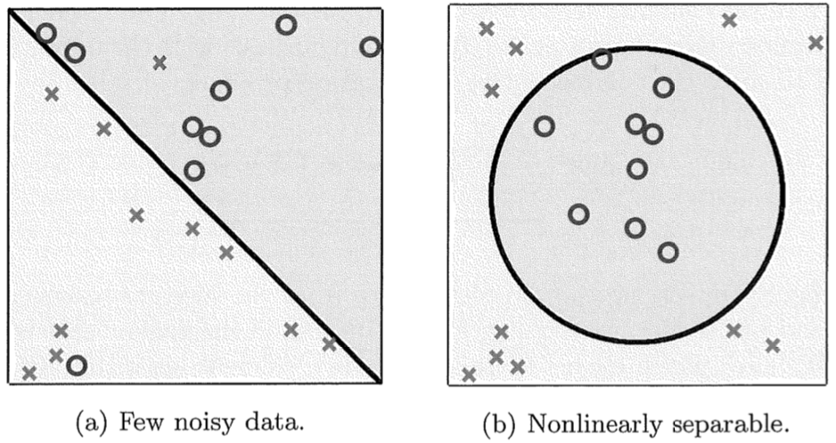
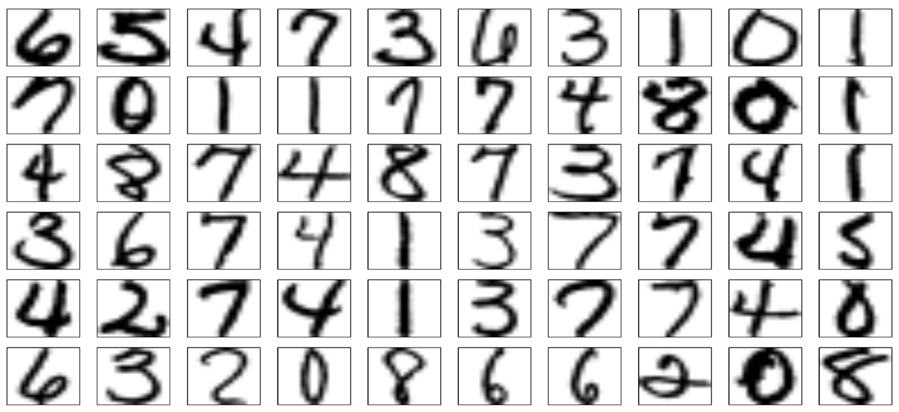
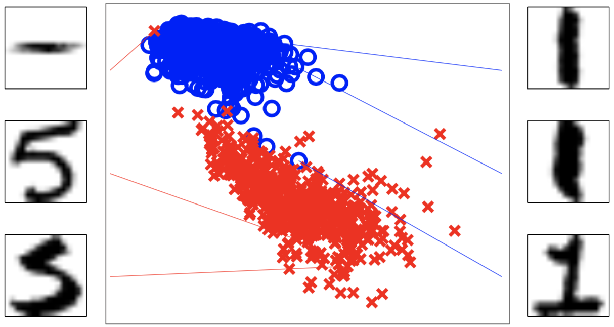

% Linear Classification

## The Linear Model

In the next few lectures we will 

- extend the perceptron learning algorithm to handle non-linearly separable data,
- explore online versis batch learning,
- learn three different learning settings -- classification, regression, and probability estimation
- learn a fundamental concept in machine learning: gradient descent
- see how the learning rate hyperparameter

## The Linear Model

Recall that the linear model for binary classification is:

$$
\mathcal{H} = \{h(\vec{x}) = sign(\vec{w}^T \cdot \vec{x})\}
$$

where

::::{.columns valign="center"}
::: {.column width="40%"}

$$
\vec{w} =
\begin{bmatrix}
w_{0} \\
w_{1} \\
\vdots \\
w_{d}
\end{bmatrix}
\in \mathbb{R}^{d + 1}
$$

:::
::: {.column width="40%"}

$$
\vec{x} =
\begin{bmatrix}
1 \\
x_{1} \\
\vdots \\
x_{d}
\end{bmatrix}
\in \{1\} \times \mathbb{R}^d
$$

:::
::::

Where 

- $\vec{w} \in \mathbb{R}^{d + 1}$ where $d$ is the dimensionality of the input space and $w_0$ is a bias weight, and 
- $x_0 = 1$ is fixed.

## Perceptron Learning Algorithm

Recall the perceptron learning algorithm, slightly reworded:

INPUT: a data set $\mathcal{D}$ with each $\vec{x_i}$ in $\mathcal{D}$ prepended with a $1$, and labels $\vec{y}$

1. Initialize $\vec{w} = (w_0, w_1, ..., w_d)$ with zeros or random values, $t = 1$
    
2. Receive a $\vec{x_i} \in \mathcal{D}$ for which $sign(\vec{w}^T \cdot \vec{x}) \ne y_i$
    - Update $\vec{w}$ using the update rule:
        - $\vec{w}(t + 1) \leftarrow \vec{w}(t) + y_i \vec{x_i}$ 
    - $t \leftarrow t + 1$

3. If there is still a $\vec{x_i} \in \mathcal{D}$ for which $sign(\vec{w}^T \cdot \vec{x}) \ne y_i$, repeat Step 2.

TERMINATION: $\vec{w}$ is a line separating the two classes (assuming $\mathcal{D}$ is linearly separable).

Notice that the algorithm only updates the model based on a single sample.  Such an algorithm is called an *online* learning algorithm.

Also remember that PLA requires that $\mathcal{D}$ be linearly separable.

## Two Fundamental Goals In Learning

We have two fundamental goals with our learning algorithms:

- Make $E_{out}(g)$ close to $E_{in}(g)$[^g].  This means that our model will generallize well.  We'll learn how to bound the difference when we study computational learning theory. 

- Make $E_{in}(g)$ small.  This means we have a model that fits the data well, or performs well in its prediction task.

Let's now discuss how to make $E_{in}(g)$ small.  We need to define *small* and we need to deal with non-separable data. 

[^g]: Remember that a *version space* is the set of all $h$ in $\mathcal{H}$ consistent with our training data. $g$ is the particular $h$ chosen by the algorithm.

## Non-Separable Data

In practice perfectly linearly separable data is rare.



- Data set could include noise which prevents linear separablility.
- Data might be fundamentally non-linearly separable.

Today we'll learn how to deal with the first case.  In a few days we'll learn how to deal with the second case.


## Minimizing the Error Rate

Earlier in the course we said that every machine learning problem contains the following elements:

- An input $\vec{x}$ 
- An unkown target function $f: \mathcal{X} \rightarrow \mathcal{Y}$
- A data set $\mathcal{D}$
- A learning model, which consists of
    - a hypothesis class $\mathcal{H}$ from which our model comes, 
    - a loss function that quantifies the badness of our model, and
    - a learning algorithm which optimizes the loss function.

Error, $E$, is another term for loss function. For the case of our simple perceptron classifer we're using 0-1 loss, that is, counting the errors (or proportion thereof) and our optmization procedure tries to find:

$$
\min_{\vec{w} \in \mathbb{R}^{d+1}} \frac{1}{N} \sum_{n=1}^{N}  \llbracket sign(\vec{w}^T \vec{x_n}) \ne y_n \rrbracket
$$

Let's look at two modifications to the PLA that perform this minimization.

## Batch PLA [^alan-fern-byron-boots]

INPUT: a data set $\mathcal{D}$ with each $\vec{x_i}$ in $\mathcal{D}$ prepended with a $1$, labels $\vec{y}$, $\epsilon$ -- an error tolerance, and $\alpha$ -- a learning rate

1. Initialize $\vec{w} = (w_0, w_1, ..., w_d)$ with zeros or random values, $t = 1$, $\Delta = (0, ..0)$
    
2. do 

    - For $i = 1, 2, ..., N$
    
        - if $sign(\vec{w}^T \cdot \vec{x_i}) \ne y_i$, then $\Delta \leftarrow \Delta + y_i \vec{x_i}$    
        - $\Delta \leftarrow \frac{\Delta}{N}$
    
    - $\vec{w} \leftarrow \vec{w} + \alpha \Delta$

   while $||\Delta||_{2} > \epsilon$

TERMINATION: $\vec{w}$ is "close enough" a line separating the two classes.

## New Concepts in the Batch PLA Algorithm

1. Initialize $\vec{w} = (w_0, w_1, ..., w_d)$ with zeros or random values, $t = 1$, $\Delta = (0, ..0)$
    
2. do 

    - For $i = 1, 2, ..., N$
    
        - if $sign(\vec{w}^T \cdot \vec{x_i}) \ne y_i$, then $\Delta \leftarrow \Delta + y_i \vec{x_i}$    
        - $\Delta \leftarrow \frac{\Delta}{N}$
    
    - $\vec{w} \leftarrow \vec{w} + \alpha \Delta$

   while $||\Delta||_{2} > \epsilon$

Notice a few new concepts in the batch PLA algorithm:

- the inner loop.  This is a *batch algorithm* -- it uses every sample in the data set to update the model.
- the $\epsilon$ hyperparameter -- our stopping condition is "good enough", i.e., within an error tolerance
- the $\alpha$ (also sometimes $\eta$) hyperparameter -- the learning rate, i.e., how much do we update the model in a given step.  

[^alan-fern-byron-boots]: Based on Alan Fern via Byron Boots


## Pocket Algorithm

Input: a data set $\mathcal{D}$ with each $\vec{x_i}$ in $\mathcal{D}$ prepended with a $1$, labels $\vec{y}$, and $T$ steps

1. Initialize $\vec{w} = (w_0, w_1, ..., w_d)$ with zeros or random values, $t = 1$, $\Delta = (0, ..0)$
    
2. for $t = 1, 2, ..., T$
    
    - Run PLA for one update to obtain $\vec{w}(t + 1)$
    - Evaluate $E_{in}(\vec{w}(t + 1))$
    
        - if $E_{in}(\vec{w}(t + 1)) < E_{in}(\vec{w}(t))$, then $\vec{w} \leftarrow \vec{w}(t + 1)$

4. On termination, $\vec{w}$ is the best line found in T steps.

Notice

- there is an inner loop under Step 2 to evaluate $E_{in}$.  This is also a *batch algorithm* -- it uses every sample in the data set to update the model.
- the $T$ hyperparameter simply sets a hard limit on the number of learning iterations we perform

## Features

Remember that the target function we're trying to learn has the form $f: \mathcal{X} \rightarrow \mathcal{Y}$, where $\mathcal{X}$ is typically a matrix of feature vectors and $\mathcal{Y}$ is a vector of corresponding labels (classes). Consider the problem of classifying images of hand-written digits:

{height=50%}

What should the feature vector be?

## Feature Engineering

Sometimes deriving descriptive features from raw data can improve the performance of machine learning algorithms.

{height=50%}[^magdon-ismail]

Here we project the 256 features of the digit images (more if you consider pixel intensity) into a 2-dimensional space: average intensity and symmetry.

[^magdon-ismail]: [http://www.cs.rpi.edu/~magdon/courses/learn/slides.html](http://www.cs.rpi.edu/~magdon/courses/learn/slides.html)

## Multiclass Classification

We've only discussed binary classifers so far.  How can we deal with a multiclass problem, e.g., 10 digits?

- Some classifiers can do multi-class classification (e.g., multinomial logistic regression).
- Binary classifiers can be combined in a chain to handle multiclass problems

```{.graphviz .center height=40%}
digraph foo {
  rankdir=LR;
  b1 [shape=box, label="Binary Classifier 1"];
  b2 [shape=box, label="Binary Classifier 2"];
  x [shape=none];
  Class1 [shape=none];
  NotClass1 [shape=none];
  Class2 [shape=none];
  NotClass2 [shape=none];
  
  x -> b1 [arrowhead=vee, arrowtail=none, dir=both, tailclip=false];
  b1 -> Class1 [arrowhead=vee, arrowtail=none, dir=both, tailclip=true];
  b1 -> NotClass1  [arrowhead=vee, arrowtail=none, dir=both, tailclip=true];
  x -> b2 [arrowhead=vee, arrowtail=none, dir=both, tailclip=false];
  b2 -> Class2 [arrowhead=vee, arrowtail=none, dir=both, tailclip=true];
  b2 -> NotClass2 [arrowhead=vee, arrowtail=none, dir=both, tailclip=true];
}
```

This is a simple example of an ensemble, which we'll discuss in greater detail in the second half of the course. 

## Closing Thoughts

- Most data sets are not linearly separable

    - We minimize some error, or loss function

- Learning algorithms learn in one of two modes:

    - Online learning algorithm -- model is updated after seeing one training samples
    - Batch learning algorithm -- model is updated after seeing all training samples

- We've now seen hyperparamters to tune the operation of learning algorithms

    - $T$ or $\epsilon$ to bound the number of learning iterations
    - A learning rate, $\alpha$ or $\eta$, to modulate the step size of the model update performed in each iteration

- A multiclass classification problem can be solved by a chain of binary classifiers
