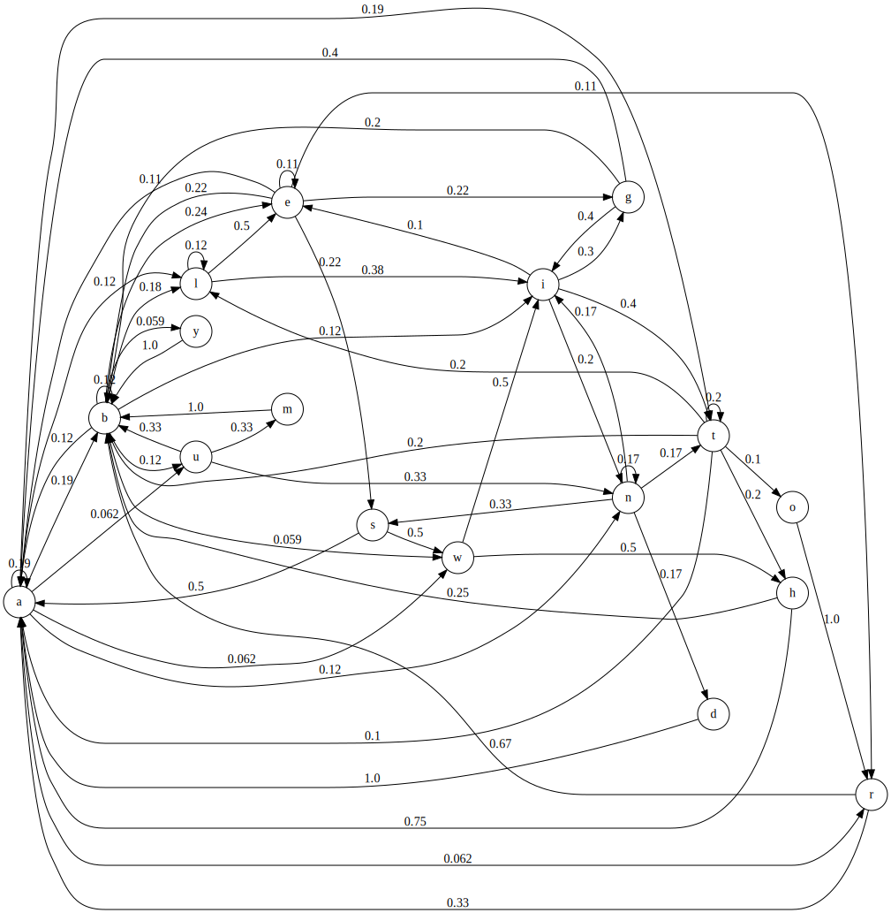
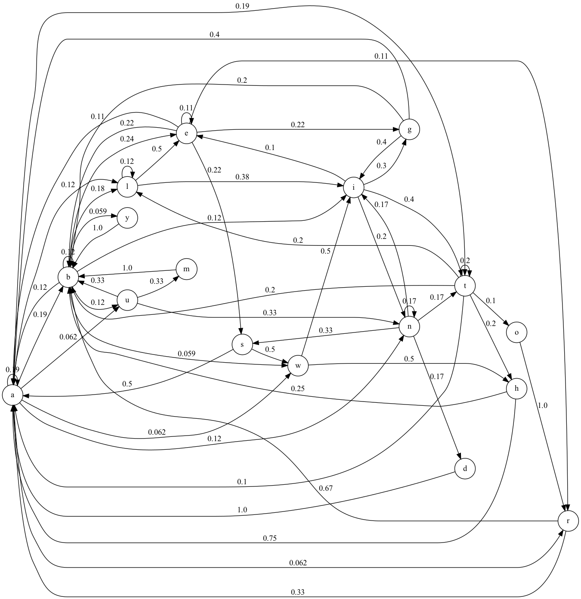

# Markov Chains

## Introduction

In this assignment you'll practice

- writing classes and modules,
- simple text processing, and
- basic numerical computing issues in Python.

## Problem Description

You're interested in natural language processing, and in the problem of identifying the source of a text.

## Solution Description

Write a module named `source.py` with a class named `SourceModel` whose constructor takes a name for a source, and a courpus object of type `TextIOWrapper` (such as a file object -- see [io module](https://docs.python.org/3/library/io.html)) and builds a first-order Markov model of the transitions between letters in the source. Only alphabetic characters in the source corpus should be considered and they should be normalized to upper or lower case. For simplicity (see background) only consider the 26 letters of the English alphabet.

Here are some example corpus files and test files:

- English: [english.corpus](english.corpus), [english.test](english.test)
- French: [french.corpus](french.corpus), [french.test](french.test)
- Spanish: [spanish.corpus](spanish.corpus), [spanish.test](spanish.test)
- HipHop: [hiphop.corpus](hiphop.corpus), [hiphop.test](hiphop.test)
- Lisp: [lisp.corpus](lisp.corpus), [lisp.test](lisp.test)

You can assume corpus files are of the form `<source-name>.corpus`.

### Background

In machine learning we train a model on some data and then use that model to make predictions about unseen instance of the same kind of data. For example, we can train a machine learning model on a data set consisting of several labeled images, some of which depict a dog and some of which don't. We can then use the trained model to predict whether some unseen image (an image not in the training set) has a dog. The better the model, the better the accuracy (percentage of correct predictions) on unseen data.

We can create a model of language and use that model to predict the likelihood that some unseen text was generated by that model, in other words, how likely the unseen text is an example of the language modeled by the model. The model could be of a particular author, or a language such as French or English. One simple kind of model is well-suited to this problem: Markov models.

Markov models are usefule for time-series or other sequential data. A Markov model is a finite-state model in which the current state is dependent only on a bounded history of previous states.  In a first-order Markov model the current state is dependent on only one previous state.


One can construct a simple first-order Markov model of a language as the transition probablilities between letters in the language's alphabet. For example, given this training corpus of a language:

```
BIG A, little a, what begins with A?
Aunt Annie’s alligator.
A...a...A

BIG B, little b, what begins with B?
Barber, baby, bubbles and a bumblebee.
```

We would have the model:



TODO: resize image.



We've only shown the letter-to-letter transitions that occur in the training corpus. Notice:

- we've normalized to lowercase,
- we only consider letters -- whitespace and punctuation are ignored
- the transition probabilities from one letter to all other letters sum to 1.0 (approximately, due to rounding),
- in a complete model, there would be arrows leading from all letters to all other letters, for 26^26 edges in a graph of 26 nodes, one for each letter, with unseen transitions labeled with 0.

This model indicates that whenever the letter a occurs in our training corpus, the next letter is a, b, e, g, h, i, l, n, r, s, t, u or w. The arrow from a to b is labeled .19 because b appears after a 3 out of 16 times, or approximately 19 percent of the time. A first-order Markov chain is a kind of bigram model. Here are all the bigrams in the training text that begin with a, that is, all the state transitions from a:

```
(a, l), (a, w), (a, t), (a, a), (a, u), (a, n), (a, l), (a, t),
(a, a), (a, a), (a, b), (a, t), (a, r), (a, b), (a, n), (a, b)
```

A Markov chain represents all the bigrams and their probabilities of occurence in the training corpus.

#### Representation as a matrix.

A Markov chain can be represented as a transition matrix in which the probability of state j after state i is found in element (i, j) of the matrix. In the example below we have labeled the rows and columns with letters for readability. The probability of seeing the letter n after the letter a in the training corpus is found by entering row a and scanning accross to column n, where we find the probability .12.

|       | a    | b    | c    | d    | e    | f    | g    | h    | i    | j    | k    | l    | m    | n    | o    | p    | q    | r    | s    | t    | u    | v    | w    | x    | y    | z    |
|-------|------|------|------|------|------|------|------|------|------|------|------|------|------|------|------|------|------|------|------|------|------|------|------|------|------|------|
| **a** | 0.19 | 0.19 | 0.01 | 0.01 | 0.01 | 0.01 | 0.01 | 0.01 | 0.01 | 0.01 | 0.01 | 0.12 | 0.01 | 0.12 | 0.01 | 0.01 | 0.01 | 0.06 | 0.01 | 0.19 | 0.06 | 0.01 | 0.06 | 0.01 | 0.01 | 0.01 |
| **b** | 0.12 | 0.12 | 0.01 | 0.01 | 0.24 | 0.01 | 0.01 | 0.01 | 0.12 | 0.01 | 0.01 | 0.18 | 0.01 | 0.01 | 0.01 | 0.01 | 0.01 | 0.01 | 0.01 | 0.01 | 0.12 | 0.01 | 0.06 | 0.01 | 0.06 | 0.01 |
| **c** | 0.01 | 0.01 | 0.01 | 0.01 | 0.01 | 0.01 | 0.01 | 0.01 | 0.01 | 0.01 | 0.01 | 0.01 | 0.01 | 0.01 | 0.01 | 0.01 | 0.01 | 0.01 | 0.01 | 0.01 | 0.01 | 0.01 | 0.01 | 0.01 | 0.01 | 0.01 |
| **d** | 1.00 | 0.01 | 0.01 | 0.01 | 0.01 | 0.01 | 0.01 | 0.01 | 0.01 | 0.01 | 0.01 | 0.01 | 0.01 | 0.01 | 0.01 | 0.01 | 0.01 | 0.01 | 0.01 | 0.01 | 0.01 | 0.01 | 0.01 | 0.01 | 0.01 | 0.01 |
| **e** | 0.11 | 0.22 | 0.01 | 0.01 | 0.11 | 0.01 | 0.22 | 0.01 | 0.01 | 0.01 | 0.01 | 0.01 | 0.01 | 0.01 | 0.01 | 0.01 | 0.01 | 0.11 | 0.22 | 0.01 | 0.01 | 0.01 | 0.01 | 0.01 | 0.01 | 0.01 |
| **f** | 0.01 | 0.01 | 0.01 | 0.01 | 0.01 | 0.01 | 0.01 | 0.01 | 0.01 | 0.01 | 0.01 | 0.01 | 0.01 | 0.01 | 0.01 | 0.01 | 0.01 | 0.01 | 0.01 | 0.01 | 0.01 | 0.01 | 0.01 | 0.01 | 0.01 | 0.01 |
| **g** | 0.40 | 0.20 | 0.01 | 0.01 | 0.01 | 0.01 | 0.01 | 0.01 | 0.40 | 0.01 | 0.01 | 0.01 | 0.01 | 0.01 | 0.01 | 0.01 | 0.01 | 0.01 | 0.01 | 0.01 | 0.01 | 0.01 | 0.01 | 0.01 | 0.01 | 0.01 |
| **h** | 0.75 | 0.25 | 0.01 | 0.01 | 0.01 | 0.01 | 0.01 | 0.01 | 0.01 | 0.01 | 0.01 | 0.01 | 0.01 | 0.01 | 0.01 | 0.01 | 0.01 | 0.01 | 0.01 | 0.01 | 0.01 | 0.01 | 0.01 | 0.01 | 0.01 | 0.01 |
| **i** | 0.01 | 0.01 | 0.01 | 0.01 | 0.10 | 0.01 | 0.30 | 0.01 | 0.01 | 0.01 | 0.01 | 0.01 | 0.01 | 0.20 | 0.01 | 0.01 | 0.01 | 0.01 | 0.01 | 0.40 | 0.01 | 0.01 | 0.01 | 0.01 | 0.01 | 0.01 |
| **j** | 0.01 | 0.01 | 0.01 | 0.01 | 0.01 | 0.01 | 0.01 | 0.01 | 0.01 | 0.01 | 0.01 | 0.01 | 0.01 | 0.01 | 0.01 | 0.01 | 0.01 | 0.01 | 0.01 | 0.01 | 0.01 | 0.01 | 0.01 | 0.01 | 0.01 | 0.01 |
| **k** | 0.01 | 0.01 | 0.01 | 0.01 | 0.01 | 0.01 | 0.01 | 0.01 | 0.01 | 0.01 | 0.01 | 0.01 | 0.01 | 0.01 | 0.01 | 0.01 | 0.01 | 0.01 | 0.01 | 0.01 | 0.01 | 0.01 | 0.01 | 0.01 | 0.01 | 0.01 |
| **l** | 0.01 | 0.01 | 0.01 | 0.01 | 0.50 | 0.01 | 0.01 | 0.01 | 0.38 | 0.01 | 0.01 | 0.12 | 0.01 | 0.01 | 0.01 | 0.01 | 0.01 | 0.01 | 0.01 | 0.01 | 0.01 | 0.01 | 0.01 | 0.01 | 0.01 | 0.01 |
| **m** | 0.01 | 1.00 | 0.01 | 0.01 | 0.01 | 0.01 | 0.01 | 0.01 | 0.01 | 0.01 | 0.01 | 0.01 | 0.01 | 0.01 | 0.01 | 0.01 | 0.01 | 0.01 | 0.01 | 0.01 | 0.01 | 0.01 | 0.01 | 0.01 | 0.01 | 0.01 |
| **n** | 0.01 | 0.01 | 0.01 | 0.17 | 0.01 | 0.01 | 0.01 | 0.01 | 0.17 | 0.01 | 0.01 | 0.01 | 0.01 | 0.17 | 0.01 | 0.01 | 0.01 | 0.01 | 0.33 | 0.17 | 0.01 | 0.01 | 0.01 | 0.01 | 0.01 | 0.01 |
| **o** | 0.01 | 0.01 | 0.01 | 0.01 | 0.01 | 0.01 | 0.01 | 0.01 | 0.01 | 0.01 | 0.01 | 0.01 | 0.01 | 0.01 | 0.01 | 0.01 | 0.01 | 1.00 | 0.01 | 0.01 | 0.01 | 0.01 | 0.01 | 0.01 | 0.01 | 0.01 |
| **p** | 0.01 | 0.01 | 0.01 | 0.01 | 0.01 | 0.01 | 0.01 | 0.01 | 0.01 | 0.01 | 0.01 | 0.01 | 0.01 | 0.01 | 0.01 | 0.01 | 0.01 | 0.01 | 0.01 | 0.01 | 0.01 | 0.01 | 0.01 | 0.01 | 0.01 | 0.01 |
| **q** | 0.01 | 0.01 | 0.01 | 0.01 | 0.01 | 0.01 | 0.01 | 0.01 | 0.01 | 0.01 | 0.01 | 0.01 | 0.01 | 0.01 | 0.01 | 0.01 | 0.01 | 0.01 | 0.01 | 0.01 | 0.01 | 0.01 | 0.01 | 0.01 | 0.01 | 0.01 |
| **r** | 0.33 | 0.67 | 0.01 | 0.01 | 0.01 | 0.01 | 0.01 | 0.01 | 0.01 | 0.01 | 0.01 | 0.01 | 0.01 | 0.01 | 0.01 | 0.01 | 0.01 | 0.01 | 0.01 | 0.01 | 0.01 | 0.01 | 0.01 | 0.01 | 0.01 | 0.01 |
| **s** | 0.50 | 0.01 | 0.01 | 0.01 | 0.01 | 0.01 | 0.01 | 0.01 | 0.01 | 0.01 | 0.01 | 0.01 | 0.01 | 0.01 | 0.01 | 0.01 | 0.01 | 0.01 | 0.01 | 0.01 | 0.01 | 0.01 | 0.50 | 0.01 | 0.01 | 0.01 |
| **t** | 0.10 | 0.20 | 0.01 | 0.01 | 0.01 | 0.01 | 0.01 | 0.20 | 0.01 | 0.01 | 0.01 | 0.20 | 0.01 | 0.01 | 0.10 | 0.01 | 0.01 | 0.01 | 0.01 | 0.20 | 0.01 | 0.01 | 0.01 | 0.01 | 0.01 | 0.01 |
| **u** | 0.01 | 0.33 | 0.01 | 0.01 | 0.01 | 0.01 | 0.01 | 0.01 | 0.01 | 0.01 | 0.01 | 0.01 | 0.33 | 0.33 | 0.01 | 0.01 | 0.01 | 0.01 | 0.01 | 0.01 | 0.01 | 0.01 | 0.01 | 0.01 | 0.01 | 0.01 |
| **v** | 0.01 | 0.01 | 0.01 | 0.01 | 0.01 | 0.01 | 0.01 | 0.01 | 0.01 | 0.01 | 0.01 | 0.01 | 0.01 | 0.01 | 0.01 | 0.01 | 0.01 | 0.01 | 0.01 | 0.01 | 0.01 | 0.01 | 0.01 | 0.01 | 0.01 | 0.01 |
| **w** | 0.01 | 0.01 | 0.01 | 0.01 | 0.01 | 0.01 | 0.01 | 0.50 | 0.50 | 0.01 | 0.01 | 0.01 | 0.01 | 0.01 | 0.01 | 0.01 | 0.01 | 0.01 | 0.01 | 0.01 | 0.01 | 0.01 | 0.01 | 0.01 | 0.01 | 0.01 |
| **x** | 0.01 | 0.01 | 0.01 | 0.01 | 0.01 | 0.01 | 0.01 | 0.01 | 0.01 | 0.01 | 0.01 | 0.01 | 0.01 | 0.01 | 0.01 | 0.01 | 0.01 | 0.01 | 0.01 | 0.01 | 0.01 | 0.01 | 0.01 | 0.01 | 0.01 | 0.01 |
| **y** | 0.01 | 1.00 | 0.01 | 0.01 | 0.01 | 0.01 | 0.01 | 0.01 | 0.01 | 0.01 | 0.01 | 0.01 | 0.01 | 0.01 | 0.01 | 0.01 | 0.01 | 0.01 | 0.01 | 0.01 | 0.01 | 0.01 | 0.01 | 0.01 | 0.01 | 0.01 |
| **z** | 0.01 | 0.01 | 0.01 | 0.01 | 0.01 | 0.01 | 0.01 | 0.01 | 0.01 | 0.01 | 0.01 | 0.01 | 0.01 | 0.01 | 0.01 | 0.01 | 0.01 | 0.01 | 0.01 | 0.01 | 0.01 | 0.01 | 0.01 | 0.01 | 0.01 | 0.01 |

#### Prediction using a Markov model.

Given a Markov chain model of a source, we can compute the probability that the model would produce a given string of letters by applying the chain rule. Simply stated, we walk the transitions in the Markov chain and multiply the trasition probabilities. For example, the rpobability that "Big C, Little C" would be produced by our model, we would get the following probabilities from the transition matrix:

```
p(b, i) = .12
p(i, g) = .30
p(g, c) = .01
p(c, l) = .01
p(l, i) = .38
p(i, t) = .40
p(t, t) = .20
p(t, l) = .20
p(l, e) = .50
p(e, c) = .01
```

Multiplying them gives us 1.0588235294117648e-10. Notice that, in order to avoid getting zero-probability predictions using our simplified technique, we store .01 in our transition matrix for any bigram we don't see in the training corpus.

#### Additinal Information

We've greatly simplified the presentation here to focus on the computer programming. For more information consult the following references.

- Natural language processing: https://web.stanford.edu/~jurafsky/slp3/
- Markov chains: Chapter 11 of http://www.dartmouth.edu/~chance/teaching_aids/books_articles/probability_book/book.html, direct link: https://www.dartmouth.edu/~chance/teaching_aids/books_articles/probability_book/Chapter11.pdf

### Requirements

Here's a skeleton `source.py` to get you started:

```Python
class SourceModel:

    def __init__(self, name, text_stream):
        # Recommended algorithm for building your transition matrix:
        # Initialize a 26x26 matrix (e.g., 26-element list of 26-element lists)
        # Print "Training {lang} model ... "
        # Read the text_stream one character at a time.
        # For each character, increment the correscponding (row, col) in your
        # matrix. The row is the for the previous character, the col is for
        # the current character. (You could also think of this in terms of bigrams.)
        # After you read the entire text_stream, you'll have a matrix of counts.
        # From the matrix of counts, create a matrix of probabilities --
        # each row of the transition matrix is a probability distribution.
        # Print "done."
    def __repr__(self):

    def probability(self, text_stream):

if __name__=="__main__":
   # The first n-1 arguments to the script are corpus files to train models.
   # Corupus files are of the form <source-name>.corpus

   # The last argument to the script is either a file to analyze or a sentence.
   # Sentences should be in quotes. (Same with file names that have special characters
   # or spaces, but decent people don't put special characters or spaces in file names.)

   # Create a SourceModel object for each corpus

   # Use the models to compute the probability that the test text was produced by the model

   # Probabilities will be very small. Normalize the probablilities of all the model
   # predictions to a probability distribution (so they sum to 1)
   # (closed-world assumption -- we only state probabilities relative to models we have).

   # Print results of analysis, sorted in order from most likely to least likely
```

## Running Your Script

Here's an analysis of a line from a famous rap song:
```sh
$ python source.py *.corpus "If you got a gun up in your waist please don't shoot up the place (why?)"
Training english model ... done.
Training french model ... done.
Training hiphop model ... done.
Training lisp model ... done.
Training spanish model ... done.
Analyzing string If you got a gun up in your waist please don't shoot up the place (why?).
Relative pobability that test string is hiphop  : 0.998103661.
Relative pobability that test string is english : 0.001896339.
Relative pobability that test string is french  : 0.000000000.
Relative pobability that test string is spanish : 0.000000000.
Relative pobability that test string is lisp    : 0.000000000.
```

```
$ python source.py *.corpus "Ou va le monde"
Training english model ... done.
Training french model ... done.
Training hiphop model ... done.
Training lisp model ... done.
Training spanish model ... done.
Analyzing string Ou va le monde.
Relative pobability that test string is french  : 0.904369735.
Relative pobability that test string is lisp    : 0.064067191.
Relative pobability that test string is english : 0.014523700.
Relative pobability that test string is hiphop  : 0.009526881.
Relative pobability that test string is spanish : 0.007512493.
```
