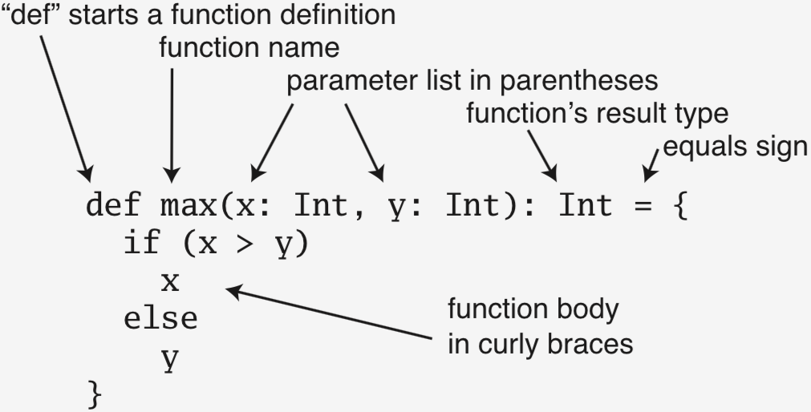

% Scala Functions

## Basic Function Definition




## Functions Return Values

Notice the mandatory = between the "header" and "body" 

```Scala
def double(x: Int): Int = 2 * x
```

- Also notice that you don't need {} if body is single expression

A function that doesn't return a useful value is called a procedure and returns the special value () of type Unit. Style guide says always annotate return type of procedures

```Scala
def say(something: String): Unit = {
  println(something)
}
```

## Local Functions

You can nest functions within functions. Here `iter` can only be called within `facIter`

```Scala
def facIter(n: BigInt): BigInt = {
  def iter(i: BigInt, accum: BigInt): BigInt =
    if (i <= 1) accum
    else iter(i - 1, i * accum)
  require(n >= 0, "Factorial defined for non-negative integers")
  iter(n, 1)
}
```

`require` takes a `Boolean` expression and an optional `String` description. If `Boolean` expression is `false`, throws an `IllegalArgumentException` with the description as the exception message

## Functions are First Class

First class values in a programming language can be

- stored in variables
- passed as arguments to functions, and 
- returned from functions

## Function Literals

Just as other types have literal values, function values can be created with literals

```Scala
val doubleFun: Int => Int = {(x: Int) => {2 * x}}
```

- Notice the type annotation. `doubleFun` is a function with a domain of `Int` and codomain of `Int`

Above is full literal notation. What can be inferred can be left off. Could be written as

```Scala
val doubleFun:Int => Int = x => 2 * x
```
or
```Scala
val doubleFun = (x: Int) => 2 * x
```

## Higher-Order Functions

- A first order function takes non-function value parameters and returns a non-function value
- A higher-order function takes function value parameters or returns a function value
- Function literals are most useful as arguments to higher-order functions `List.filter` takes a function of one parameter of the list's element type and returns a `Boolean`

```Scala
val evens = List(1,2,3,4,5,6,7,8).filter(x => x % 2 == 0)
```

If each parameter appears once in the function literal's body, can use placeholder syntax

```Scala
val evens2 = List(1,2,3,4,5,6,7,8).filter(_ % 2 == 0)
```

## Repeated Parameters

Repeated parameters, or "var-args" parameters, are annotated with a * after the type

```Scala
def max(x: Int, xs: Int*): Int = { xs.foldLeft(x)((x, y) => if (x > y) x else y)
}
```

Must pass a multiple single arguments to a repeated parameter

```Scala
val varArgsMax = max(3, 5, 7, 1)
```

- In application of `max` above, `x` is `3`, `xs` is `Array(5, 7, 1)`

To pass a sequence to a varargs parameter, use `: _*`

```Scala
val seqMax = max(0, List(2, 4, 6, 8, 0): _*)
```

## Functional Function Evaluation

The result of a pure function depends only on its inputs

A pure function is referentially transparent, i.e., a function application can be replaced with the value it produces without changing the meaning of the program

Application of pure functions to their arguments can be understood with the substitution model of evaluation:

1. Evaluate arguments left to right
2. Replace function call with function body, substituting arguments for parameters in body

## Recursive Function Evaluation

```Scala
def fac(n: Int): Int = if (n <= 1) 1 else n * fac(n - 1)
```

Applying the steps of applicative-order evaluation gives:

[5/n]fac(n) ($[v_1/p_1, ...v_n/p_n]expr$ means substitute $v_i$ for $p_i$ in $expr$)

- => fac(5)
- => 5 * fac(4)
- => 5 * 4 * fac(3)
- => 5 * 4 * 3 * fac(2)
- => 5 * 4 * 3 * 2 * fac(1)
- => 5 * 4 * 3 * 2 * 1
- => 5 * 4 * 3 * 2
- => 5 * 4 * 6
- => 5 * 24
- => 120

Notice the expanding-contracting pattern. This mirrors stack usage -- calling `fac` with a large argument will overflow the stack

## Iterative Recursive Functions Evaluation

Recursive calls in tail position are turned into loops (only one stack frame is used). This is called tail call optimization

`facIter` uses an iterative local function whose recursive call is in tail position

```Scala
def facIter(n: BigInt): BigInt = {
  def iter(i: BigInt, accum: BigInt): BigInt =
    if (i <= 1) accum
    else iter(i - 1, i * accum)
  iter(n, 1)
}
```

## Iterative Recursive Functions Evaluation

```Scala
def facIter(n: BigInt): BigInt = {
  def iter(i: BigInt, accum: BigInt): BigInt =
    if (i <= 1) accum
    else iter(i - 1, i * accum)
  iter(n, 1)
}
```

[5/n]facIter(n)

- => iter(5, 1)

[5/i, 1/accum]iter(i, accum)

- => iter(5, 1)
- => iter(4, 5)
- => iter(3, 20)
- => iter(2, 60)
- => iter(1, 120)
- => 120

% Scala Functional Abstraction

## Function Values

Function values, like all values in Scala, are instances of classes.

Function1, ..., Function22 [^1]

[^1] The FunctionN classes and the 22 limit are going away in Scala 3.


## Closures

```Scala
def makeDecorator(
    leftBrace: String,
    rightBrace: String): String => String =
  (middle: String) => leftBrace + middle + rightBrace

val squareBracketer = makeDecorator("[", "]")
```

In the function literal
```Scala
(middle: String) => leftBrace + middle + rightBrace
```

- `middle` is *bound* variable because it's in the parameter list
- `leftBrace` and `rightBrace` are *free* variables

A function literal with only bound variables is called a closed term.

A function literal with free variables is called an open term becuase values for the free variables must be captures from an enclosing environment, thereby *closing* the term.

## Abstractions with Higher-order Functions

::::{.columns}
::: {.column width="40%" valign="top"}

- 

:::
::: {.column width="60%" valign="top"}

```Scala
```

:::
::::

## Partial Application

## Partially Applied Functions

A `def` is not a function value.

```Scala
def dubbel(x: String): String = s"two ${x}s"

// Won't compile because dubbel is not a function value
val wontCompile = dubbel
```

To turn the dubbel method in to a Function value, partially apply it

```Scala
val dubbelFun = dubbel _
```

Don't forget the space between the name of the function and the underscore.

The partial function application above is equivalent to:

```Scala
val dubbelFun = (x: String) => dubbel(x)
```

## Partial Function Short Forms

You can leave off the underscore if target type is a function.  These three are equivalent

```Scala
List("Honey", "Boo", "Boo").foreach(x => print(x))
List("Honey", "Boo", "Boo").foreach(print _)
List("Honey", "Boo", "Boo").foreach(print)
```

- The third example above works because `foreach` takes a function value, so print is lifted to a function (another term for partial function application)

Note that this form is not technically a partially applied function, it's just a short-form of a function literal using placeholder syntax:

```Scala
List("Honey", "Boo", "Boo").foreach(print(_))
```


## Schönfinkeling, a.k.a., Currying

Scala syntax for curried functions: multiple param lists

```Scala
def curry(chicken: String)(howard: String): String =
  s"Love that $chicken from $howard!"
```

Above is equivalent to:

```Scala
def explicitCurry(chicken: String): String => String =
 (howard: String) => s"Love that $chicken from $howard!"
```

You can partially apply second parameter list to get another function

```Scala 
val eleganceFrom = curry("elegence")_
eleganceFrom("provability")
```

## Control Abstraction with Higher-Order Functions

::::{.columns}
::: {.column width="40%" valign="top"}

- 

:::
::: {.column width="60%" valign="top"}

```Scala
```

:::
::::

## By-Name Parameters

::::{.columns}
::: {.column width="40%" valign="top"}

- 

:::
::: {.column width="60%" valign="top"}

```Scala
```

:::
::::

