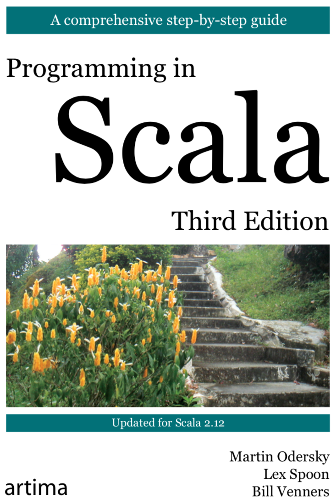

% Scala Implicits
% { height=40% } { height=40% }
% [Programming in Scala, Ch 21](https://www.artima.com/shop/programming_in_scala_3ed), [Scala for the Impatient, Ch 21](http://www.informit.com/store/scala-for-the-impatient-9780134540566)

## The Case for Implicits

- Extending classes that you can't directly modify (like 3rd party libraries)
- Reducing boilerplate

## Three Uses for Implicits in Scala

There are three situations where implicits are used in Scala:

1. conversions to an expected type, 
2. conversions of the receiver of a method, and 
3. implicit parameters.

## Implicit Conversions

Recall our `Rational` class:

```Scala
class Rational(n: Int, d: Int) {
  require(d != 0, "Denominator can't be negative")

  private val g = gcd(n, d)
  val numer: Int = n / g
  val denom: Int = d / g

  override def toString = s"$numer/$denom"

  def +(other: Rational) =
    new Rational(
      this.numer * other.denom + other.numer * this.denom,
      this.denom * other.denom
    )

  private def gcd(a: Int, b: Int): Int =
      if (b == 0) a else gcd(b, a % b)
}
```

## Conversion to an Expected Type

We'd like to be able to do this:

```Scala
oneHalf + 1
```

but the `+` method of `Rational` expects a `Rational`, not an `Int`.  We can tell Scala to automatically convert `Int` values to `Rational` values where needed by importing an implicit conversion function: 

```Scala
implicit def int2Rational(i: Int) = new Rational(i, 1)
```

An implicit conversion function must be marked `implicit` and have a single parameter.

This is similar to conversion constructors in C++, except that in Scala you can tightly control the cases where the conversion is applied.  In particular, Scala implicits follow several rules:

## Rules for Implicits

- **Marking rule:** Only definitions marked implicit are available.
    - The compiler will only change `x + y` to `convert(x) + y` if `convert` is marked as `implicit`.
    
- **Scope rule:** An inserted implicit conversion must be in scope as a *single identifier*, or be associated with the source or target type of the conversion (more later).

- **One-at-a-time rule:** Only one implicit is inserted for a value.
    - The compiler will never rewrite `x + y` to `convert1(convert2(x)) + y`.

- **Explicits-first rule:** Whenever code type checks as it is written, no implicits are attempted.

In addition, implicit conversions trigger a compiler warning.  To silence that warning and express your intent precisely, add `import scala.language.implicitConversions` to any scope in which you want implicit conversions to happen.

## Converting the Receiver of a Method Call

We call the object on which a method is called the *receiver* of the method call.  Here the receiver is an `Int` object:

```Scala
1 + oneHalf
```

The same implicit conversion we wrote earlier works for this case too:

```Scala
implicit def int2Rational(i: Int) = new Rational(i, 1)
```

effectively giving `Int` values a `+(Rational)` method.

## Bringing Implicit Conversions into Scope

Recall:

- **Scope rule:** An inserted implicit conversion must be in scope as a *single identifier*, or be associated with the source or target type of the conversion (more later).

For our `Rational` examples, we could have a function in scope, as the previous examples showed, or we can associate the conversion to the target type (`Rational`) by putting the method in a companion object:

```Scala
object Rational {
  implicit def int2Rational(i: Int) = new Rational(i, 1)
}
```

- Putting the conversion method in the companion object means it will always be available.
- Having a conversion function not associated to the source or target type allows us to explicitly control when the conversion is applied.

## Simulating new syntax

Ever wondered how this works?

```Scala
Map(1 -> "one", 2 -> "two", 3 -> "three")
```

It's not a syntax rule, it's an implicit conversion in the standard library:

```Scala
package scala
  object Predef {
    class ArrowAssoc[A](x: A) {
      def -> [B](y: B): Tuple2[A, B] = Tuple2(x, y)
    }
    implicit def any2ArrowAssoc[A](x: A): ArrowAssoc[A] = new ArrowAssoc(x)
}
```

How is the `Map` object's `apply` method defined?


## Map Objects

Given:

```Scala
package scala
  object Predef {
    class ArrowAssoc[A](x: A) {
      def -> [B](y: B): Tuple2[A, B] = Tuple2(x, y)
    }
    implicit def any2ArrowAssoc[A](x: A): ArrowAssoc[A] = 
      new ArrowAssoc(x)
}
```
```Scala
abstract class GenMapFactory {
  def apply[A, B](elems: (A, B)*) ...
}
```

`Map` construction looks something like:

```Scala
Map(1 -> 'a, 2 -> 'b)
Map(any2ArrowAssoc[Int](1), any2ArrowAssoc[Int](2))
Map(ArrowAssoc(1).->[Symbol]('a), ArrowAssoc(2).->[Symbol]('b))
Map(Tuple2[Int, Symbol](1, 'a), Tuple2[Int, Symbol](2, 'b))
Map[Int, Symbol]((1, 'a), (2, 'b))
```

## Implicit classes

Common to convert a value to an instance of a "rich wrapper" class.  Scala has syntax for this common idiom.

```Scala
case class Rectangle(width: Int, height: Int)

implicit class RectangleMaker(width: Int) {
  def x(height: Int) = Rectangle(width, height)
}
```

automatically generates

```Scala
implicit def RectangleMaker(width: Int) = new RectangleMaker(width)
```

which makes this possible:

```Scala
val myRectangle: Rectangle = 3 x 4 // RectangleMaker(3).x(4)
```

## Implicit Parameters

Given:

```Scala
case class Delimiters(left: String, right: String)

def quote(what: String)(implicit delims: Delimiters) = 
  delims.left + what + delims.right
```

The second parameter list of `quote` is implicit (even with multiple parameters in the second parameter list, only the first is marked `implicit` and all other parameters are also implicit).

We can call `quote` with explicit arguments:

```Scala
quote("Bonjour le monde")(Delimiters("«", "»")) // «Bonjour le monde»
```

But since the second parameter list is implicit, we can reduce biolerplate ...

## Implicit `val`s

Scala will use implicit `val`s in scope to supply arguments to implicit parameters.  Given
 
```Scala
object FrenchPunctuation {
  implicit val quoteDelimiters = Delimiters("«", "»")
}
```

Scala will automically pass `FrenchPunctuation.quoteDelimiters` as an argument if it's in scope:

```Scala
import FrenchPunctuation.quoteDelimiters

quote("Bonjour le monde")
```

Note that we had to import the implicit val as a simple name for it to be available as an implicit argument.

## Context Bounds

Here, the `ordering` parameter provides operations on instances of `T`, which we use explicitly here:

```Scala
def smaller[T](a: T, b: T)(implicit ordering: Ordering[T]) =
  if (ordering.lt(a, b)) a else b
```

Scala provides a function for explicitly retrieving an implicit value:

```Scala
def implicitly[T](implicit t: T) = t
```

So we can explicitly retrieve the implicit argument:

```Scala
def smaller2[T](a: T, b: T)(implicit ordering: Ordering[T]) =
  if (implicitly[Ordering[T]].lt(a, b)) a else b
```

Since the name of the argument doesn't matter, we can use a context bound and leave off the implicit parameter:

```Scala
def smaller3[T : Ordering](a: T, b: T) =
  if (implicitly[Ordering[T]].lt(a, b)) a else b
```

`T : Ordering` is a  context bound, and it means there must be an implicit `Ordering[T]` in scope to use `smaller3`.

## Type Classes

`Ordering` is an example of a *type class*.  This term comes from Haskell, and is not like a class in OOP.

- A type class defines some behavior.
- A type "joins" the type class by providing an implicit conversion to the type class.

(Note: this is simplified from the [standard library](https://github.com/scala/scala/blob/v2.12.8/src/library/scala/math/Ordering.scala#L1) for clarity.)

```Scala
trait Ordering[T] extends Comparator[T] {
  def compare(x: T, y: T): Int
  override def lt(x: T, y: T): Boolean = compare(x, y) < 0
}
object Ordering {
  def apply[T](implicit ord: Ordering[T]) = ord
  implicit object IntOrdering extends Ordering[Int] {
    def compare(x: Int, y: Int) = java.lang.Integer.compare(x, y)
  }
}
```

Type classes allow us to extend existing classes without resorting to inheritance.

## Case Study: Play! JSON Library

The Play! Framework includes a JSON library that you can use in any application.  Just add the dependency to your `build.sbt` (update Play! version from 2.7.3 if necessary):

```Scala
libraryDependencies += "com.typesafe.play" %% "play-json" % "2.7.3"
```

The play-json library includes parsing, validating, serializing, and converting between Scala objects and `JsValue`s.  We'll take a look at the conversion features, which rely on implicits.

- See [Play! JSON Basics](https://www.playframework.com/documentation/2.7.x/ScalaJson) for more details.

## JSON Strings

JSON (JavaScript Object Notation) has become a popular data exchange format.  Indeed most web applications and many web services exchange data between the server and client using JSON strings.  Here's an example:

```JSON
{
  "name" : "Watership Down",
  "location" : {
    "lat" : 51.235685,
    "long" : -1.309197
  },
  "residents" : [ {
    "name" : "Fiver",
    "age" : 4,
    "role" : null
  }, {
    "name" : "Bigwig",
    "age" : 6,
    "role" : "Owsla"
  } ]
}
```


## JSON Parsing

Of course, play-json provides easy JSON parsing:

```Scala
import play.api.libs.json._

val json: JsValue = Json.parse("""
  {
    "name" : "Watership Down",
    "location" : {
      "lat" : 51.235685,
      "long" : -1.309197
    },
    "residents" : [ {
      "name" : "Fiver",
      "age" : 4,
      "role" : null
    }, {
      "name" : "Bigwig",
      "age" : 6,
      "role" : "Owsla"
    } ]
  }
  """)
```

But it's more instructive for us to look at how `JsValue`s are created and serialized.

## `JsValues`

You can create a `JsValue` that represents the JSON on the previous slide using the constructor directly:

```Scala
import play.api.libs.json._

val json: JsValue = JsObject(Seq(
  "name" -> JsString("Watership Down"),
  "location" -> JsObject(Seq("lat" -> JsNumber(51.235685), "long" -> JsNumber(-1.309197))),
  "residents" -> JsArray(IndexedSeq(
    JsObject(Seq(
      "name" -> JsString("Fiver"),
      "age" -> JsNumber(4),
      "role" -> JsNull
    )),
    JsObject(Seq(
      "name" -> JsString("Bigwig"),
      "age" -> JsNumber(6),
      "role" -> JsString("Owsla")
    ))
  ))
))
```

## `JsValue` Implicit Conversions

The previous example can be rewritten without the `JsValue` constructors by relying on implicit conversions in the companion objects:

```Scala
import play.api.libs.json.{ JsNull, Json, JsString, JsValue }

val json: JsValue = Json.obj(
  "name" -> "Watership Down",
  "location" -> Json.obj("lat" -> 51.235685, "long" -> -1.309197),
  "residents" -> Json.arr(
    Json.obj(
      "name" -> "Fiver",
      "age" -> 4,
      "role" -> JsNull
    ),
    Json.obj(
      "name" -> "Bigwig",
      "age" -> 6,
      "role" -> "Owsla"
    )
  )
)
```

## Implicit Conversion in `Json` Object

```Scala
object Json extends JsonFacade {
  implicit def toJsFieldJsValueWrapper[T](field: T)(implicit w: Writes[T]): JsValueWrapper = 
    JsValueWrapperImpl(w.writes(field))
}
```

In `Writes` you find typeclasses that extend the basic types in Scala with the ability to be converted to `JsValue`s:

```Scala
trait DefaultWrites extends LowPriorityWrites {
  /**
   * Serializer for Int types.
   */
  implicit object IntWrites extends Writes[Int] {
    def writes(o: Int) = JsNumber(o)
  }
  /**
   * Serializer for String types.
   */
  implicit object StringWrites extends Writes[String] {
    def writes(o: String) = JsString(o)
  }
  // and many more ...
}
``` 

## Leveraging the JSON Typeclass Design

Say you have a `Resident` class:

```Scala
case class Resident(name: String, age: Int, role: Option[String])
```

If you write a typeclass for `Resident`:

```Scala
implicit val residentWrites = new Writes[Resident] {
  def writes(resident: Resident) = Json.obj(
    "name" -> resident.name,
    "age" -> resident.age,
    "role" -> resident.role
  )
}
```

Then you can do:

```Scala
val resident = Resident(...)
val residentJsValue = Json.toJson(resident)
```

Beacuse the signature of `Json.toJson` is:

```Scala
def toJson[T](o: T)(implicit tjs: Writes[T]): JsValue = tjs.writes(o)
```

## Embedded DSLs in Scala

If you import the syntax combinator library you can write your typeclass like this:

```Scala
import play.api.libs.json._
import play.api.libs.functional.syntax._

implicit val residentWrites: Writes[Resident] = (
  (JsPath \ "name").write[String] and
  (JsPath \ "age").write[Int] and
  (JsPath \ "role").writeNullable[String]
)(unlift(Resident.unapply))
```


