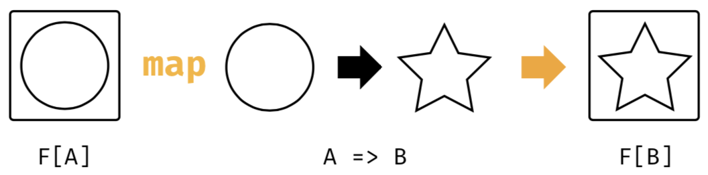

% Monads in Scala

## Functors

A *functor* is a container type that supports `map`ping over its contents.

{height=40%}[^scala-cats]

`List` is functor:

```Scala
List(1, 2, 3).map((x: Int) => x.toString) == List("1", "2", "3")
```

As a conceptual exercise, we could represent functor with a type:

```Scala
trait Functor[T] {
  def map[U](f: T => U): Functor[U]
}
```

[^scala-cats]: [Scala with Cats](https://underscore.io/books/scala-with-cats/)

## Option

`Option` is also a functor:

```Scala
Some(1).map(x => x.toString) == Some(1)
None.map(x => x.toString) == None
```

We usually first learn `map` in the context of collections.  

```Scala
List(1, 2, 3).map((x: Int) => x.toString) == List("1", "2", "3")
```

Think of `map` more generally:

- Given a functor that contains one or more values of type `A` -- `List[A]`, `Option[A]`, etc 
- and a function `f: A => B`, 

`map` applies `f` to the contained value(s) to produce a container of the same type with value(s) of type `B`. 
 
## Nested Container Structure

What if we have a function that transforms an `A` into a `Container[B]` for some container type?

```Scala
def toInt(s: String): Option[Int] = {
  try {
    Some(s.toInt)
  } catch {
    case _: Throwable => None
  }
}
```

Then:

```Scala
Some("1").map((s: String) => toInt(s)) == Some(Some(1))
Some("one").map((s: String) => toInt(s)) == Some(None)
```

## `flatMap`

`flatMap` is like `map` but

- takes a function of the form `f: A => Container[B]` and
- removes one level of nesting.

```Scala
Some("1").flatMap((s: String) => toInt(s)) == Some(1)
Some("one").flatMap((s: String) => toInt(s)) == None
```
 
Again, we typically encounter `flatMap` in the context of collections:

```Scala
List("RESPECT").map(_.toCharArray) == List(Array("R", "E", "S", "P", "E", "C", "T"))
List("RESPECT").flatMap(_.toCharArray) == List("R", "E", "S", "P", "E", "C", "T")
```

But the concept is more general (and in the context of monads is called *bind* in FP/category theory). 

## Monad Definition

In Scala a monad can be conceptualized in the type:

```Scala
trait Monad[T] {
  def flatMap[U](f: T => Monad[U]): Monad[U]
}

def unit[T](x: T): Monad[T]
```

In addition, a monad must satisfy these algebraic laws:

- Associativity

```Scala
m.flatMap(f).flatMap(g) == m.flatMap(x => f(x).flatMap(g))
```

- Left unit

```Scala
unit(x).flatMap(f) == f(x)
```

- Right unit

```Scala
m.flatMap(unit) == m
```

## Aside: Clearer Associativity

It's a bit hard to see that

```Scala
m.flatMap(f).flatMap(g) == m.flatMap(x => f(x).flatMap(g))
```

is an associativity law.  For monoids it was much simpler:

```Scala
op(op(x, y), z) == op(x, op(y, z)
```

We can use a concept from category theory called *Kleisli composition* to make it clearer.  Kleisli arrows, i.e., monadic functions like `A => F[B]`:

```Scala
def compose[A,B,C](f: A => F[B], g: B => F[C]): A => F[C]
```

Using Kleisli composition the Monad associativity law can be written as

```Scala
compose(compose(f, g), h) == compose(f, compose(g, h))
```

## Monads in the Scala Standard Library

We already know that there are several monads in the Scala standard library, e.g.:

- `List`
- `Set`
- `Option`

But there are several other types that Support `map` and `flatMap` operations, e.g.:

- `Try`
- `Future`

These aren't monads because they don't obey all of the monad laws, so why do they bother implementing `map` and `flatMap`?

## Scala `for` Loops

Recall Scala's `for` construct:

```Scala
for (i <- 1 to 5) {
  val dub = i * 2
  println(dub)
}
```

- `i <- coll` is a generator expression.  `i` is a new val successively assigned values from `coll` in each iteration.


Any container type with a `foreach` method can be used in the imperative `for` loop.  These are equivalent:

```Scala
Some(1).foreach(println)
for (x <- Some(1)) println(x)
``` 

## Scala `for` Comprehensions

Any container type with a `map` method can be used in a single-generator `for` comprehension.  These are equivalent:

```Scala
Some(1).map(_ + 1)
for (x <- Some(1)) yield x + 1
```

Any container type with a `flatMap` method can be used in a mulitple-generator `for` comprehension.  These are equivalent:

```Scala
val sum = for {
    a <- toInt("1")
    b <- toInt("2")
    c <- toInt("3")
} yield a + b + c
sum == Some(6)
```

## De-Sugaring `for` Comprehensions

Scala's `for` is actually syntax sugar for higher-order methods on container types.

```Scala
for {
    a <- toInt("1")
    b <- toInt("2")
    c <- toInt("3")
} yield a + b + c
```

Is converted by the Scala compiler to:

```Scala
toInt("1").flatMap(a => 
  toInt("2").flatMap(b => 
    toInt("3").map(c => 
      a + b + c)))
```

Most people find the `for` comprehension syntax (which is inspired by Haskell's do-notation) much clearer.

## `Try`

Remember `Try`?

```Scala
import scala.util.Try
import scala.io.StdIn.readLine

val answer = for {
  x <- Try { readLine("x: ").toInt }
  y <- Try { readLine("y: ").toInt }
} yield x + y
```

## More ...

to come.
