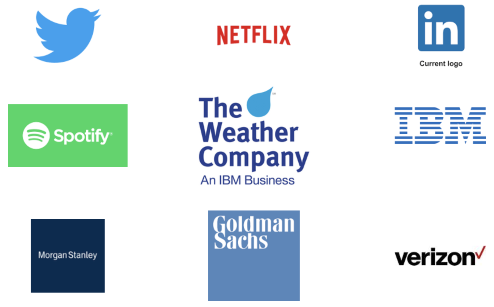

% Introduction to CS2340

## Modern Software Engineering

- Process
    - Requirements analysis
    - Process paradigms (waterfall vs. iterative/agile)
    - Scrum

- Practices
    - Team development
    - Version control
    - Testing

## Modern Software Design

- Object-oriented design
    - SOLID principles
    - Design patterns

- Functional design
    - Monoids, monads, applicative and traversable functors
    - Lazy evaluation
    - Functional state

- Domain-driven design
- Software architecture

## Scala!

- New to CS2340 in 2019
- Builds on Java -- don't worry
- We'll also level-up in Java
- Programming assignments will be done in Scala

## Why Scala?

- Learning opportunities
    - Fusion of object-oriented and functional programming
    - Advanced static type system
    - Wide array of language features enabling many design paradigms (OO, functional, reactive, DSLs)

## Why Scala?

{height=70%}

And more every day ...

## Why Scala?

{height=40%}

[Spark](http://spark.apache.org/) is the darling of the Big Data world.  Spark is written in Scala.

## Why Scala?

::::{.columns}
::: {.column width="40%" valign="top"}

- Scala has been the top-paying language in the U.S. for several years.
- Notice that the top four are all FP languages.

:::
::: {.column width="60%" valign="top"}

 
:::
::::

[https://insights.stackoverflow.com/survey/2018/#top-paying-technologies](https://insights.stackoverflow.com/survey/2018/#top-paying-technologies)

## Course Logistics

- Syllabus
- Schedule
- Project
- Getting started
- HW0
