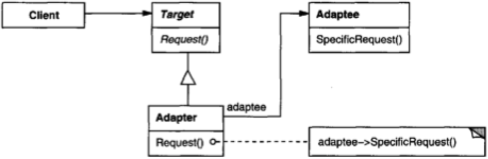
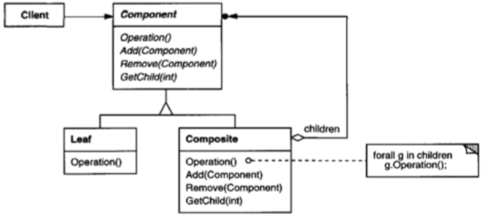
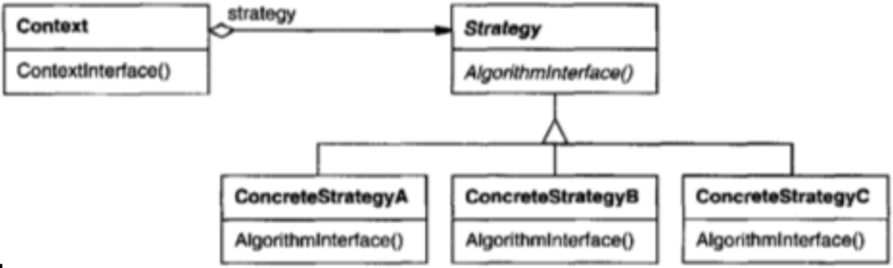

% Object-Oriented Design Patterns

 
## Design Patterns

::::{.columns}
::: {.column width="40%" valign="top"}


:::
::: {.column width="60%" valign="top"}

Recurring object-oriented designs.

- Make proven techniques more accessible to developers of new systems – don’t have to study other systems.
- Helps in choosing designs that make the system more reusable.
- Facilitate documenentation and communication with other developers.

:::
::::

Design pattern catalog: descriptions of communicating objects and classes that are customized to solve a general design problem in a particular context.

 
## Elements of Design Patterns

- The **pattern name** is a handle we can use to describe a design problem, its solutions, and consequences in a word or two.
- The **problem** describes when to apply the pattern.
- The **solution** describes the elements that make up the design, their relationships, responsibilities, and collaborations. The pattern provides an abstract description of a design problem and how a general arrangement of classes and objects solves it.
- The consequences are the results and trade-offs of applying the pattern.

 
## How Design Patterns Solve Design Problems

- Finding appropriate objects
- Determining object granularity
- Specifying object interfaces
- Specifying object implementations

 
## Types versus Classes

Class versus interface inheritance

- An object’s class defines how the object is implemented.
    - Class inheritance defines an object’s implementation in terms of another object’s implementation.

- An object’s type refers to its interface – the set of methods it can respond to.
    - Interface inheritance is subtyping. It describes when an object can be used in place of another.

> Program to an interface, not an implementation.

 
## Reuse Mechanisms

Inheritance versus composition

- Inheritance: “White box reuse” – subclass reuses details of superclass and extends with new functionality
    - Defined at compile-time.
    - Straightforward to use
    - "Inheritance breaks encapsulation" (superclass implementation exposed to subclasses)
    - Reuse can be difficult in new contexts – may require rewriting superclasses or carrying baggage.

- Composition: “Black-box reuse” – new functionality obtained by composing objects of other objects
    - Defined at run-time by objects acquiring references to other objects. 
    - Must program to interfaces, so interfaces must be well thought-out and stable.
    - Emphasis on interface stability encourages granular objects with single responsiblities.

> Favor object composition over class inheritance.
   
## Designing for Change

Common causes of redesign (and design patterns that address them):

- Creating an object by specifying a class explicitly. (Factory)
- Dependence on specific operations. (Command)
- Dependence on hardware and software platform. (Factory, Bridge).
- Dependence on object representations or implementations (Factory, Bridge, Proxy).
- Algorithmic dependencies. (Visitor, Iterator, Strategy, Template Method)
- Tight coupling. Design patterns: (Factory, Bridge, Command, Facade, Mediator, Observer).
- Extending functionality by subclassing. (Bridge, Chain of Responsibility, Composite, Decorator, Observer, Strategy)
- Inability to alter classes conveniently. (Adapter, Decorator, Visitor)

 
## Selecting a Design Pattern

- Consider how design patterns solve design problems.
- Scan Intent sections. Read through each pattern’s intent to find one or more that sound relevant to your problem.
- Study how patterns interrelate. Studying these relationships can help direct you to the right pattern or group of patterns.
- Study patterns of like purpose.
- Examine a cause of redesign, look at the patterns that help you avoid the causes of redesign.
- Consider what should be variable in your design. 

    - This approach is the opposite of focusing on the causes of redesign. 
    - Instead of considering what might force a change to a design, consider what you want to be able to change without redesign. 
    - The focus here is on encapsulating the concept that varies, a theme of many design patterns.
  
 
## Using Design Patterns (1 of 2)

- Read the pattern once through for an overview.
- Go back and study the Structure, Participants, and Collaborations sections. Make sure you understand the classes and objects in the pattern and how they relate to one another.
- Look at Sample Code to see a concrete example of the pattern in code.
- Choose names for pattern participants that are meaningful in the application context. OK to use abstract participant names from design pattern. For example, if you use the Strategy pattern for a text compositing algorithm, then you might have classes SimpleLayoutStrategy or TeXLayoutStrategy.

## Using Design Patterns (2 of 2)

- Define the classes. Declare their interfaces, establish their inheritance relationships, and define the instance variables that represent data and object references. Identify existing classes in your application that the pattern will affect, and modify them accordingly.
- Define application-specific names for operations in the pattern. Use the responsibilities and collaborations associated with each operation as a guide. Be consistent in your naming conventions. For example, you might use the "Create-" prefix consistently to denote a factory method.
- Implement the operations to carry out the responsibilities and collaborations in the pattern. The Implementation section from a pattern catalog and sample code offers hints to guide you in the implementation.

 
## Common Design Patterns

- **Abstract Factory** Provide an interface for creating families of related or dependent objects without specifying their concrete classes. (GoF, 87)
- **Factory Method** Define an interface for creating an object, but let subclasses decide which class to instantiate. Factory Method lets a class defer instantiation to subclasses. (GoF, 107)
- **Adapter** Convert the interface of a class into another interface clients expect. Adapter lets classes work together that couldn’t otherwise because of incompat ible interfaces. (GoF, 139)
- **Composite** Compose objects into tree structures to represent part-whole hierarchies. Composite lets clients treat individual objects and compositions of objects uniformly. (GoF, 163)

 
## Common Design Patterns

- **Decorator** Attach additional responsibilities to an object dynamically. Decorators provide a flexible alternative to subclassing for extending functionality. (GoF, 175)
- **Observer** Define a one-to-many dependency between objects so that when one object changes state, all its dependents are notified and updated automatically. (GoF, 293)
- **Strategy** Define a family of algorithms, encapsulate each one, and make them interchangeable. Strategy lets the algorithm vary independently from clients that use it. (GoF, 315)
- **Template Method** Define the skeleton of an algorithm in an operation, deferring some steps to subclasses. Template Method lets subclasses redefine certain steps of an algorithm without changing the algorithm’s structure. (GoF, 325)

## Creational Design Patterns

Abstracts the instantiation process.

- Encapsulate knowledge about which concrete classes the system uses.
- Hide how instances of these classes are created and put together.
 
## Abstract Factory

**Intent:** Provide an interface for creating families of related or dependent objects without specifying their concrete classes. 

**Structure:**

**Participants**

- **AbstractFactory** declares an interface for operations that create abstract product objects.
- **ConcreteFactory** implements the operations to create concrete product objects.
- **AbstractProduct** declares an interface for a type of product.
- **ConcreteProduct** defines a product object to be created by the corresponding concrete factory; implements the AbstractProduct interface.
 

## Abstract Factory Example: `java.sql.Connection`

```Java

public interface Connection ... {
    public Blob createBlob();
    public Statement createStatement();
    public PreparedStatement prepareStatement();
    ...
}
```

- The `Connection` interface has factory methods for a family of related classes.
- A particular `Connection` instance would return database-specific implementations of `Statement`, etc.

```Java
String URL = "jdbc:oracle:thin:username/password@amrood:1521:EMP";
Connection conn = DriverManager.getConnection(URL);
```
 
## Factory Method (a.k.a. Virtual Constructor)

**Intent:** Define an interface for creating an object, but let subclasses decide which class to instantiate. Factory Method lets a class defer instantiation to subclasses.

**Structure:**

**Participants:**

- **Product** defines the interface of objects the factory creates. ConcreteProduct implements the Product interface.
- **Creator** declares the factory method, which returns an object of type Product.
- **ConcreteCreator** overrides factory method to return a ConcreteProduct object.
  
 
## Factory Method Example: Active Records (1 of 4)

Say we have a solution domain object that represents a problem domain entity:

```Java
public class Person {
    protected final int id;
    protected String name;
    public Person(int id, String name) {
        this.id = id;
        this.name = name;
    }
    public int getId() { return id; }
    public String getName() { return name; }
    public void setName(String name) { this.name = name; }
}
```

How can we add persistence capability in an abstract way so that we can swap out different persistence implementations (database, etc.)?
 
## Factory Method Example: Active Records (2 of 4)

Active Records are objects that know how to store and retrieve themselves from a data store. The simplest implementation of an ActiveRecord uses an abstract class:

```Java
public abstract class ActivePerson extends Person {
    public ActivePerson(int id, String name) {
        super(id, name);
    }
    public abstract Person createNew(String name);
    public abstract Person findById(int id);
    public abstract void save();
}
```

`ActivePerson` extends `Person` with persistence capabilities. Now applications that use a particular data store can sublcass `ActivePerson` and implement data store-specific versions of these persistence methods.
 
## Factory Method Example: Active Records (3 of 4)

Here’s a subclass of `ActivePerson` that uses a HashMap:

```Java
public class HashMapPerson extends ActivePerson {
    private static HashMap<Integer, Person> persons = new HashMap<>();
    private static int lastUsedId = 0;
    protected HashMapPerson(int id, String name) {
        super(id, name);
    }
    public Person createNew(String name) {
        Person newPerson = new HashMapPerson(lastUsedId++, name);
        persons.put(newId, newPerson);
        return newPerson;
    }
    public Person findById(int id) {
        return persons.get(id);
    }
    public void save() {
        // nothing to do - client has alias to object in HashMap
    } 
}
``` 

## Factory Method Example: Active Records (4 of 4)

Benefits of using `ActivePerson`:

- A `MySQLPerson` would implement MySQL-specific code that maps relational database reperesentations of objects to their Java object counterparts.
- Application is coded to `ActivePerson` interface so versions of `ActivePerson` that use different data stores can be swapped out by changing only the client code that instantiates the `ActivePerson` objects.
- You could put all of your active record-instantiating code in an Abstract Factory or a registry (which could be a singleton) so there’s only one place to make this change for all kinds of peristed objects.

There are other ways of doing this, but active records are easy to understand. Object-relational mapping and data store frameworks use these concepts.

 
## Implementing Factories with Reflection

Reflection is an advanced Java programming technique often used to implement factories. Consider:

```Java
MyClass instance = new MyClass();
```

You can also do this with reflection:

```Java
MyClass instance = (MyClass) Class.forName("MyClass").newInstance();
```

You can store the string "MyClass" in a properties file, which could be changed without changing any code. Take a  look at greeter for a simple but complete example of this technique.

## Singleton

**Intent:** Ensure a class only has one instance, and provide a global point of access to it.

**Structure**

{height=25%}

**Participants**

- **Singleton** defines an Instance operation that lets clients access its unique instance.
- **Instance** is a class operation (that is, a class method in Smalltalk and a static member function in C++, or static method in Java). May be responsible for creating its own unique instance.
 
## Singleton Example: java.text.NumberFormat

Remember NumberFormat from CS 1331?

```Java
public abstract class NumberFormat extends Format  {
    protected NumberFormat() {}
    public final static NumberFormat getInstance() { ... }
    public static NumberFormat getInstance(Locale inLocale) { ... }
    ... 
}
```

- `NumberFormat` instance is instantiated once; this instance is shared by all users of NumberFormat 

- `getInstance()` is also a factory method: creates a NumberFormat instance for a particular Locale
 
## Implementing a Singleton

Three things to make a singleton:

- hide constructor,
- store singleton instance in some cache, 
- provide public access to singleton instance.

A minimum example:

```Java
public class MySingleton {
    protected static instance;
    // Hidden with private visibility - can only instantiate inside
    private MySingleton() {}
    
    public static MySingleton getInstance() {
        if (instance == null) {
            instance = new MySingleton();
        }
        return instance; 
    }
    
}
```
 
## Structural Design Patterns

Concerned with how classes and objects are composed to form larger structures.

- Structural class patterns use inheritance to compose interfaces or implementations.

- Rather than composing interfaces or implementations, structural object patterns describe ways to compose objects to realize new functionality.
    - The added flexibility of object composition comes from the ability to change the composition at run-time, which is impossible with static class/interface composition.
 
## Adapter (A.K.A Wrapper)

**Intent:** Convert the interface of a class into another interface clients expect. Adapter lets classes work together that couldn’t otherwise because of incompatible interfaces.

**Structure**

{height=25%}

**Participants**

- **Target** defines the domain-specific interface that Client uses. 
- **Client** collaborates with objects conforming to the Target interface. 
- **Adaptee** defines an existing interface that needs adapting. 
- **Adapter** adapts the interface of Adaptec to the Target interface.
 
## Adapter Example

Imagine we’re a team writing an application that will use a hardware transmitter, but the transmitter’s software is handled by another team that hasn’t defined their software interface.

- We can define our own interface the way we want it to work. 
- While we’re waiting for the transmitter team, we create a fake implementation to work with.
- When the transmitter team finally gives us their interface, we can write an adapter to fit it to our interface.
- The rest of our code is unaffected.
 
{height=25%}
 
## Composite

**Intent:** Compose objects into tree structures to represent part-whole hierarchies. Composite lets clients treat individual objects and compositions of objects uniformly.

**Structure**

{height=20%}

**Participants**

- **Component** declares the interface for objects in the composition. 
- **Leaf** represents leaf objects (objects with no children). 
- **Composite** defines behavior for components having children; stores child components; implements child-related operations. 
- **Client** manipulates objects in the composition through the Component interface.
 
## Composite Example: Dive Log (1 of 3)

Say we have a dive log with individual dives. Both represent the concept of dive experience, so we can represent this concept abstractly which allows us to get reports of dive experience in a uniform way whether we have a single dive or a log of several dives:

```Java
public interface DiveExperience {
    public Date getDateTimeBegin();
    public Date getDateTimeEnd();
    public int getMaxDepthFeet();
    public int getBottomTimeMinutes();
}
```

This interface plays the Component role in the composite pattern.
 
## Composite Example: Dive Log (2 of 3)

Dive plays the Leaf role:

```Java
public class Dive implements DiveExperience, Comparable<Dive> {
    private Date dateTimeBegin, dateTimeEnd;
    private int maxDepthFeet, bottomTimeMinutes;
    public Dive(Date dateTimeBegin, Date dateTimeEnd,
                int maxDepthFeet, int bottomTimeMinutes) {
        this.dateTimeBegin = dateTimeBegin;
        // ...
    }
    public Date getDateTimeBegin() **return dateTimeBegin; **
    public Date getDateTimeEnd() ** return dateTimeEnd; **
    public int getMaxDepthFeet() ** return maxDepthFeet; **
    public int getBottomTimeMinutes() ** return bottomTimeMinutes; **
    public int compareTo(Dive other) {
        return this.getDateTimeBegin().
                 compareTo(other.getDateTimeBegin());
    }
    public boolean equals(Object other) ** .. **
    public int hashCode() ** ... **
}
```

## Composite Example: Dive Log (3 of 3)

And DiveLog plays the Composite role:

```Java
public class DiveLog implements DiveExperience {
    private TreeSet<Dive> dives = new TreeSet<Dive>();
    private int maxDepthFeet = 0;
    public void add(Dive dive) {
        dives.add(dive);
        if (dive.getMaxDepthFeet() > maxDepthFeet)
            maxDepthFeet = dive.getMaxDepthFeet();
    }
    public Date getDateTimeBegin() {
        return dives.first().getDateTimeBegin();
    }
    public Date getDateTimeEnd() {
        return dives.last().getDateTimeEnd();
    }
    public int getMaxDepthFeet() { return maxDepthFeet; }
    public int getBottomTimeMinutes() {
        int sum = 0;
        for (Dive dive: dives) {
            sum += dive.getBottomTimeMinutes();
        }
        return sum; 
    }
}
```
   
## Decorator

**Intent:** Attach additional responsibilities to an object dynamically. Decorators provide a flexible alternative to subclassing for extending functionality.

**Structure**

{height=25%}

**Participants**

- **Component** defines the interface for objects that can have responsibilities added to them dynamically. 
- **ConcreteComponent** defines an object to which additional responsibilities can be attached.
- **Decorator** maintains a reference to a Component object and defines an interface that conforms to Component’s interface.
 
## Decorator Example: JScrollPane

The Swing library provides a scrollbar decorator called `JScrollPane`. Using it is easy:

```Java
add(new JScrollPane(new JList(...)));
```

By simply wrapping our `JList` in a `JScrollPane` the list will show horizontal and vertical scroll bars as needed.

{height=25%}

We’ve extended the functionality of a `JList` without having to subclass it.

## Behavioral Design Patterns

Behavioral patterns are concerned with algorithms and the assignment of responsibilities between objects. These patterns characterize complex control flow that’s difficult to follow at run-time. They shift your focus away from flow of control to let you concentrate just on the way objects are interconnected.

- Behavioral class patterns use inheritance to distribute behavior between classes. (Template Method)

- The Strategy (315) pattern encapsulates an algorithm in an object. Strategy makes it easy to specify and change the algorithm an object uses.
 
Behavioral object patterns use object composition rather than inheritance. 

## Observer (a.k.a. Dependents, Publish-Subscribe)

**Intent:** Define a one-to-many dependency between objects so that when one object changes state, all its dependents are notified and updated automatically.

**Structure**

{height=25%}

**Participants**

- **Subject** knows its observers.
- **Observer** defines a notification interface for objects that should be notified of changes in a subject.
- **ConcreteSubject** sends a notification to its observers when its state changes.
- **ConcreteObserver** implements Observer notification interface.
 
## Observer Example: Swing Buttons

`javax.swing.AbstractButton` is a Subject, `javax.swing.JButton` is a ConcreteSubject. We set up an exit button like this:

```Java
JButton exitButton = new JButton("Exit");
exitButton.addActionListener(new ExitListener());
```

JButton’s `addActionListener` method takes an object that implements the java.awt.event.ActionListener interface:

```Java
public interface ActionListener extends EventListener {
    /**
     * Invoked when an action occurs.
    */
    public void actionPerformed(ActionEvent e);
}
```

`java.awt.event.ActionListener` is an Observer, and `ExitListener` is a ConcreteObserver.
 
## Command (a.k.a. Action, Transaction)

**Intent:** Encapsulate a request as an object, thereby letting you parameterize clients with different requests, queue or log requests, and support undoable operations.

**Structure**

{height=25%}

**Participants**

- **Command** declares an interface for executing an operation.
- **ConcreteCommand** defines a binding between a Receiver object and an action; implements Execute by invoking the corresponding operation(s) on Receiver.
- **Client** creates a ConcreteCommand object and sets its receiver. Invoker asks the command to carry out the request.
- **Receiver** knows how to perform the operations associated with carrying out a request. Any class may serve as a Receiver.

See colorbox for an example of an undoable command.
 
## Iterator (a.k.a. Cursor)

**Intent:** Provide a way to access the elements of an aggregate object sequentially without exposing its underlying representation.

**Structure**

{height=25%}

**Participants**

- **Iterator** defines an interface for traversing elements. 
- **Concretelterator** implements the Iterator interface; keeps track of the current position in the traversal of the aggregate.
- **Aggregate** defines an interface for creating an Iterator object. 
- **ConcreteAggregate** implements the Iterator creation interface to return an instance of the proper Concretelterator.
 
## Iterator Example: BST Traversal (1 of 2)

Binary tree implemented as linked nodes:

```Java
public class BinaryTree<E extends Comparable<E>> implements
    Iterable<E> {
    private class Node<E> {
        E item;
        Node<E> left;
        Node<E> right;
        Node(E item, Node<E> left, Node<E> right) {
            this.item = item;
            this.left = left;
            this.right = right;
    } 
}
...
    private Node<E> root;
...
```

We’d like to allow clients to traverse a BST in a uniform way whether traversing in-order, pre-order, or post-order.

 
## Iterator Example: BST Traversal (2 of 2)

`java.util.Iterator` interface provides a uniform way to traverse all Java collections. Here’s an implementation for BST:

```Java
private class InOrder<E> implements Iterator<E> {
  private Node<E> curNode;
  private Stack<Node<E>> fringe;
  public InOrder(Node<E> root) {
    curNode = root;
    fringe = new LinkedStack<>();
  }
  public boolean hasNext() { ... }
  public E next() {
    while (curNode != null) {
      fringe.push(curNode);
      curNode = curNode.left;
    }
    curNode = fringe.pop();
    E item = curNode.item;
    curNode = curNode.right;
    return item;
  }
  public void remove() { throw new UnsupportedOperationException(); }
}
```
                             
## Strategy (a.k.a. Policy)

**Intent:** Define a family of algorithms, encapsulate each one, and make them interchangeable. Strategy lets the algorithm vary independently from clients that use it.

**Structure**

{height=20%}

**Participants**

- **Strategy** declares an interface common to all supported algorithms.
- **ConcreteStrategy** implements the algorithm using the Strategy interface.
- **Context** is configured with a ConcreteStrategy object; maintains a reference to a Strategy object; may define an interface that lets Strategy access its data.

 
## Strategy Example: Repetitive Dives (1 of 4)

When we breath air at depth the increased pressure causes nitrogen to dissolve into body tissues. In SCUBA diving one must be mindful of resudual nitrogen in the body absorbed during a dive.

- On repetitive dives residual nitrogen limits the depth and time allowed on subsequent dives before decompression is required.
- The residual nitrogen in a diver’s body is represented by a “pressure group” named by a single letter.
- There are many different ways to calcuate this pressure group: PADI’s dive tables, NAUI’s dive tables, the U.S. Navy dive tables, and so on.
- These tables different strategies for calculating pressure groups.
 
## Strategy Example: Repetitive Dives (2 of 3)

We can represent the general **Strategy** for calculating pressure group ofr repetitive dives as an interface:

```Java
public interface DiveTable {
    public void addDives(SortedSet<Dive> dives);
    public String calculatePressureGroup();
}
```

The PADI table is an example of a **ConcreteStrategy**:

```Java
public class PadiDiveTable implements DiveTable {
    private SortedSet<Dive> dives;
    public void addDives(SortedSet<Dive> dives) {
        this.dives = dives;
    }
    public String calculatePressureGroup() {
      // calculate using PADI’s dive table.
    } 
}
```
   
## Strategy Example: Repetitive Dives (3 of 3)

The Context in which a DiveTable strategy is used is RepetitiveDives:

```Java
public class RepetitiveDives {
    private TreeSet<Dive> dives = new TreeSet<Dive>();
    public void add(Dive dive) {
        dives.add(dive);
    }
    public String calculatePressureGroup(DiveTable diveTable) {
        diveTable.addDives(dives);
        return diveTable.calculatePressureGroup();
    }
}
```

And if we have an instance of RepetitiveDives we can calucate the ending pressure group with any concrete strategy:

```Java
repetitiveDives.calculatePressureGroup(new PadiDiveTable());
// or
repetitiveDives.calculatePressureGroup(new NauiDiveTable());
// and so on ...
```
 
## Template Method

**Intent:** Define the skeleton of an algorithm in an operation, deferring some steps to subclasses. Template Method lets subclasses redefine certain steps of an algorithm without changing the algorithm’s structure.

**Structure** 

{height=20%}

**Participants**

- **AbstractClass** defines abstract primitive operations that concrete subclasses define to implement steps of an algorithm; implements a template method defining the skeleton of an algorithm. The template method calls primitive operations.
- **ConcreteClass** implements the primitive operations to carry out subclass-specific steps of the algorithm.
 
## Template Method Example: Q Learning Agent

```Scala
class TabularQLearner[WS, MS, A] extends Learner ... {
  override def observe(worldState: WS, action: A, worldNextState: WS) ={
    observe(worldState, action, worldNextState)
    val state: MS = moduleState(worldState)
    val nextState: MS = moduleState(worldNextState)
    val r = reward(nextState)
    val maxAction = calcMaxAction(nextState)
    val newVal = q((state, action)) + alpha *
      (r + gamma * q((nextState, maxAction)) - q((state, action)))
    q += ((state, action) -> newVal)
    r
  } 
}
```

`observe` is a template method, calling the primitive `moduleState` and `reward` methods defined in a subclass.
   
```Scala
class FindGoal extends TabularQLearner[ ... ] {
  def moduleState(ws: WumpusState) = FindGoalState(ws.wumpus, ws.goal)
  def reward(ms: FindGoalState) =
    if (ms.wumpus == ms.goal) 1.0 else -0.4
}
```

## Closing Thoughts

Design patterns

- promote loose coupling and high cohesion
- identify and encapsulate points of change in a system
- promote good general OO design guidance

    - program to interfaces, not implementations
    - favor composition over inheritance

- Creational patterns abstract the instantiation process.

- Structural patterns are concerned with how classes and objects are composed to form larger structures.

- Behavioral patterns are concerned with algorithms and the assignment of responsibilities between objects.
