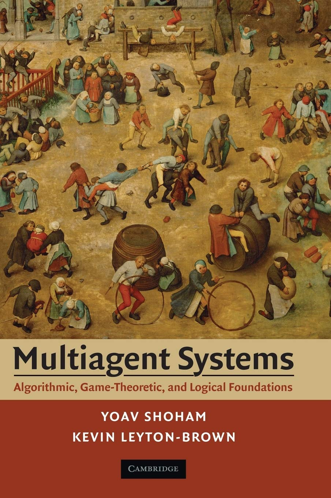
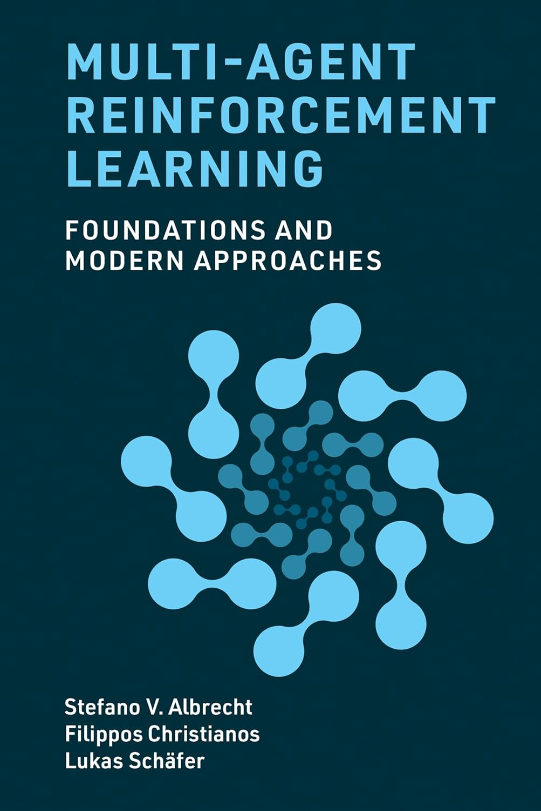
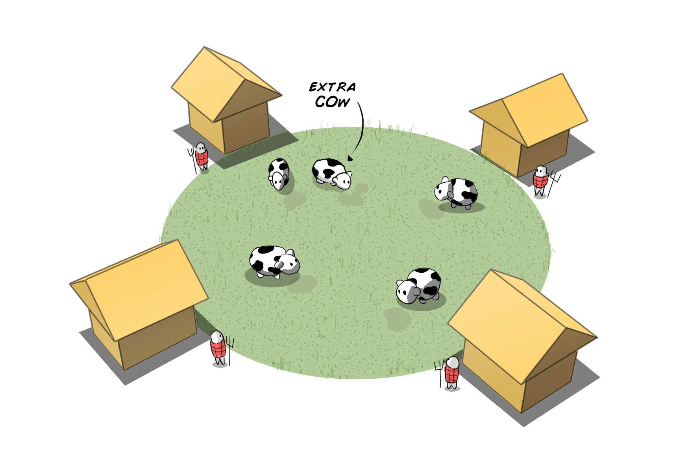
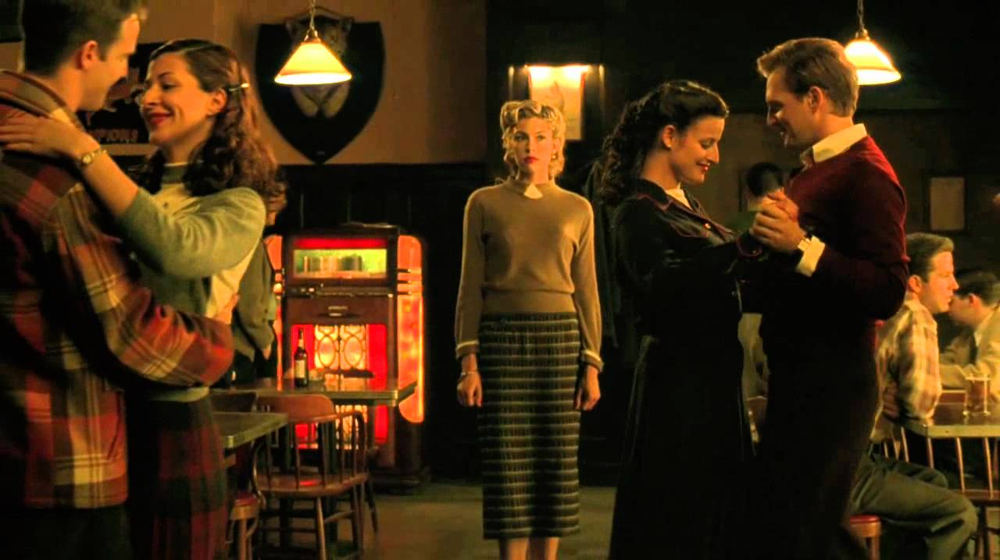
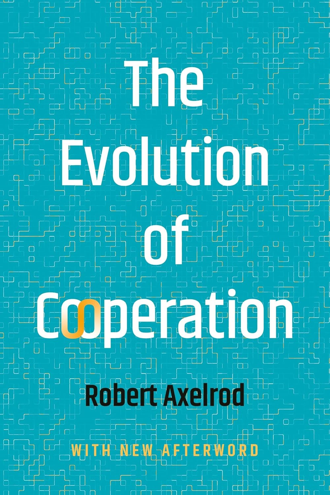

## Making Simple Decisions

> This slide deck summarizes the most important topics from the lesson on Decision Theory and Multiagent Systems.  Refer to those lessons for more details.

A decision-theoretic agent—an agent can make rational decisions based on what it believes and what it wants.

- A goal-based agent has a binary distinction between good (goal) and bad (non-goal) states.

- A decision-theoretic agent assigns a continuous range of values to states, enabling decision-making even when no best option is available.

## Combining Beliefs and Desires under Uncertainty

- Agent uncertain about current state, so each state has a probability $P(s)$.

- Action outcomes are also uncertain, so the transition model is $P(s' \mid s, a)$.

$$
P(RESULT(a) = s') = \sum_s P(s) P(s' \mid s, a)
$$

Expected utility:

$$
EU(a) = \sum_{s'} P(RESULT(a) = s') U(s') \tag{16.1}
$$

Principle of **maximum expected utility** (MEU):

$$
action = \argmax_a EU(a)
$$

A few points:

- The MEU principle *formalizes* rational decisions but does not *operationalize* them.

- If an agent acts so as to maximize a utility function *that correctly reflects the performance measure*, then the agent will achieve the highest possible performance score (averaged over all the possible environments).

## Basis of Utility Theory

Preference notation:

- $A \succ B$: the agent prefers $A$ over $B$.
- $A \sim B$: the agent is indifferent between $A$ and $B$.
- $A \succsim B$: the agent prefers $A$ over $B$ or is indifferent between them.

**Lottery** $L$ with outcomes $S_1, \dots, S_n$ that occur with probabilities $p_1, \dots, p_n$:

$$
L = [p_1, S_1; p_2, S_2; \dots p_n, S_n]
$$

## Axioms of Utility Theory (1/2)

Six constraints that we require any reasonable preference relation to obey:

- **Orderability**: Given any two lotteries, a rational agent must either prefer one or else rate them as equally preferable. That is, the agent cannot avoid deciding. Refusing to bet is like refusing to allow time to pass.

    - Exactly one of $(A \succ B)$, $(B \succ A)$, or $(A \sim B)$ holds.

- **Transitivity**: Given any three lotteries, if an agent prefers $A$ to $B$ and prefers $B$ to $C$, then the agent must prefer $A$ to $C$.

    - $(A \succ B) \land (B \succ C) \implies (A \succ C)$.

- **Continuity**: If some lottery $B$ is between $A$ and $C$ in preference, then there is some probability $p$ for which the rational agent will be indifferent between getting $B$ for sure and the lottery that yields $A$ with probability $p$ and $C$ with probability $1-p$.

    - $A \succ B \succ C \implies \exists p [p,A; 1-p,C] \sim B$.

- **Substitutability**: If an agent is indifferent between two lotteries $A$ and $B$, then the agent is indifferent between two more complex lotteries that are the same except that $B$ is substituted for $A$ in one of them. This holds regardless of the probabilities and the other outcome(s) in the lotteries.

    - $A \sim B \implies [p,A; 1-p,C] \sim [p,B;1-p,C]$.
    - This also holds if we substitute $\succ$ for $\sim$ in this axiom.

## Axioms of Utility Theory (2/2)

:::: {.columns}
::: {.column width="70%"}

- **Monotonicity**: Suppose two lotteries have the same two possible outcomes, $A$ and $B$. If an agent prefers $A$ to $B$, then the agent must prefer the lottery that has a higher probability for $A$ (and vice versa).

    - $A \succ B \implies (p > q \iff [p,A; 1-p,B] \succ [q,A; 1-q,B])$.


- **Decomposability**: Compound lotteries can be reduced to simpler ones using the laws of probability. This has been called the "no fun in gambling" rule: as Figure 15.1(b) shows, it compresses two consecutive lotteries into a single equivalent lottery.

    - $[p,A; 1-p,[q,B; 1-q,C]] \sim [p,A; (1-p)q,B; (1-p)(1-q),C]$.

:::
::: {.column width="35%"}

```{=latex}
\begin{center}
```

```{=latex}
\end{center}
```

:::
::::


## Nontransitive Preferences

Suppose an agent held the following preferences for freely exchangeable goods: $A \succ B \succ C \succ A$.

This agent would be willing, e.g., to exchange $B$ plus $.01 for $A$, and so on.  But the nontransitivity of the agent's preferences could lead to a cycle that ends in complete financial depletion:


```{=latex}
\begin{center}
```

```{=latex}
\end{center}
```

The axioms of utility theory are rational because violating them leads to bad outcomes.

## From Rational Preferences to Utilities

- **Existence of Utility Function**: If an agent’s preferences obey the axioms of utility, then there exists a function U such that $U(A) > U(B)$ if and only if $A$ is preferred to $B$, and $U(A) = U(B)$ if and only if the agent is indifferent between $A$ and $B$. That is,

    - $U(A) > U(B) \iff A \succ B$ and $U(A) = U(B) \iff A \sim B$.

- **Expected Utility of a Lottery**: The utility of a lottery is the sum of the probability of each outcome times the utility of that outcome.

    - $U([p_1,S_1; \dots ; p_n,S_n]) = \sum_i p_i U(S_i)$.

Utility functions create relative scales, not absolute scales.  For example, if we apply a positive affine transformation:

$$
U'(S) = aU(S) + b \tag{16.2}
$$

Then $U'$ and $U$ are effectively equivalent because they lead to the same decisions.

So $U(S)$ is a **value function** or **ordinal utility function**, in which an agent needs only a preference ranking on states.

## Utility Functions

Utility functions

- map from lotteries to real numbers, and
- obey the axioms of utility theory.

Otherwise, they are arbitrary.

- I might prefer pepperoni pizza to pineapple, another might prefer the reverse.
- Decisions based on either preference ordering, as long as it follows the two properties above, are rational.

To build a decision support system for humans we must try to infer the human's utility function, a process called **preference elicitation**.

## Utility Scales and Preference Elicitation

There is no absolute scale for utilities, but we can establish some scale.  Let

- $U(S) = u_{\top}$ be the best possible prize,
- $U(S) = u_{\bot}$ be the worst possible catastrophe, and
- use a **normalized utility scale** in which $u_{\bot} = 0$ and $u_{\top} = 1$.

Then preference elicitation can proceed by

- asking the agent to choose between a particular prize $S$ and a **standard lottery** $[p, u_{\top}; (1-p), u_{\bot}]$, and
- adjusting the probability $p$ until the agent is indifferent between $S$ and the standard lottery.

Assuming normalized probabilities, the utility of $S$ is then given by $p$.  We repeat this process for every $S$ to get the full utility function.

## Multiattribute Preference Structure

Specifying complete utility function $U(x_1, \dots, x_n)$ requires $d^n$ values in the worst case.  Avoid this complexity by encoding some structure of preferences into **representation theorems**:

$$
U(x_1, \dots, x_n) = F\left[f_1(x_1), \dots, f_n(x_n) \right]
$$

Where

- $F$ is a simple function (like addition), and
- each $f_i$ converts utility attributes into a common measure.

Example: Each $x_i$ is an amount of money in an abitrary currency like Euros or Rupees, and each $f_i$ converts the amount into USD.

## Multiagent Systems

Dealing with multiagent environments:

- Single agent with other agents considered part of the environment
- Multiple actors, but one decision maker controlling all actors
- Multiple actors, each of which makes its own decisions


:::: {.columns}
::: {.column width="50%"}

```{=latex}
\begin{center}
```
{height="50%"}
```{=latex}
\end{center}
```

MAS: https://www.masfoundations.org/

:::
::: {.column width="50%"}

```{=latex}
\begin{center}
```
{height="50%"}
```{=latex}
\end{center}
```

MARL: https://www.marl-book.com/

:::
::::


## Multiple Decision Makers

All agents, a.k.a. **counterparts**, make decisions.  Two categories:

1. Agents have a **common goal**.

    - Agents **coordinate** to accomplish common goal, e.g., workers in a company, players on a team

2. Agents have differeent goals.

    - Goals may be unrelated, diametrically opposed (e.g., zero-sum games), or anything in between.


## Game Theory

Multiple decision makers pursuing their own preferences.

- An agent must take into account preferences of other agents.
- These other agents also take into account preferences of other agents, and so on.

**Game theory**: the theory of **strategic decision making**.

- *Strategic* because decisions must take into account how other players act.
- Strategic aspect distinguishes game theory from decision theory.

Just as decision theory provides the theoretical foundation for single-agent decision making, game theory provides the theoretical foundation for multiagent decision making.


## Game Theory in AI

In AI, game theory can be used in two main ways:

1. **Agent design**: analyzing decisions in multiagent environments.

    - Enumerate possible decisions
    - Compute expected utility of each decision

2. **Mechanism design**: deisign multiagent environment in such a way that when agents act selfishly to maximize utility, it has the effect of maximizing some collective good.

    - Example: protocols for Internet routers
    - Example: criminal legal system

## Games with a Single Move: Normal Form Games

All players take actions that are chosen simultaneously with no knowledge of other players' choices and the result of the game is based on the profile of actions that are selected in this way.

**Normal form game** defined by:

- A finite set $N$ of $n$ **players** (agents) making decisions. Two-player games most studied, but games for $n > 2$ also common.

- **Actions** $A = A_i \times \cdots \times A_n$, where $A_i$ is a finite set of actions available to player $i$.  Each vector $a = (a_i, \dots, a_n)$ is called an **action profile** or a **strategy**.

- **Payoff function** $u = (u_i, \dots, u_n)$ where $u_i \colon A \mapsto \mathbb{R}$ is the utility/payoff function for player $i$. Here we assume outcomes $O$ are completely determined by $A$.

    - For two-player games, payoff function can be represented by a matrix in which there is a row for each possible action of one player, and a column for each possible choice of the other player: a chosen row and a chosen column define a matrix cell, which is labeled with the payoff for the relevant player. In the two- player case, it is conventional to combine the two matrices into a single **payoff matrix**, in which each cell is labeled with payoffs for both players.


## Example: Two-Finger Morra

Here is the payoff matrix for **two-finger Morra**, a game in which each player displays one or two fingers.

```{=latex}
\begin{center}
\begin{tabular}{|c|c|c|}\hline
       & O: one         & O: two         \\\hline
E: one & E = +2, O = -2 & E = -3, O = +3 \\\hline
E: two & E = -3, O = +3 & E = +4, O = -4 \\\hline
\end{tabular}
\end{center}
```

- $E$ is the **row player**, $O$ is the **column player**.
- Each cell shows the payoffs given the players' actions.

## Solution Concepts

A **solution concept** is a way of choosing actions that take other players' actions into account.  Some important terminology:

- **Strategy**: like a policy, but we must account for the actions of the other players.

- **Pure strategy**: a deterministic strategy/policy.  For a single-move game, a single action.

- **Mixed strategy**: a randomized policy.  The mixed strategy that chooses action $a$ with probability $p$ and action $b$ otherwise is written $[p:a;(1 - p):b]$.

    - Two-finger Morra example: $[0.5:one;0.5:two]$

- **Strategy profile**: an assignment of a strategy to each player.

- **Outcome**: a numeric value for each player.  For mixed strategies, this is expected utility.

Solution concepts define rationality in games.

## The Prisoner's Dilemma[^PD]

Two prisoners, $A$ and $B$, suspected of committing a crime together are taken to separate interrogation rooms, and each can either "confess" to the crime (a.k.a. "cooperate") or "deny" it (a.k.a. "defect").

- If both prisoners confess/cooperate, each gets a 1-year sentence.
- If both prisoners deny/defect, each gets a 3-year sentence
- If one player denies and the other confesses, the the confessor ("sucker"/cooperator) gets 5 years and the denier (defector) gets 0 years.

The game can be summarized in the following payoff matrix (row player's payoff is listed first):

```{=latex}
\begin{center}
\begin{tabular}{|c|c|c|}\hline
       & B: c         & B: d         \\\hline
A: c & -1, -1 & -5, 0 \\\hline
A: d & 0, -5  & -3, -3 \\\hline
\end{tabular}
\end{center}
```

The dillemma: should they confess or deny?

[^PD]: We adopt the more common notation found, e.g., in https://www.marl-book.com/, https://www.masfoundations.org/, and https://www.amazon.com/Evolution-Cooperation-Robert-Axelrod/dp/1541606841/

## The TCP Game[^TCP]

Internet traffic is governed by the TCP protocol. One feature of TCP is the *backoff* mechanism; if your data rates cause congestion, back off until congestion subsides.

Consider a world of two TCP users, $A$ and $B$.

- If both users use a corect TCP implementation, $c$, each gets a 1 ms packet delays.
- If both users use a defective TCP implementation, $d$, each gets a 3 ms packet delays.
- If one user uses a correct implmentation and the other a defective one, the correct user (or "sucker") gets 5 ms packet delays and the other gets 0 ms delays.

```{=latex}
\begin{center}
\begin{tabular}{|c|c|c|}\hline
       & B: c         & B: d         \\\hline
A: c & -1, -1 & -5, 0 \\\hline
A: d & 0, -5  & -3, -3 \\\hline
\end{tabular}
\end{center}
```

The Prisoner's dilemma is widely applicable.  In general:

```{=latex}
\begin{center}
\begin{tabular}{|c|c|c|}\hline
       & C         & D        \\\hline
C & a, a & b, c \\\hline
D & c, b & d, d  \\\hline
\end{tabular}
\end{center}
```

with $c > a > d > b$.  Adding $a > \frac{b+c}{2}$ guarantees that $(C, C)$ maximizes the sum of the agents' utilities/payoffs.

[^TCP]: https://www.masfoundations.org/ Section 3.2.1-3.2.3

## Dominant Strategies and Equilibria

:::: {.columns}
::: {.column width="50%"}

Consider $A$'s response when $B$'s strategy is $c$:

```{=latex}
\begin{center}
\begin{tabular}{|c|c|c|}\hline
       & B: c         & B: d                 \\\hline
A: c & \cellcolor{lightgray} -1, -1 &  -5, 0 \\\hline
A: d & \cellcolor{lightgray} 0, -5   & -3, -3 \\\hline
\end{tabular}
\end{center}
```

$A$'s highest payoff is with $d$.

How about when $B$'s strategy is $d$:

```{=latex}
\begin{center}
\begin{tabular}{|c|c|c|}\hline
       & B: c         & B: d                 \\\hline
A: c & -1, -1  & \cellcolor{lightgray} -5, 0  \\\hline
A: d & 0, -5   & \cellcolor{lightgray} -3, -3 \\\hline
\end{tabular}
\end{center}
```

Again, $A$'s highest payoff is with $d$.  No matter what $B$ does, $A$'s **best response** is $d$.  So $d$ is a **dominant strategy** for $A$ -- $d$ acheives the highest payoff in response to every possible action of $B$.

:::
::: {.column width="50%"}

Consider $B$'s response when $A$'s strategy is $c$:

```{=latex}
\begin{center}
\begin{tabular}{|c|c|c|}\hline
       & B: c         & B: d                                      \\\hline
A: c & \cellcolor{lightgray} -1, -1  & \cellcolor{lightgray} -5, 0 \\\hline
A: d & 0, -5                         & -3, -3                      \\\hline
\end{tabular}
\end{center}
```

$B$'s highest payoff is with $d$.

How about when $A$'s strategy is $d$:

```{=latex}
\begin{center}
\begin{tabular}{|c|c|c|}\hline
       & B: c         & B: d                                      \\\hline
A: c & -1, -1                      & -5, 0                         \\\hline
A: d & \cellcolor{lightgray} 0, -5 & \cellcolor{lightgray}-3, -3   \\\hline
\end{tabular}
\end{center}
```

Again, $B$'s highest payoff is with $d$.  No matter what $A$ does, $B$'s **best response** is $d$.  So the **dominant strategy** for $B$ is also $d$.

:::
::::

When all players choose a dominant strategy, the result is a **dominant strategy equilibrium**.

- An **equilibrium** is a state where no player has an incentive to change their action.

Choosing a dominant strategy is *rational*.  But notice that the payoff under strategy profile $(d, d)$ is $[-3, -3]$ whereas the payoff for strategy profile $(c, c)$ is $[-1, -1]$.

## Optimal Strategies and Social Welfare

An **optimal strategy** for an agent optimizes the payoff/utility for that agent.  From the standpoint of **social welfare** we want to optimize the utility of all agents.

- Strategy profile $s$ **Pareto dominates** strategy profile $s'$ if for all $i \in N$, $u_i(s) \ge u_i(s')$, and there exists some $j \in N$ for which $u_j(s) > u_j(s')$.

- Strategy profile $s$ is **Pareto optimal**, or **strictly Pareto efficient**, if there does not exist another strategy profile $s' \in S$ that Pareto dominates $s$.

- An outcome is **Pareto optimal** if there is no other outcome that would make one player better off without making someone else worse off. If you choose an outcome that is not Pareto optimal, then it wastes utility in the sense that you could have given more utility to at least one agent, without taking any from other agents.

Utilitarian social welfare is a measure of how good an outcome is in the aggregate.  Two difficulties:

- Considers the sum but not the distribution of utilities among players, so it could lead to a very unequal distribution if that happens to maximize the sum.

- Assumes a common scale for utilities.

## Tragedy of the Commons

Classic formulation:

```{=latex}
\begin{center}
```
{height="40%"}
```{=latex}
\end{center}
```

Modern instantiation: air pollution.

- Air is a common good.
- Each country affects every other country's air.
- A country can reduce polution at a cost of -10 (to implement reduction technology, reduced economic output, etc.).
- A country can continue to polute at a cost of -5 (added health costs, etc), but this also adds a -1 cost to all other countries.

So, if there are 100 countries and each continues to pollute, the total utility for each country is -104 -- far greater than the -10 for reducing pollution.  This is a version of The Prisoner's Dilemma.

## Nash Equilibria

```{=latex}
\begin{center}
```
{height="40%"}

[https://www.youtube.com/watch?v=QzwcGkfEra4](https://www.youtube.com/watch?v=QzwcGkfEra4)
```{=latex}
\end{center}
```

A strategy profile is a **Nash equilibrium** if no player could unilaterally change their strategy and as a consequence receive a higher payoff, under the assumption that the other players
stayed with their strategy choices.

- In a Nash equilibrium, every player is simultaneously playing a best response to the choices of their counterparts.
- A Nash equilibrium represents a stable point in a game: stable in the sense that there is no rational incentive for any player to deviate.
- However, Nash equilibria are local stable points: as we will see, a game may contain
multiple Nash equilibria.

## Finding Nash Equilibria

Let's find the Nash equlibria in the Prisoner's Dilemma.

- First, find the best reponses of the row player to each strategy of the column player (boxed):

```{=latex}
\begin{center}
\begin{tabular}{|c|c|c|}\hline
  & C              & D         \\\hline
C & -1, -1         & -5, 0 \\\hline
D & \boxed{0}, -5  & \boxed{-3}, -3 \\\hline
\end{tabular}
\end{center}
```

- Then find the best responses of the column player to each strategy of the column player (circled):

```{=latex}
\begin{center}
\begin{tabular}{|c|c|c|}\hline
  & C              & D         \\\hline
C & -1, -1         & -5, \circled{0} \\\hline
D & \boxed{0}, -5  & \boxed{-3}, \circled{-3} \\\hline
\end{tabular}
\end{center}
```

The Nash equilibria are the cases where both players' best responses coincide, here $(D, D)$.

This is sometimes called a "no regret" decision -- couldn't have done better given what other players did.

## Coordination and Competition: Battle of the Sexes (MAS 3.2.3)

A husband and wife wish to go to the movies, and they can select among two movies:
"Lethal Weapon (LW)" and "Wondrous Love (WL)."

- They much prefer to go together rather than to separate movies, but
- the wife (player 1) prefers LW, the husband (player 2) prefers WL.

```{=latex}
\begin{center}
\begin{tabular}{|c|c|c|}\hline
   & LW     & WL         \\\hline
LW & 2, 1  & 0, 0 \\\hline
WL & 0, 0  & 1, 2 \\\hline
\end{tabular}
\end{center}
```

This is like a common-payoff game where both players get the same reward when they do the same thing, but each player has different payoffs when they coordinate.

## Multiple Nash Equilibria

Now lets find the Nash equilibria for the Battle of t he Sexes game.

- First, find the best reponses of the row player to each strategy of the column player (boxed):

```{=latex}
\begin{center}
\begin{tabular}{|c|c|c|}\hline
   & LW     & WL         \\\hline
LW & \boxed{2}, 1  & 0, 0 \\\hline
WL & 0, 0  & \boxed{1}, 2 \\\hline
\end{tabular}
\end{center}
```

- Then find the best responses of the column player to each strategy of the column player (circled):

```{=latex}
\begin{center}
\begin{tabular}{|c|c|c|}\hline
   & LW     & WL         \\\hline
LW & \boxed{2}, \circled{1}  & 0, 0 \\\hline
WL & 0, 0  & \boxed{1}, \circled{2} \\\hline
\end{tabular}
\end{center}
```

Here we see that the only best responses for both players are also both Nash equilibria.

## Iterated Prisoner's Dilemma (IPD)

The simplest kind of multiple-move game is the repeated game (also called an **iterated game**), in which players repeatedly play rounds of a single-move game, called the **stage game**.

- A strategy in a repeated game specifies an action choice for each player at each time step for every possible history of previous choices of players.
- In a finite game you essentially end up with a single game repeated $n$ times, because if you know the last game is the last, then you simply play the single-game dominant strategy.  This leads to playing the same for the $n-1$st game, and so on.
- In an infinite game you don't know when it ends, so strategy changes.  We can represent infinite strategies with finite state machines:

```{=latex}
\begin{center}
```
{height="40%"}
```{=latex}
\end{center}
```

Note that AIMA uses $refuse$ for $confess/cooperate$ and $testify$ for $deny/defect$.


## Axelrod's IPD Tournaments

:::: {.columns}
::: {.column width="50%"}

```{=latex}
\begin{center}
```
{height="80%"}
```{=latex}
\end{center}
```

:::
::: {.column width="50%"}

In the 1980s, Robert Axelrod organized a series of computer tournaments in which computer programs submitted by contestants implemented any strategy of their choosing.  Suprising key findings:

- **Tit for tat was the winning strategy.**
- Starting out cooperate is better.
- Adding forgiveness helps.

Knight, et. al. [^knight2025reviving] recently reproduced these results, confirming that "TFT prevails, and successful play tends to be cooperative, responsive to defection, and willing to forgive."

[^knight2025reviving]: https://arxiv.org/abs/2510.15438

:::
::::
