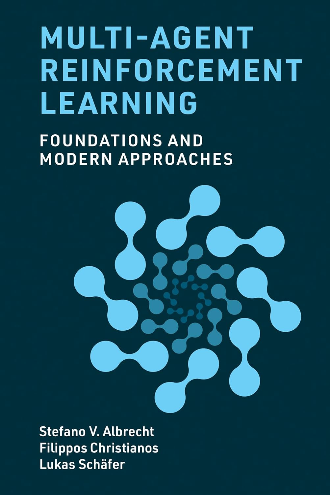
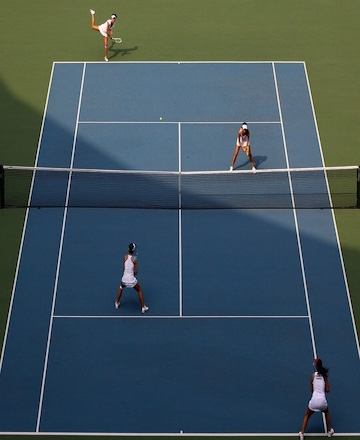
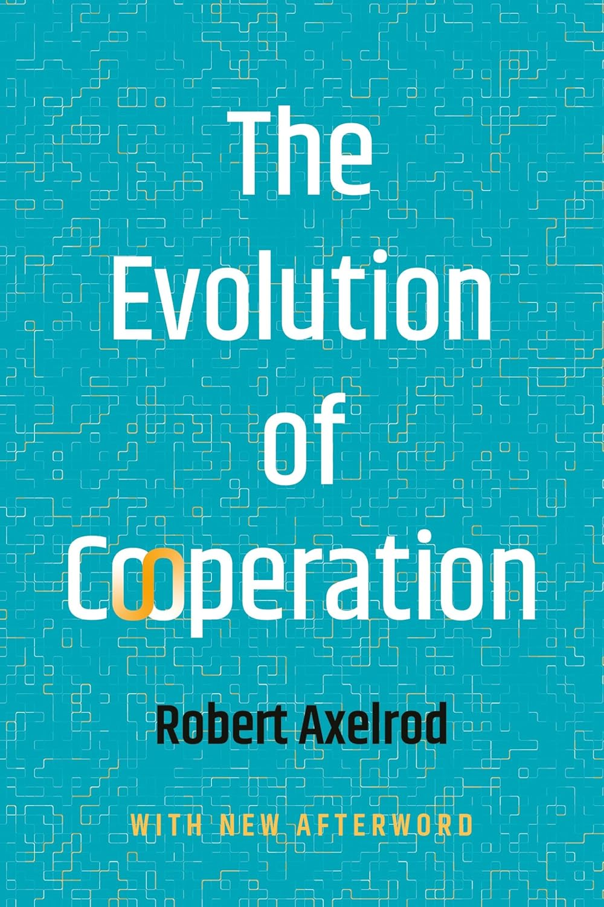
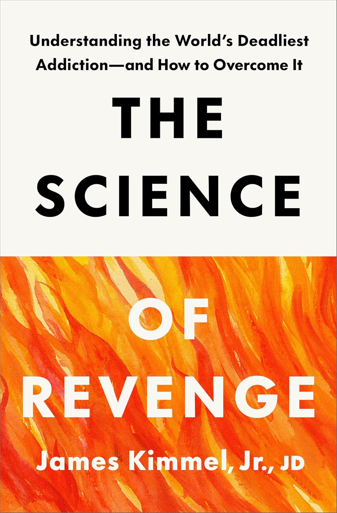
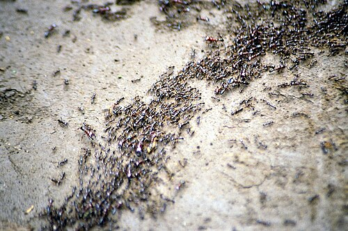

## Multiagent Systems

:::: {.columns}
::: {.column width="50%"}

```{=latex}
\begin{center}
```
{height="80%"}
```{=latex}
\end{center}
```

:::
::: {.column width="50%"}

```{=latex}
\begin{center}
```
{height="80%"}
```{=latex}
\end{center}
```

:::
::::

## Multiagent Environments

Dealing with multiagent environments:

- Single agent with other agents considered part of the environment
- Multiple actors, but one decision maker controlling all actors
- Multiple actors, each of which makes its own decisions

## One Decsion Maker

Rests on **benevolent agent assumption**: agents will do what they are told.

Action synchronization:

- Sumultaneous/joint actions
- Mutually exclusive actions executed at different times
- Sequential actions $A$ before $B$ when $A$'s postconditions are $B$'s preconditions

Architectures:

- **Multieffector planning**: multiple concurrently acting effectors
- **Multibody planning**: physically decoupled effectors

    - Centralized planning: sensor information from each body is pooled
    - Decentralized planning: plan execution partially or fully decoupled, explicit communication to share information when possible (e.g., back in comms range)

## Multiple Decision Makers

All agents, a.k.a. **counterparts**, make decisions.  Two categories:

1. Agents have a **common goal**.

    - Agents **coordinate** to accomplish common goal, e.g., workers in a company, players on a team

2. Agents have differeent goals.

    - Goals may be unrelated, diametrically opposed (e.g., zer-sum games), or anythin in between.


## Game Theory

Multiple decision makers pursuing their own preferences.

- An agent must take into account preferences of other agents.
- These other agents also take into account preferences of other agents, and so on.

**Game theory**: the theory of **strategic decision making**.

- *Strategic* because decisions must take into account how other players act.
- Strategic aspect distinguishes game theory from decision theory.

Just as decision theory provides the theoretical foundation for single-agent decision making, game theory provides the theoretical foundation for multiagent decision making.


## Game Theory in AI

In AI, game theory can be used in two main ways:

1. **Agent design**: analyzing decisions in multiagent environments.

    - Enumerate possible decisions
    - Compute expected utility of each decision

2. **Mechanism design**: deisgn multiagent environment in such a way that when agents act selfishly to maximize utility, it has the effect of maximizing some collective good.

    - Example: protocols for Internet routers
    - Example: criminal legal system

## Cooperative vs Noncooperative Games

Two broad categories of game models:

1. Cooperative games:

    - Binding agreement between agents ensuring cooperation.

2. Noncooperative games:

    - Not necessarily competitive.
    - Simply means no binding agreement to cooperate.

Often mix models:

- Package company: centralized planning for routes and trucks, decentralized execution via autonomous decisions of drivers and pilots responsing individually to real-time conditions.
- Company: individual **incentives** for employees designed to bring their behavior into alignment with company's goals.

## Multiagent Planning

Use generic term **actor** for effectors, bodies and agents.  Need to define:

- transition models
- correct plans
- planning algorithms

Agents must take into account the way in which their own actions interact with the actions of other agents.

- Example: Agent $A$'s action might clobber the precoditions of the action Agent $B$ planned to execute.

## Concurrency Models

Three approaches to dealing with concurrency:

1. **Interleaved execution**.  Given Agents $A$ and $B$ with plans $[a_1, a_2]$ and $[b_1, b_2]$ there are six ways to execute them concurrently:

    ```{=latex}
    \begin{align*}
    [a_1,a_2,b_1,b_2]\\
    [b_1,b_2,a_1,a_2]\\
    [a_1,b_1,a_2,b_2]\\
    [b_1,a_1,b_2,a_2]\\
    [a_1,b_1,b_2,a_2]\\
    [b_1,a_1,a_2,b_2]
    \end{align*}
    ```

    - Plans must be correct with respect to all possible interleavings.
    - Popular in OS concurrency on single CPU.
    - Does not model true concurrency, i.e., simultaneous action.
    - Number of sequences grows exponentially with numbers of agents and actions.

2. **True concurrency**: leave plans *partially ordered* and don't create a fully serialized ordering.

3. **Synchronization**: global clock, each action takes one time step, joint actions execute simultaneously, no-ops in case "waiting" is needed.

## Multiagent Transition Models

Deterministic single-agent case: `RESULT(s, a)` with $b$ choices for the action.

Multiagent case: with $n$ actors, joint action $\langle a_1, \dots, a_n \rangle$ where $a_i$ is actoin taken by  $i$th actor.

- Must describe transition model for $b^n$ joint actions.
- Joint planning problem with branching factor of $b^n$.

Standard solution: pretend problems are decoupled and fix the interactions as they arise, i.e., writing action schemas as if actors acted independently.  Let's see how this works with an example ...


## Example: Doubles Tennis Planning

:::: {.columns}
::: {.column width="40%"}

```{=latex}
\begin{center}
```

```{=latex}
\end{center}
```

:::
::: {.column width="60%"}

```{=latex}
\begin{center}
```

```{=latex}
\end{center}
```

Here's a 2-step **joint plan** that works:

```{=latex}
\begin{align*}
\text{PLAN 1}: &A : [Go(A,RightBaseline),Hit(A,Ball)] \\
               &B : [NoOp(B),NoOp(B)].
\end{align*}
```


:::
::::

## Concurrent Action Constraints


What if both players try to $Hit$ at the same time?  Add a **concurrent action constraint** to prevent:

```{=latex}
\vspace{-.25in}
\begin{align*}
& Action(Hit(actor, Ball),\\
& \hspace{.1in} \text{CONCURRENT:} \forall b, b \neq Actor \implies \neg Hit(b, Ball)\\
& \hspace{.1in} \text{PRECOND:} Approaching(Ball, loc) \land At(actor, loc) \\
& \hspace{.1in} \text{EFFECT:} Returned(Ball))
\end{align*}
\vspace{-.25in}
```

Some tasks require concurrent action, e.g., carrying a large cooler:

```{=latex}
\vspace{-.25in}
\begin{align*}
& Action(Carry(actor, cooler, here, there),\\
& \hspace{.1in} \text{CONCURRENT:} \exists b, b \neq Actor \land Carry(b, cooler, here, there) \\
& \hspace{.1in} \text{PRECOND:} At(actor, here) \land At(cooler, here) \land Cooler(cooler) \\
& \hspace{.1in} \text{EFFECT:} At(actor, there) \land At(cooler, there) \land \neg At(actor, here) \land \neg At(cooler, here)
\end{align*}
\vspace{-.25in}
```

## Cooperation and Coordination

There can be multiple joint plans that acheive the goal:

:::: {.columns}
::: {.column width="50%"}

```{=latex}
\begin{align*}
\text{PLAN 1}: &A : [Go(A,RightBaseline),Hit(A,Ball)] \\
               &B : [NoOp(B),NoOp(B)].
\end{align*}
```

:::
::: {.column width="50%"}

```{=latex}
\begin{align*}
\text{PLAN 2}: &A : [Go(A,LeftNet),NoOp(A)] \\
               &B : [Go(B, RightBaseline), Hit(B, Ball)]
\end{align*}
```

:::
::::

If both agents choose Plan 1 or 2, goal is acheived.  If one agent chooses 1 and other chooses 2, goal is not acheived.  How to coordinate?

- **Convention**: any constraint on selection of joint plans.

    - Example: "stick to your side of the court."
    - Widespread conventions are sometimes called **social laws**.

- **Communication**

    - Example: shout "Mine!" or "Yours!"
    - Can be implicit, based on observation -- **plan recognition**.

## Games with a Single Move: Normal Form Games

All players take action that are chosen simultaneously with no knowledge of other players' choices and the result of the game is based on the profile of actions that are selected in this way.

**Normal form game** defined by:

- **Players** (agents) making decisions. Two-player games most studied, but games for $n > 2$ also common. Players have capitalized names, like $Ali$ and $Bo$ or $O$ and $E$.

- **Actions** the players choose. Actions have lowercase names, like $one$ or $testify$. Players may have same or different sets of actions.

- **Payoff function** that gives the utility to each player for each combination of actions by all the players.

    - For two-player games, payoff function can be represented by a matrix in which there is a row for each possible action of one player, and a column for each possible choice of the other player: a chosen row and a chosen column define a matrix cell, which is labeled with the payoff for the relevant player. In the two- player case, it is conventional to combine the two matrices into a single **payoff matrix**, in which each cell is labeled with payoffs for both players.


## Example: Two-Finger Morra

Here is the payoff matrix for **two-finger Morra**, a game in which each player displays one or two fingers.

```{=latex}
\begin{center}
\begin{tabular}{|c|c|c|}\hline
       & O: one         & O: two         \\\hline
E: one & E = +2, O = -2 & E = -3, O = +3 \\\hline
E: two & E = -3, O = +3 & E = +4, O = -4 \\\hline
\end{tabular}
\end{center}
```

- $E$ is the **row player**, $O$ is the **column player**.
- Each cell shows the payoffs given the players' actions.

## Solution Concepts

A **solution concept** is a way of choosing actions that take other players' actions into account.  Some important terminology:

- **Strategy**: like a policy, but we must account for the actions of the other players.

- **Pure strategy**: a deterministic strategy/policy.  For a single-move game, a single action.

- **Mixed strategy**: a randomized policy.  The mixed strategy that chooses action $a$ with probability $p$ and action $b$ otherwise is written $[p:a;(1 - p):b]$.

    - Two-finger Morra example: $[0.5:one;0.5:two]$

- **Strategy profile**: an assignment of a strategy to each player.

- **Outcome**: a numeric value for each player.  For mixed strategies, this is expected utility.

Solution concepts define rationality in games.

## The Prisoner's Dilemma[^PD]

Two prisoners, $A$ and $B$, suspected of committing a crime together are taken to separate interrogation rooms, and each can either "confess" to the crime (a.k.a. "cooperate") or "deny" it (a.k.a. "defect").

- If both prisoners confess, each gets a 1-year sentence.
- If both prisoners deny, each gets a 3-year sentence
- If one player denies and the other confesses, the denier (or "sucker") gets 5 years and the confessors gets 0 years.

The game can be summarized in the following payoff matrix (row player's payoff is listed first):

```{=latex}
\begin{center}
\begin{tabular}{|c|c|c|}\hline
       & B: c         & B: d         \\\hline
A: c & -1, -1 & -5, 0 \\\hline
A: d & 0, -5  & -3, -3 \\\hline
\end{tabular}
\end{center}
```

The dillemma: should they confess or deny?

[^PD]: We adopt the more common notation found, e.g., in https://www.marl-book.com/, https://www.masfoundations.org/, and https://www.amazon.com/Evolution-Cooperation-Robert-Axelrod/dp/1541606841/

## The TCP Game[^TCP]

Internet traffic is governed by the TCP protocol. One feature of TCP is the *backoff* mechanism; if your data rates cause congestion, back off until congestion subsides.

Consider a world of two TCP users, $A$ and $B$.

- If both users use a corect TCP implementation, $c$, each gets a 1 ms packet delays.
- If both users use a defective TCP implementation, $d$, each gets a 3 ms packet delays.
- If one user uses a correct implmentation and the other a defective one, the correct user (or "sucker") gets 5 ms packet delays and the other gets 0 ms delays.

```{=latex}
\begin{center}
\begin{tabular}{|c|c|c|}\hline
       & B: c         & B: d         \\\hline
A: c & -1, -1 & -5, 0 \\\hline
A: d & 0, -5  & -3, -3 \\\hline
\end{tabular}
\end{center}
```

The Prisoner's dilemma is widely applicable.  In general:

```{=latex}
\begin{center}
\begin{tabular}{|c|c|c|}\hline
       & C         & D        \\\hline
C & a, a & b, c \\\hline
D & c, b & d, d  \\\hline
\end{tabular}
\end{center}
```

with $a > \frac{b+c}{2}$ to guarantee that $(C, C)$ maximizes the sum of the agents' utilities/payoffs.

[^TCP]: https://www.masfoundations.org/ Section 3.2.1-3.2.3

## Dominant Strategies and Equilibria

:::: {.columns}
::: {.column width="50%"}

Consider $A$'s response when $B$'s strategy is $c$:

```{=latex}
\begin{center}
\begin{tabular}{|c|c|c|}\hline
       & B: c         & B: d                 \\\hline
A: c & \cellcolor{lightgray} -1, -1 &  -5, 0 \\\hline
A: d & \cellcolor{lightgray} 0, -5   & -3, -3 \\\hline
\end{tabular}
\end{center}
```

$A$'s highest payoff is with $d$.

How about when $B$'s strategy is $d$:

```{=latex}
\begin{center}
\begin{tabular}{|c|c|c|}\hline
       & B: c         & B: d                 \\\hline
A: c & -1, -1  & \cellcolor{lightgray} -5, 0  \\\hline
A: d & 0, -5   & \cellcolor{lightgray} -3, -3 \\\hline
\end{tabular}
\end{center}
```

Again, $A$'s highest payoff is with $d$.  No matter what $B$ does, $A$'s **best response** is $d$.  So $d$ is a **dominant strategy** for $A$ -- $d$ acheives the highest payoff in response to every possible action of $B$.

:::
::: {.column width="50%"}

Consider $B$'s response when $A$'s strategy is $c$:

```{=latex}
\begin{center}
\begin{tabular}{|c|c|c|}\hline
       & B: c         & B: d                                      \\\hline
A: c & \cellcolor{lightgray} -1, -1  & \cellcolor{lightgray} -5, 0 \\\hline
A: d & 0, -5                         & -3, -3                      \\\hline
\end{tabular}
\end{center}
```

$B$'s highest payoff is with $d$.

How about when $A$'s strategy is $d$:

```{=latex}
\begin{center}
\begin{tabular}{|c|c|c|}\hline
       & B: c         & B: d                                      \\\hline
A: c & -1, -1                      & -5, 0                         \\\hline
A: d & \cellcolor{lightgray} 0, -5 & \cellcolor{lightgray}-3, -3   \\\hline
\end{tabular}
\end{center}
```

Again, $B$'s highest payoff is with $d$.  No matter what $A$ does, $B$'s **best response** is $d$.  So the **dominant strategy** for $B$ is also $d$.

:::
::::

When all players choose a dominant strategy, the result is a **dominant strategy equilibrium**.

- An **equilibrium** is a state where no player has an incentive to change their action.

Choosing a dominant strategy is *rational*.  But notice that the payoff under strategy profile $(d, d)$ is $[-3, -3]$ whereas the payoff for strategy profile $(c, c)$ is $[-1, -1]$.

## Social Welfare

An outcome is **Pareto optimal** if there is no other outcome that would make one player better off without making someone else worse off. If you choose an outcome that is not Pareto optimal, then it wastes utility in the sense that you could have given more utility to at least one agent, without taking any from other agents.

Utilitarian social welfare is a measure of how good an outcome is in the aggregate.  Two difficulties:

- Considers the sum but not the distribution of utilities among players, so it could lead to a very unequal distribution if that happens to maximize the sum.
- Assumes a common scale for utilities.

## Tragedy of the Commons

Classic formulation:

```{=latex}
\begin{center}
```
{height="40%"}
```{=latex}
\end{center}
```

Modern instantiation: air pollution.

- Air is a common good.
- Each country affects every other country's air.
- A country can reduce polution at a cost of -10 (to implement reduction technology, reduced economic output, etc.).
- A country can continue to polute at a cost of -5 (added health costs, etc), but this also adds a -1 cost to all other countries.

So, if there are 100 countries and each continues to pollute, the total utility for each country is -104 -- far greater than the -10 for reducing pollution.  This is a version of The Prisoner's Dilemma.


## Iterated Prisoner's Dilemma (IPD)

The simplest kind of multiple-move game is the repeated game (also called an **iterated game**), in which players repeatedly play rounds of a single-move game, called the **stage game**.

- A strategy in a repeated game specifies an action choice for each player at each time step for every possible history of previous choices of players.
- In a finite game you essentially end up with a single game repeated $n$ times, because if you know the last game is the last, then you simply play the single-game dominant strategy.  This leads to playing the same for the $n-1$st game, and so on.
- In an infinite game you don't know when it ends, so strategy changes.  We can represent infinite strategies with finite state machines:

```{=latex}
\begin{center}
```
{height="40%"}
```{=latex}
\end{center}
```

Note that AIMA uses $refuse$ for $confess/cooperate$ and $testify$ for $deny/defect$.


## Axelrod's IPD Tournaments

:::: {.columns}
::: {.column width="50%"}

```{=latex}
\begin{center}
```
{height="80%"}
```{=latex}
\end{center}
```

:::
::: {.column width="50%"}

In the 1980s, Robert Axelrod organized a series of computer tournaments in which computer programs submitted by contestants implemented any strategy of their choosing.  Suprising key findings:

- Tit for tat was the winning strategy.
- Starting out cooperate is better.
- Adding forgiveness helps.

Knight, et. al. [^knight2025reviving] recently reproduced these results, confirming that "TFT prevails, and successful play tends to be cooperative, responsive to defection, and willing to forgive."

[^knight2025reviving]: https://arxiv.org/abs/2510.15438

:::
::::

## Closing Thoughts: Rational Altruism

:::: {.columns}
::: {.column width="50%"}

```{=latex}
\begin{center}
```
{height="80%"}[^kimmel2025science]
```{=latex}
\end{center}
```

:::
::: {.column width="50%"}

The lesson of The Prisoner's Dilemma is that individually rational action often leads not just to lower total *social* utility, but lower *indivdual* utility over the long run.

- Previously we saw that if an agent's utility function aligns with the external performance measure of its task environment, then maximizing its utility maximizes its performance.
- How do we get global utility into local utility functions?

There is exciting research in neuroscience that suggests that social good and individual utility are aligned.

- Revenge triggers the same dopamine reponse as addiction.
- Forgiveness cuts this cycle.

Perhaps there is a link between the results of Axelrod's IPD tournaments and neurobiology.

:::
::::

[^kimmel2025science]: https://www.amazon.com/Science-Revenge-Understanding-Deadliest-Addiction/dp/0593796519


## Lessons from Animals

:::: {.columns}
::: {.column width="50%"}

```{=latex}
\begin{center}
```
{height="70%"}
```{=latex}
\end{center}
```

:::
::: {.column width="50%"}

```{=latex}
\begin{center}
```
{height="40%"}
```{=latex}
\end{center}
\vspace{.25in}
```

```{=latex}
\begin{center}
```
{height="30%"}
```{=latex}
\end{center}
```

:::
::::


<!--

## Nash Equilibria

A strategy profile is a **Nash equilibrium** if no player could unilaterally change their strategy and as a consequence receive a higher payoff, under the assumption that the other players
stayed with their strategy choices.

- In a Nash equilibrium, every player is simultaneously playing a best response to the choices of their counterparts.
- A Nash equilibrium represents a stable point in a game: stable in the sense that there is no rational incentive for any player to deviate.
- However, Nash equilibria are local stable points: as we will see, a game may contain
multiple Nash equilibria.


## Mixed Strategies


## Morra Minimax Trees with Pure Strategies

:::: {.columns}
::: {.column width="50%"}

```{=latex}
\begin{center}
```

```{=latex}
\end{center}
```

:::
::: {.column width="50%"}

```{=latex}
\begin{center}
```

```{=latex}
\end{center}
```

:::
::::

## Morra Minimax Trees with Mixed Strategies

:::: {.columns}
::: {.column width="50%"}

```{=latex}
\begin{center}
```

```{=latex}
\end{center}
```

:::
::: {.column width="50%"}

```{=latex}
\begin{center}
```

```{=latex}
\end{center}
```

:::
::::

## Multiagent Systems

```{=latex}
\begin{center}
```

```{=latex}
\end{center}
```

## Multiagent Systems

```{=latex}
\begin{center}
```

```{=latex}
\end{center}
```

## Hawk Strategy in IPD

```{=latex}
\begin{center}
```

```{=latex}
\end{center}
```

## Dove Strategy in IPD

```{=latex}
\begin{center}
```

```{=latex}
\end{center}
```

## Grim Strategy in IPD

```{=latex}
\begin{center}
```

```{=latex}
\end{center}
```

## Tit for Tat Strategy in IPD

```{=latex}
\begin{center}
```

```{=latex}
\end{center}
```

## Tat for Tit Strategy in IPD

```{=latex}
\begin{center}
```

```{=latex}
\end{center}
```

## Multiagent Systems

```{=latex}
\begin{center}
```

```{=latex}
\end{center}
```

## Multiagent Systems

```{=latex}
\begin{center}
```

```{=latex}
\end{center}
```

-->
