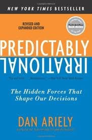

## Making Simple Decisions

A decision-theoretic agent—an agent can make rational decisions based on what it believes and what it wants.

- A goal-based agent has a binary distinction between good (goal) and bad (non-goal) states.

- A decision-theoretic agent assigns a continuous range of values to states, enabling decision-making even when no best option is available.

This lesson deals with simple decisions, that is, decisions based on immediate outcomes in episodic environments.

## Combining Beliefs and Desires under Uncertainty

- An agent has uncertainty about the current state, so each state has an associated probability $Pr(s)$.

- Action outcomes are also uncertain, so the transition model is $Pr(s' \mid s, a)$.

$$
Pr(RESULT(a) = s') = \sum_s Pr(s) Pr(s' \mid s, a)
$$

## Decision Theory

Expected utility:

$$
EU(a) = \sum_{s'} Pr(RESULT(a) = s') U(s') \tag{16.1}
$$

Principle of **maximum expected utility** (MEU):

$$
action = \argmax_a EU(a)
$$

A few points:

- The MEU principle *formalizes* rational decisions but does not *operationalize* them.

- If an agent acts so as to maximize a utility function *that correctly reflects the performance measure*, then the agent will achieve the highest possible performance score (averaged over all the possible environments).

## Basis of Utility Theory

Notation:

- $A \succ B$: the agent prefers $A$ over $B$.
- $A \sim B$: the agent is indifferent between $A$ and $B$.
- $A \succsim B$: the agent prefers $A$ over $B$ or is indifferent between them.

**Lottery** $L$ with outcomes $S_1, \dots, S_n$ that occur with probabilities $p_1, \dots, p_n$:

$$
L = [p_1, S_1; p_2, S_2; \dots p_n, S_n]
$$

## Axioms of Utility Theory (1/2)

Six constraints that we require any reasonable preference relation to obey:

- **Orderability**: Given any two lotteries, a rational agent must either prefer one or else rate them as equally preferable. That is, the agent cannot avoid deciding. Refusing to bet is like refusing to allow time to pass.

    - Exactly one of $(A \succ B)$, $(B \succ A)$, or $(A \sim B)$ holds.

- **Transitivity**: Given any three lotteries, if an agent prefers $A$ to $B$ and prefers $B$ to $C$, then the agent must prefer $A$ to $C$.

    - $(A \succ B) \land (B \succ C) \implies (A \succ C)$.

- **Continuity**: If some lottery $B$ is between $A$ and $C$ in preference, then there is some probability $p$ for which the rational agent will be indifferent between getting $B$ for sure and the lottery that yields $A$ with probability $p$ and $C$ with probability $1-p$.

    - $A \succ B \succ C \implies \exists p [p,A; 1-p,C] \sim B$.

- **Substitutability**: If an agent is indifferent between two lotteries $A$ and $B$, then the agent is indifferent between two more complex lotteries that are the same except that $B$ is substituted for $A$ in one of them. This holds regardless of the probabilities and the other outcome(s) in the lotteries.

    - $A \sim B \implies [p,A; 1-p,C] \sim [p,B;1-p,C]$.
    - This also holds if we substitute $\succ$ for $\sim$ in this axiom.

## Axioms of Utility Theory (2/2)

:::: {.columns}
::: {.column width="70%"}

- **Monotonicity**: Suppose two lotteries have the same two possible outcomes, $A$ and $B$. If an agent prefers $A$ to $B$, then the agent must prefer the lottery that has a higher probability for $A$ (and vice versa).

    - $A \succ B \implies (p > q \iff [p,A; 1-p,B] \succ [q,A; 1-q,B])$.


- **Decomposability**: Compound lotteries can be reduced to simpler ones using the laws of probability. This has been called the "no fun in gambling" rule: as Figure 15.1(b) shows, it compresses two consecutive lotteries into a single equivalent lottery.

    - $[p,A; 1-p,[q,B; 1-q,C]] \sim [p,A; (1-p)q,B; (1-p)(1-q),C]$.

:::
::: {.column width="35%"}

```{=latex}
\begin{center}
```

```{=latex}
\end{center}
```

:::
::::


## Nontransitive Preferences

Suppose an agent held the following preferences for freely exchangeable goods: $A \succ B \succ C \succ A$.

This agent would be willing, e.g., to exchange $B$ plus $.01 for $A$, and so on.  But the nontransitivity of the agent's preferences could lead to a cycle that ends in complete financial depletion:


```{=latex}
\begin{center}
```

```{=latex}
\end{center}
```

The axioms of utility theory are rational because violating them leads to bad outcomes.

## From Rational Preferences to Untilities

- **Existence of Utility Function**: If an agent’s preferences obey the axioms of utility, then there exists a function U such that $U(A) > U(B)$ if and only if $A$ is preferred to $B$, and $U(A) = U(B)$ if and only if the agent is indifferent between $A$ and $B$. That is,

    - $U(A) > U(B) \iff A \succ B$ and $U(A) = U(B) \iff A \sim B$.

- **Expected Utility of a Lottery**: The utility of a lottery is the sum of the probability of each outcome times the utility of that outcome.

    - $U([p_1,S_1; \dots ; p_n,S_n]) = \sum_i p_i U(S_i)$.

Utility functions create relative scales, not absolute scales.  For example, if we apply a positive affine transformation:

$$
U'(S) = aU(S) + b \tag{16.2}
$$

Then $U'$ and $U$ are effectively equivalent because they lead to the same decisions.

So $U(S)$ is a **value function** or **ordinal utility function**, in which an agent needs only a preference ranking on states -- the numbers don’t matter.

## Utility Functions

A utility functions

- map from lotteries to real numbers, and
- obey the axioms of utility theory.

Otherwise, they are arbitrary.

- I might prefer pepperoni pizza to pineapple, another might prefer the reverse.
- Decisions based on either preference ordering, as long as it follows the two properties above, are rational.

To build a decision support system for humans we must try to infer the human's utility function, a process called **preference elicitation**.

## Utility Scales and Preference Elicitation

There is no absolute scale for utilities, but we can establish some scale.  Let

- $U(S) = u_{\top}$ be the best possible prize,
- $U(S) = u_{\bot}$ be the worst possible catastrophe, and
- use a **normalized utility scale** in which $u_{\bot} = 0$ and $u_{\top} = 1$.

Then preference elicitation can proceed by

- asking the agent to choose between a particular prize $S$ and a **standard lottery** $[p, u_{\top}; (1-p), u_{bot}]$, and
- adjusting the probability $p$ until the agent is indifferent between $S$ and the standard lottery.

Assuming normalized probabilities, the utility of $S$ is then given by $p$.  We repeat this process for every $S$ to get the full utility function.

Example:

## The "Value" of Human Life

:::: {.columns}
::: {.column width="50%"}

- Asbestos in schools paradox.

- US govt agencies like FDA and EPA use the **value of a statistical life** to determine the costs and benefits of regulations.  In 2019 this was $10M.

- A **micromort** is a one in a million chance of death.

    - Say driving a car for 230 miles incurs a risk of one micromort.
    - If you drive 92,000 miles that's 400 micromorts.
    - If you're willing to pay $12,000 more for a car that halves your risk of death, then a micromort has a value of $60 to you.

- **QALY** is quality-adjusted life year. Patients are willing to accept a shorter life expectancy to avoid a disability.

:::
::: {.column width="50%"}

{height="80%"}

:::
::::

## The Utility of Money

Money is an obvious candidate for a utility measure.

- Most agents exhibit a **monotonic preference** for more money.
- However, money is not necessarily a utility function because it says nothing about preferences between *lotteries* involving money.

    - Example: Choose between $1,000,000 and a 50% chance for $2,500,000.
    - The **expected monetary value** (EMV) of the gamble is $.5 (\$0) + .5 (\$2,500,000) = \$1,250,000$

Key idea: value of money not directly proportional to utility.

- Let $k$ be current wealth and $S_n$ be the state of posessing total wealth of $n$ dollars.

```{=latex}
\begin{align*}
EU(Accept)  &= \frac{1}{2} U (S_k) + \frac{1}{2} U (S_{k+2,500,000}) \\
eu(Decline) &= U(S_{k+1,000,000})
\end{align*}
```

Now say $U((S_k) = 5$, $U(S_{k+2,500,000})$ = 9$, and $U(S_{k+1,000,000} = 8$.  Then

- $EU(Accept) = 7$
- $EU(Decline) = 8$

"Utility of your first million is higher than your second."  A billionaire would likely have a locally linear utility function over such small amounts, so would accept the gamble.

## Utility of Money Example

```{=latex}
\begin{center}
```

```{=latex}
\end{center}
```

## Utility of Money in General

```{=latex}
\begin{center}
```

```{=latex}
\end{center}
```

## The Optimzer's Curse

The greater the number of choices, the more biased your estimates are because you always pick "optimal" action.

```{=latex}
\begin{center}
```

```{=latex}
\end{center}
```

## Human Judgement and Irrationality

:::: {.columns}
::: {.column width="60%"}

- Decision theory is a **normative theory** -- how people *should* act.
- Actualy behavior is described by a **descriptive theory**.

Humans aren't "rational." (Ariely, 2009)

Allais Paradox: people don't act in accordance with utility theory.

Common errors in thinking:

- Ambiguity aversion
- Framing effect
- Anchoring effect


:::
::: {.column width="40%"}


```{=latex}
\begin{center}
```


{height="40%"}

{height="40%"}[^DanAriely]


```{=latex}
\end{center}
```


[^DanAriely]: https://web.mit.edu/ariely/www/

:::
::::

<!--

## Deterministic Dominace

```{=latex}
\begin{center}
```
 represent random variables, just as they do in Bayesian networks. The agent could be uncertain about the construction cost, the level of air traffic and the potential for litigation, and the Safety, Quietness, and total Frugality variables, each of which also depends on the site chosen. Each chance node has associated with it a conditional distribution that is indexed by the state of the parent nodes. In decision networks, the parent nodes can include decision nodes as well as chance nodes. Note that each of the current-state chance nodes could be part of a large Bayesian network for assessing construction costs, air traffic levels, or litigation potentials.

- Decision nodes (rectangles) represent points where the decision maker has a choice of actions. In this case, the AirportSite action can take on a different value for each site under consideration. The choice influences the safety, quietness, and frugality of the solution. In this chapter, we assume that we are dealing with a single decision node.  Chapter 16 deals with cases in which more than one decision must be made.

- Utility nodes (diamonds) represent the agent’s utility function. The utility node has as parents all variables describing the outcomes that directly affect utility. Associated with the utility node is a description of the agent’s utility as a function of the parent attributes. The description could be just a tabulation of the function, or it might be a parameterized additive or linear function of the attribute values. For now, we will assume that the function is deterministic; that is, given the values of its parent variables, the value of the utility node is fully determined.

## Decision Network for Airport Siting

```{=latex}
\begin{center}
```
![](aima-fig-16_06-decision-network-airport-siting.pdf
```{=latex}
\end{center}
```

## Simplified Decision Network for Airport Siting

```{=latex}
\begin{center}
```
![](aima-fig-16_07-decision-network-airport-siting-simplified.pdf
```{=latex}
\end{center}
```

## Value of Information

```{=latex}
\begin{center}
```
![](aima-fig-16_08-value-of-information.pdf
```{=latex}
\end{center}
```

## Information Gathering Agent

```{=latex}
\begin{center}
```
![](aima-fig-16_09-information-gathering-agent-algorithm.pdf
```{=latex}
\end{center}
```

## Decision Network for Ice Cream

```{=latex}
\begin{center}
```
![](aima-fig-16_10-decision-networks-ice-cream.pdf
```{=latex}
\end{center}
```

## Off Switch Game

```{=latex}
\begin{center}
```
![](aima-fig-16_11-off-switch-game.pdf
```{=latex}
\end{center}
```

-->
