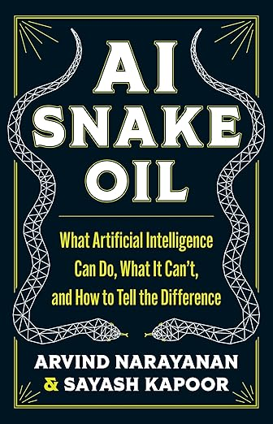

## What is a value?

In ethical theory, how "good" something is.

- Value of a goal
- Value of an action

Values lead to hierarchies

- Cookies vs. health

https://plato.stanford.edu/entries/value-theory/

## Amazon's Sexist Hiring Tool

- Resume evaluator trained on 10 yers of hiring data
- Most software engineers are male
- Tool learned from data to prefere males

https://www.technologyreview.com/2018/10/10/139858/amazon-ditched-ai-recruitment-software-because-it-was-biased-against-women/

## The Genie Problem

:::: {.columns}
::: {.column width="50%"}

```{=latex}
\begin{center}
```
{height="75%"}
```{=latex}
\end{center}
```

:::
::: {.column width="50%"}

- Value: diversity
- Result: inacurate and offensive images

:::
::::

## AI Snake Oil

:::: {.columns}
::: {.column width="50%"}

```{=latex}
\begin{center}
```
{height="75%"}
```{=latex}
\end{center}
```

:::
::: {.column width="50%"}

- AI, like other products, tends to be oversold
- As AI engineers we need to be aware of AI's limitations

> It all comes down to honesty.

:::
::::


## Value Alignment

foo

## Rational Decisions

Elements of outcomes can be more or less desirable -- more or less *useful* -- to a given agent.

- Utility is the quality of being useful.
- That "usefulness" may simply be pleasure, or even altruism.

Utility theory associates a utility value with each possible outcome, which induces a preference ordering over outcomes.

> An agent is rational if and only if it chooses the action that yields the highest expected utility, averaged over all the possible outcomes of the action.

Each action, $a$, leads to a probability distribution over outcomes, or "result states":

```{=latex}
$$
\sum_{s \in S} Pr(s) = 1
$$
```

And each outcome state has a utility.  A rational decision-theoretic agent chooses the action that maximize expected utility, that is:

```{=latex}
$$
\argmax_{a} \sum_{s \in S} Pr(s) U(s)
$$
```

## Values, Utilities, Rewards, Goals

- Values: general concept
- Utility: quality of being useful
- Reward: feedback from the enbvironment
- Goal: state of the environment satisfying set of conditions

Coconut cupcakes.

## Reinforcement Learning

An intelligent agent learns how to behave from experience interacting with the world.

- We represent subsets of the world as *environments* comprised of *states*..
- An *agent* takes an *action* that causes a transition to a new state.
- The agent receives a scalar feedback signal, called a *reward*, from the environment after the transition to a new state.
- The agent maximizes the long-term expected value of cumulative reward.

Reinforcement learning directly addresses the intelligent agent problem.  Its central hypothesis is:

>All of what we mean by goals and purposes can be well thought of as the maximization of the expected value of the cumulative sum of a received scalar signal (called reward).[^SuttonBarto2018]

[^SuttonBarto2018]:http://incompleteideas.net/book/the-book-2nd.html

## Markov Process

A markov process models the world as a set of states and associated transition probability distributions, calles a *transition function*, that models how the world moves from one state to the next.

```{=latex}
\[
Pr(s_{t+1} | s_t)
\]
```

is the probability that the state at time $t+1$ is $s_{t+1}$, given that the previous state is $s_t$.  The fact that the transition probability depends only on the previous state and not the history of all previous states is called the *Markov assumption*.

```{=latex}
\begin{center}
```
{height="40%"}
```{=latex}
\end{center}
```

A sequense of states from a Markov process is called a *trajectory*: $\tau = (s_1, S_2, ...)$.

## Markov Reward Process

A *Markov reward process* adds a reward distribution $Pr(r_{t+1} | s_t)$ (note that this implicitly accompanies a state transition).  Now a trajectory includes the rewards, $\tau = (s_1, r_2, s_2, r_3...)$, and the sum of cumulative discounted future rewards, the *return*, is:

```{=latex}
\[
G_t = \sum_{k = 0}^\infty \gamma^k r_{t+k+1}
\]
```

$\gamma$ is the *discount factor* which says how much we discount future rewards.  With $\gamma < 0$ it decays to zero.

```{=latex}
\begin{center}
```
{height="40%"}
```{=latex}
\end{center}
```

## Markov Decision Process (MDPs)

A *Markov decision process* (MDP) adds a set of *actions* at each time step.  Now:

- transition probabilities are $Pr(s_{t+1} | s_t, a_t)$.  Sometimes written as $T(s, a, s')$ -- a *transition model* that returns the probability that taking action $a$ in state $s$ results in state $s'$.
- the reward probabilities are $Pr(r_{t+1} | s_t, a_t)$.  This is sometimes written as $r(s, a, s')$
- a trajectory is $\tau = (s_1, a_1, r_2, s_2, a_2, r_3...)$

```{=latex}
\begin{center}
```
{height="50%"}
```{=latex}
\end{center}
```

## Parially-Observable MDP (POMDP)

In a *partially observable Markov decision process* (POMDP) the state is not fully observable.  The agent receives an observation drawn from a probability distribution $Pr(o_t | s_t)$.  Now a trajectory is $\tau = (s_1, o_1, a_1, r_2, s_2, o_2, r_3...)$

```{=latex}
\begin{center}
```

```{=latex}
\end{center}
```

## Policy

The goal of a reinforcement learning algorithm is to learn a *policy*: a deterministic or stochastic function mapping states to actions.

- Stationary: $\pi(a | s)$
- Non-stationary: $\pi(a_t | s_t)$

```{=latex}
\begin{center}
```

```{=latex}
\end{center}
```

## State and Action Values

- State value function: $v(s_t | \pi) = \mathbb{E} [G_t | s_t, \pi]$
- Action value function: $q(s_t, a_t | \pi) = \mathbb{E} [G_t | s_t, a_t, \pi]$

```{=latex}
\begin{center}
```

```{=latex}
\end{center}
```

## Optimal Policy

An optimal policy maximizes the expected return.  Any MDP has a deterministic stationary optimal policy, i.e., it maximizes the value of every state.  Given this policy:

```{=latex}
\[
v^*(s_t ) = \max_{\pi} \big( \mathbb{E} [G_t | s_t, \pi] \big)
\]
```

The optimal action value function is then:

```{=latex}
\[
q^*(s_t, a_t ) = \max_{\pi} \big( \mathbb{E} [G_t | s_t, a_t \pi] \big)
\]
```

If we know $q^*$ we can use it to derive $\pi^*$:

```{=latex}
\[
\pi^*(a_t | s_t ) \leftarrow \argmax_{a_t} \big( q^*(s_t, a_t ) \big)
\]
```

We'll see this idea when we solve MDPs using dynamic programming.

## Consistent State Values

Whatever the values of the states or actions for a given policy, they must be consistent.

```{=latex}
\[
v(s_t ) = \sum_{a_t} \pi(a_t | s_t) q(s_t, a_t)
\]
```

```{=latex}
\begin{center}
```

```{=latex}
\end{center}
```

## Consistent Action Values

The value of an action in a state is the immediate reward plus the value of the resulting next state.  Assuming deterministic reward and  probabilistic transition function:

```{=latex}
\[
q(s_t, a_t) = r(s_t, a_t) + \gamma \sum_{s_{t+1}} Pr(s_{t+1} | s_t, a_t) v(s_{t+1})
\]
```


```{=latex}
\begin{center}
```

```{=latex}
\end{center}
```

## Bellman Equations

If we substitute the action value function into the state value function we get:

```{=latex}
\[
v(s_t ) = \sum_{a_t} \pi(a_t | s_t) \big( r(s_t, a_t) + \gamma \sum_{s_{t+1}} Pr(s_{t+1} | s_t, a_t) v(s_{t+1})  \big)
\]
```

If we substitute the state value function into the action value function we get:

```{=latex}
\[
q(s_t, a_t) = r(s_t, a_t) + \gamma \sum_{s_{t+1}} Pr(s_{t+1} | s_t, a_t) \Huge( \sum_{a_{t+1}} \pi(a_{t+1} | s_{t+1}) q(s_{t+1}, a_{t+1})  \Huge)
\]
```

Thesej two relations are called the *Bellman equations*.  They say that state and action values mult be self-consistent, so when we update the estimated value of a state or actoin, we have to update all the others that depend on the updated value.

## Tabular RL

In classical tabular RL, we represent the policy function as a table.

- Model-based: use the MDP to solve for the best policy.

    - Policy iteration
    - Value iteration

- Model-free: estimate from observed trajectories

    - Tabular Q-Learning and SARSA
    - Function approximation (including deep RL)

*Monte Carlo* methods simulate trajectories (called *rollouts*) under some policy and use the information from the rollouts to improve the policy.

## Dynamic Programming

If we know the MDP, we can find the optimal policy using dynamic programming, where we iteratively update our estimates of state and action values until they converge.

```{=latex}
\begin{center}
```

```{=latex}
\end{center}
```

## Policy Iteration

Use the Bellman equaiotns to solve the MDP.

**Policy evaluation**: sweep through states $s_t$, updating values:

```{=latex}
\[
v(s_t ) = \sum_{a_t} \pi(a_t | s_t) \Big( r(s_t, a_t) + \gamma \sum_{s_{t+1}} Pr(s_{t+1} | s_t, a_t) v(s_{t+1})  \Big)
\]
```

**Policy improvement**: update policy with greedy action selection:

```{=latex}
\[
\pi(a_t | s_t) =\argmax_{a_t} \Big( r(s_t, a_t) + \gamma \sum_{s_{t+1}} Pr(s_{t+1} | s_t, a_t) v(s_{t+1}) \Big)
\]
```


## Monte Carlo Methods

Sample the MDP via episodes -- a trajectory from a start state to a terminal state using the current policy (also called a *rollout*):

- use the returns for a given $(s, a)$ pair to estimate $q(s, a)$
- use the estimates for each $q(s, a)$ to update the policy:

```{=latex}
\[
\pi(s, a) \leftarrow \argmax_{a} \big( q(s, a) \big)
\]
```

```{=latex}
\begin{center}
```

```{=latex}
\end{center}
```


## Temporal Difference Methods

Combine the ideas of dynamic programming and Monte Carlo methods.  Instead of generating rollouts to estimate values with which to update the policy, we iteratively update the policy while the agent traverses the MDP.

```{=latex}
\begin{center}
```

```{=latex}
\end{center}
```

## Q-Learning and SARSA

In typical learning scenarios we don't have the MDP, so we learn a direct mapping from states to actions, an action-value function, a Q-function.

1. $Q \gets$ random initial values
2. For each episode
   1. $s \gets$ world.initialState()
   2. While $s$ is not terminal
      1. $a$ $\gets$ $\epsilon-$greedy action for $s$ from $\pi$ derived from $Q$
      2. Execute $a$, observe effects $r$ and $s'$
      3. $Q(s, a) \gets Q(s, a) + \alpha [R(s) + \gamma \max_{a'} Q(s', a') - Q(s, a)]$
      4. $s \gets s'$

For the Sarsa variant of Q-learning, save $a$ in $a'$ and replace the update in Step 2.2.3 with

\begin{equation}
Q(s, a) \leftarrow Q(s, a) + \alpha [R(s) + \gamma Q(s', a') - Q(s, a))]
\end{equation}

Sarsa is *on-policy* because the temporal difference used in the Q-update is based on the policy being followed by the agent during learning. The standard Q-learning update is *off-policy* because the Q-update is based on the best known next action.

## Machine Theory of Mind

An agent develops a model of how another agent thinks.  For RL, can model other agent's:

- Value function
- Reward function
- Policy

Our idea: action restrictions

## Learning Action Restriction from a Teacher

In general imitation learning, we call the agent learning from the other the student and the agent providing the example to learn from the teacher.
