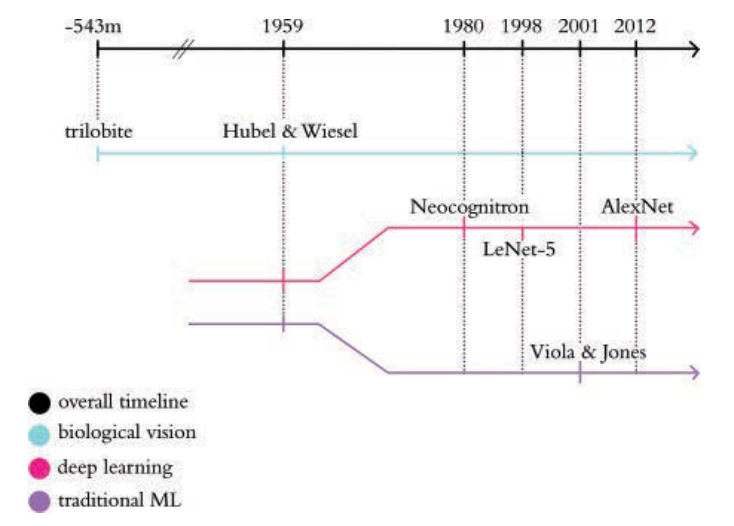

## Biological Vision

In the 1950s, Hubel and Wiesel at Johns Hopkins, experimenting on cats, discovered the hierarchical nature of neurons in the visual cortex.

```{=latex}
\begin{center}
```
{height="70%"}[^DLI]
```{=latex}
\end{center}
```

[^DLI]: [https://www.deeplearningillustrated.com](https://www.deeplearningillustrated.com)

## Machine Vision

In 1980 Kunihiko Fukushima proposed the *Neocognitron* architecture explicitly based on neuron layers in biological vision.

```{=latex}
\begin{center}
```
{height="60%"}[^DLI]
```{=latex}
\end{center}
```

It took the success of LeCun and Bengio's *LeNet-5*, and later Krizhevsky and Stuskever's *AlexNet* to realize the full potential of a deeply layered machine vision model and firmly establish the supremacy of Deep Learning for machine vision.

## Composing Shallow Networks

Recall a single input/output shallow network:

$$
h_d = a(\theta_{d0} + \theta_{d1}x)
$$

$$
y = \phi_0 + \sum_{d=1}^{D}\phi_d h_d
$$

You could concatenate this with another shallow network with the same architecture that takes the first network's output as its input:

$$
h'_d = a(\theta'_{d0} + \theta'_{d1}y)
$$

$$
y = \phi'_0 + \sum_{d=1}^{D}\phi'_d h'_d
$$

## Composed Shallow Networks

```{=latex}
\begin{center}
```
{height="70%"}
```{=latex}
\end{center}
```

## Composed Shallow Networks Formulation

4.2

## Deep Neural Networks

4.3

## Hyperparameters

4.3.1

## Linear Algebra Interlude: Matrices

Boom!

## Matrix Network Notation

4.4

## General Matrix Formulation

4.4.1

## Capacity of Shallow vs. Deep Neural Networks

4.5.1, 4.5.2

## Depth and Width Efficiency

4.5.3

## Large Structured Inputs

4.5.4

## Training and Generalization

4.5.5

