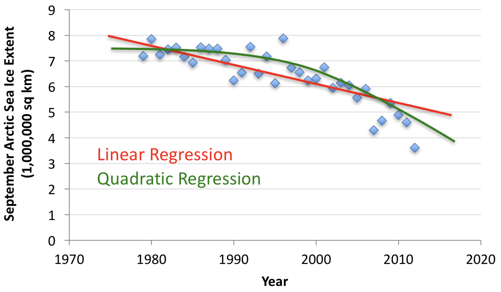

## What is machine learning?

Definition by Tom Mitchell (1998):

Machine Learning is the study of algorithms that

- improve their performance `P`
- at some task `T`
- with experience `E`.

A well-defined learning task is given by `<P, T, E>`.

## Examples of Machine Learning Tasks [^mooney]

Improve on task `T`, with performance `P`, given experience `E`

`T`: Playing checkers

- `P`: Percentage of games won against an arbitrary opponent
- `E`: Playing practice games against itself

`T`: Recognizing hand-written words

- `P`: Percentage of words correctly classified
- `E`: Database of human-labeled images of handwritten words

`T`: Driving on four-lane highways using vision sensors

- `P`: Average distance traveled before a human-judged error
- `E`: A sequence of images and steering commands recorded while observing a human driver.

`T`: Categorize email messages as spam or legitimate.

- `P`: Percentage of email messages correctly classified.
- `E`: Database of emails, some with human-given labels

[^mooney]: Slide credit: Ray Mooney

## Elements of Machine Learning Problems

Every machine learning problem includes

- data from which to learn,
- a model that takes input data and produces an "answer",
- an error function that quantifies the badness of our model, and
- an algorithm that adjusts the model’s parameters to minimize a loss function.
    - A loss function is a surrogate of the error function used by the algorithm.  It may be the error function itself, but is often some closely related function with desirable mathematical properties.

Our model, or hypothesis, comes from a model/hypothesis class.  Once the parameters are learned, we have an instance of the hypothesis class tuned to our particular machine learning problem.

## Kinds of Machine Learning Tasks

- Classification: identify the correct label for an instance
  - Does this image contain a dog/peron on no-fly list/lung tumor?
  - Which radio emitted the signal we received?
  - Will this customer respond to this advertisement?

- Clustering: identify the groups into which instances fall
  - What are the discernible groups of ... customers, cars, colors in an images
  - Is this operating state similar to known operating states, or is it an anomaly?

- Agent behavior
  - Given the state, which action should the agent take to maximize its goal attainment?

- Generation
    - Given a prompt, generate an image/video/poem/love letter.

## Kinds of Machine Learning Algorithms

- Supervised
  - Learn from a training set of labeled data -- the supervisor
  - Generalize to unseen instances

- Unsupervised
  - Learn from a set of unlabeled data
  - Place an unseen instance into appropriate group
  - Infer rules describing the groups

- Reinforcement learning
  - Learn from a history of trial-and-error exploration
  - Output is a *policy* -- a mapping from states to actions (or probability distributions over actions)

Classification using supervised learning methods makes up the lion's share of machine learning.

## Supervised Learning Problem Setup

Every machine learning problem contains the following elements:

- An input $\vec{x}$
- An unkown target function $f: \mathcal{X} \rightarrow \mathcal{Y}$
- A data set $\mathcal{D}$
- A learning model, which consists of
    - a hypothesis class $\mathcal{H}$, and
    - a learning algorithm.

A learning algorithm uses elements of $\mathcal{D}$ to estimate parameters of of a particular $h(\vec{x})$ from $\mathcal{H}$ which maps every $\vec{x}$ to an element of $\mathcal{Y}$.

## Classification Example

Classification is a supervised learning task in which the target function maps feature vectors in $\mathbb{R}^{d}$ to one of a defined set of classes.

{height="50%"}[^cs231n]

- In linear classification we assume that there are lines that separates classes acceptably well.
    - Binary: two classes
    - Multiclass: more than two classes

[^cs231n]: https://cs231n.github.io/classification/

## Regression Example

Regression is a kind of supervised learning in which the target function maps feature vectors in $\mathbb{R}^{d}$ to arbitrary real values.

{height=40%}[^byron-boots]

- In linear regression we assume that there is a line that fits the data acceptably well.
    - Simple regression: one input variable, e.g.,  $f(x; \vec{\theta}) = wx + b$, where $\vec{\theta} = (w, b)$
    - Multiple regression: multiple input variables
    - Multivariate regression: multiple output variables

[^byron-boots]: https://www.cc.gatech.edu/~bboots3/CS4641-Fall2018/Lecture3/03_LinearRegression.pdf

## Example: Credit Scoring

Let's create a credit score based on two variables: age and income (in thousands), which we'll say are real numbers.

- An input $\vec{x}$ is a vector in $\mathbb{R}^2$.  For example, a 25 year-old person making $60,000 would be represented by the vector $(24, 60)$.

- "Credit score" = $\sum_{i=1}^{d} w_i x_i$

The weights $w_i$ represent the importance of corresponding features of input instances.

From that "score" we take a decision:

- Approve credit if $\sum_{i=1}^{d} w_i x_i \ge$ threshold
- Deny credit if $\sum_{i=1}^{d} w_i x_i$ < threshold

## Data Sets

Consider a hypothetical data set, $\mathcal{D}$, for the credit scoring problem.

- Each data point represents a previous customer
- Since this is is supervised learning, every data point has an associated label: $+1$ for a customer off whom the bank made money, $-1$ for a customer off whom the bank lost money

```Python
    age  income  approve
0    64      90        1
1    78      92        1
2    38      80        1
3    29      66       -1
4    94      79        1
```

Data in this form is often called a *design matrix*, an $N \times D$ matrix in which

- each of the $N$ rows represent an example, and
- each of the $D$ columns represents a *feature* (or *covariate* or *predictor*) of the data examples.

## Tabular Data vs. Unstructured Data

::::{.columns valign="top"}
::: {.column width="45%"}

The credit data is an example of *tabular* or *structured* data.

```Python
    age  income  approve
0    64      90        1
1    78      92        1
2    38      80        1
3    29      66       -1
4    94      79        1
```


We say it is structured because we impose the structure on it.  There is nothing inherent in the data that requires `age` to come before`income`, but we must choose some order and stick with it.

:::
::: {.column width="45%"}

{height="45%"}


Unstructured data is data whose structure is inherent in the data, not imposed by us.  Examples include images and natural langauge text.

:::
::::

## Credit Data Plot

A scatter plot gives us intuition about the structure of the data.

{height=70%}

Is there a line that separates the +s from the -s?

## A Linear Separator

Here's a line that separates the data into classes.

{height=70%}

Are there other lines? How many of these lines are there?

## Version Spaces

A *version space* is the set of all $h$ in $\mathcal{H}$ consistent with our training data.  For our credit data, it's the set of all lines that separate the classes.

{height=70%}

Machine learning algorithms find these lines algorithmically.

## A Practical Example: Iris Classification

It's a rite of passage to apply supervised learning to the Iris data set. The canonical source for the Iris data set is the [UCI Machine Learning Repository](https://archive.ics.uci.edu/ml/). Download  [iris.data](https://archive.ics.uci.edu/ml/machine-learning-databases/iris/iris.data).

{height=6-%}

## Iris Data

The data set contains 150 instance of Iris flowers with

- 4 features:
  - sepal_length
  - sepal_width
  - petal_length
  - petal_width

and

- 3 classes:
  - Iris-setosa
  - Iris-versicolour
  - Iris-virginica

## Scikit-learn Recipe

1. Set up feature matrix and target array
2. Separate data into training set and test set
3. Choose (import) model class
4. Set model parameters via arguments to model constructor
5. Fit model to data
6. Apply model to new data

Let's apply this recipe to a data set.

## Scikit-learn Data Representation

The basic supervised learning setup in Scikit-learn is:

- Feature Matrix

  - Rows are instances
  - Columns are features

- Target array

  - An array of len(rows) containing the training labels for each instance

We can easily obtain these with a Pandas DataFrame.

## Step 1: Iris feature matix and target array

From the description on the [Iris Data Set page](https://archive.ics.uci.edu/ml/datasets/Iris) we know that the Iris instances have four features -- (sepal_length, sepal_width, petal_length, petal_width) -- and three classes -- (Iris-setosa, Iris-versicolour, Iris-virginica). We can read these into a DataFrame with [^DataLoaders]

```Python
import pandas as pd
iris = pd.read_csv(
    "iris.data",
    names=["sepal_length", "sepal_width", "petal_length", "petal_width", "species"])
iris.head()
   sepal_length  sepal_width  petal_length  petal_width      species
0           5.1          3.5           1.4          0.2  Iris-setosa
1           4.9          3.0           1.4          0.2  Iris-setosa
2           4.7          3.2           1.3          0.2  Iris-setosa
3           4.6          3.1           1.5          0.2  Iris-setosa
4           5.0          3.6           1.4          0.2  Iris-setosa
```

This DataFrame (in [tidy format](http://vita.had.co.nz/papers/tidy-data.pdf)) contains an $N \times D$ design matrix in the first four columns.


[^DataLoaders]: You can get this data set through Scikit-learn's datasets module or the [ucimlrepo](https://github.com/uci-ml-repo/ucimlrepo) package, but I want to show the use of Pandas for general data manipulation.


## Step 1.1: Scikit-learn Input Data

For Scikit-learn we need a feature matrix `X` and target array `y`:

```Python
X_iris = iris.drop("species", axis=1)
y_iris = iris["species"]
```

We can check that the number of samples in the feature matrix equals the number of labels in the target array with

```Python
X_iris.shape[0] == y_iris.shape[0] # True
```

There are 150 samples and 150 target labels.

## Step 2: Separate Data into Training and Test Sets

We want to separate our data into non-overlapping training and test subsets. Since the data in our data set are arranged in a neat order, we should randomize the samples and split in a way that represents each class equally in the training and test sets. Scikit-learn provides a library functoin to do this:

```Python
import sklearn
from sklearn.model_selection import train_test_split

X_iris_train, X_iris_test, y_iris_train, y_iris_test = \
    train_test_split(X_iris,
                     y_iris,
                     random_state=1)
```

You will often want to create a third set, a *validation* set, which you use to tune hyperparameters.

> Set aside your test set at the beginning of the process and don't use it for anything but testing!

## Step 3.1: Choose a model

In your machine learning class you'll learn that no hypothesis class (aka model class, aka hypothesis class, aka algorithm, aka estimator) is best for all data [^fn2]. You must choose your model class based on the data. Things to consider:

- What's the dimensinalty of your data?
- Are your features linearly separable?
- Are your features numeric or categorical?

Scikit-learn calls models *estimators*.

[^fn2]: [Wolpert and Macready, *No Free Lunch Theorems for Optimization*](https://www.cc.gatech.edu/~isbell/reading/papers/nfl-optimization.pdf)

## Step 3: Visualizing the Iris data

You can begin to explore your data with a pairplot:

```Python
import seaborn as sns
sns.pairplot(X_iris_train, hue="species", size=1.5)
```

{height=60%}

These look linearly separable, so we'll try a linear discriminant classifier, SVM.

## Step 4: Set algorithm hyperparameters

Hyperparameters are parameters of the algorithm or fixed parameters of the model, as opposed to the learnable parameters of the model that are adjusted by the learning algorithm.

```Python
from sklearn import svm
model = svm.SVC(kernel="linear")
```

Most parameters are optional, with reasonable default values. Beacuse we know the Iris data set is so well-suited to liner classifiers we choose a `linear` kernel (deafult is `rbf` -- radial basis function)

## Step 5: Fit model to data

The General Form of Learning Algorithms is:

1. Initialize a model's parameters to some initial values.
2. Until some stopping criterion is reached (e.g., error within bounds)

    -  Evaluate the model on some subset of the data $\mathcal{D}$
    -  If error is present, update the model's parameters to reduce the error
        - The magnitude of the correction is often captured in a "learning rate" hyperparameter, often represented by $\eta$ or $\alpha$

When the algorithm is finished, you have a model, a particular $h \in \mathcal{H}$, that "fits" the training data.  In Scikit-learn the learning algorithm is encapsulated in the model's `fit` method:

```Python
model.fit(X_iris_train, y_iris_train)
```

## Step 6: Apply model to new data

To apply the trained model to new (unseen) data, pass an array of instances to ~predict~:

```Python
y_iris_model = model.predict(X_iris_test)
```

We can test the generalization error (how well the classifier performs on unseen data) using the built-in accuracy score:

```Python
from sklearn.metrics import accuracy_score
accuracy_score(y_iris_test, y_iris_model)
1.0
```

As you can see, a linear SVM classifier works perfectly on the Iris data. Try out different classifiers to see how well they perform.

A Scikit-learn estimator (model/hypothesis) is an object that has `fit` (train) and `predict` (test) methods.

## The Deep Learning Revolution

{height="60%"}


In 2010, [Fei-Fei Li](https://profiles.stanford.edu/fei-fei-li) and her team published a data set of tens of millions of labeled photographs -- [ImageNet](https://image-net.org) -- and launched the annual ImageNet Large Scale Visual Recognition Challenge (ILSVRC)

In the first two years traditional approaches, characterized by complex feature engineering, continued to win.

## AlexNet

{height="50%"}[^UTorontoHintonNobel]

In 2012, Alex Krizhevsky and Ilya Sutskever from Geoff Hinton's lab at the University of Toronto **dominated** the ILSVRC with what is now called [AlexNet](https://www.cs.toronto.edu/~kriz/imagenet_classification_with_deep_convolutional.pdf)

Since then, deep learning has practically taken over AI.


[^UTorontoHintonNobel]: https://web.cs.toronto.edu/news-events/news/congratulations-pour-in-for-geoffrey-hinton-after-nobel-win


## Autonomous Cars

Autonomous cars are teeming with deep learning models.

{height=75%}

## Scene Labeling

Convolutional deep neural networks (CNNs), or ConvNets, are widely used in vision applications.

{height=75%}[^farabet]

[^farabet]: Farabet et al. ICML 2012, PAMI 2013

## Speech Recognition

One of the early projects that popularized the uses of ReLU activation functions in deep neural networks.

{height=80%}

## Generative AI

What is "generative AI?"

- Two types of supervised machine learning models: discriminative and generative
    - Discriminative, $p(y|x)$: learn a function that discriminates between classes
    - Generative, $p(x, y)$: learn a joint probability distribution over data
        - Enables generative models to both discriminate and *generate samples*
- Modern GenAI based on deep learning
- Gained attention with Ian Goodfellow's generative adversarial networks (GANs) in 2014, now auto-regressive transformer models all the rage, e.g., large language models (LLMs) like ChatGPT
