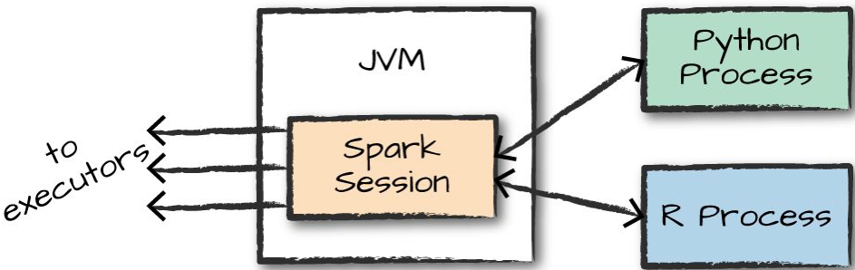

% Introduction to Spark

## Apache Spark

"Unified computing engine"

- cluster manager for running programs distributed across multiple computers ("nodes")
    - Spark cluster manager, YARN, or Mesos
- libraries for parallel data processing


## Spark Applications

- Driver process runs `main()` function on a node in the cluster
    - Maintains information about the Spark application
    - Responds to user's program or input
    - Analyzes, distributes, and schedules work across executors
- Executor processes
    - Carry out work assigned by driver
    - Report state of computation to driver
 
{height=30%}

## Spark Langauges and APIs

Executors run Spark code.  Driver runs user's program, which can be written in one of Spark's langauge APIs:

- Scala -- the default language; Spark is written in Scala.
- Java
- Python -- includes most of the Scala API
- SQL -- subset of ANSI SQL 2003
- R -- SparkR is part of Spark core, R community provides an alternative called spraklyr

{height=20%}

Note: there are two APIs: a high-level "structured" API, and a low-level API.

## Spark Session

Every Spark application has exactly one associated `SparkSession`. 

- Explicitly create a `SparkSession` in Spark programs
- `SparkSession` instance implicitly created in Spark shell

```Scala
scala> spark
res0: org.apache.spark.sql.SparkSession = org.apache.spark.sql.SparkSession@32950acc
```

## DataFrames

A DataFrame is table of rows and columns partitioned across the nodes in the Spark cluster.


## DataFrame

```Scala
scala> val myRange = spark.range(1000).toDF("number")
myRange: org.apache.spark.sql.DataFrame = [number: bigint]

scala> myRange.show(5)
+------+
|number|
+------+
|     0|
|     1|
|     2|
|     3|
|     4|
+------+
only showing top 5 rows
```

A DataFrame's schema is a list of columns and their types:

```Scala
scala> myRange.schema
res6: org.apache.spark.sql.types.StructType = StructType(StructField(number,LongType,false))

scala> myRange.printSchema
root
 |-- number: long (nullable = false)
```

A DataFrame is 

## DataFrame Computation Pipeline

- Transformations take a DataFrame as input and produce another DataFrame (lazily)
- An action is executed as the last step of a computation pipeline to produce the final DataFrame
