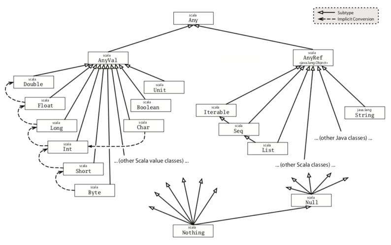

% Scala Control Structures

## Scala Control Structures

- Only six: if, while, do-while, for, match, try
- Scala control structures are expressions -- they return values
- These returned values are sometimes useless

## `if` Expressions

Syntactically similar to Java's if-statement, but Scala's if is an expression.  What's the type of result below?

```Scala
val first = true
val result = if (!first) "last" else "shake and bake!"
```

What's the type of cal below?

```Scala
val cal = if (true) "magic man" else 42
```

## Type Inference in `if` Expressions

Types are static, so type of `cal` below is `Any`, because `Any` is the least supertype of both `String` and `Int`

```Scala
val cal = if (true) "magic man" else 42
```

{height=60%}

## Semicolon Inference

A line ending is treated as a semicolon unless one of the following conditions is true: 

- The line in question ends in a word that would not be legal as the end of a statement, such as a period or an infix operator. 
- The next line begins with a word that cannot start a statement. 
- The line ends while inside parentheses (...) or brackets [...], because these cannot contain multiple statements anyway. 

Unlike the Java, Scala style is to end lines of multi-line expressions with operators.

## Imperative Loops

`while` is like Java's `while` loop, but is an expression like other elements of Scala

```Scala
val enough = 3
var i = 1 // has to be a var because it's reassigned
val useless = while (i < enough) {
  i += 1
}
```

- After code above, useless has the value (), which is the only value of the special type Unit.  Unit is analogous to void in Java.

`do`-`while` is just like Java's:

```Scala
var j = 0
do {
  println(j)
  j += 1
} while (j < 5)
```

## `for` Expressions

Simplest case (`1 to 5` creates a `Range.Inclusive` sequence):

```Scala
for (i <- 1 to 5) {
  val dub = i * 2
  println(dub)
}
```

- `i <- coll` is a generator expression.  `i` is a new val successively assigned values from `coll` in each iteration.

Add filter with an `if` clause after the generator expression.  Only doubles of even numbers:

```Scala
for (i <- 1 to 10 if i % 2 == 0) {
  val dub = i * 2
  println(dub)
}
```

## Variable Scope

- Scala is fully lexically scoped, which differs slightly from Java which is mostly lexically scoped
- In code below, the dub inside the loop shadows the dub outside the loop

```Scala
val dub = "step"
for (i <- 1 to 10 if i % 2 == 0) {
  val dub = i * 2
  println(dub)
}
```

- In Java  you can shadow static or instance variables in local scope (inside methods), but you can't shadow local variables in nested local scopes, like the bodies of loops.
- In Scala you can create arbitrary blocks which are truly nested lexical scopes.

## `for` Comprehensions

Putting a `yield` before the body of the for expression turns it into a comprehension, which collects the values produced into a `Seq` of the same type as the source in the generator expression

```Scala
val doubles = for (i <- 1 to 5) yield {
  val dub = i * 2
  dub
}
```

- `doubles == Vector(2, 4, 6, 8, 10)` because `1 to 5` is a `Vector`

Beware this gotcha:

```Scala
val units = for (i <- 1 to 5) yield {
  val dub = i * 2
  println(dub)
}
```
Above would print `double` values, but `println` returns `()`.  What's value of `units`?

## `match` Expressions

- Scala match expression like Java's `switch` but far better
- Can match on any type, no fall-through, and returns value of first matching alternative. 

```Scala
val love = "boat"
val swipe = love match {
  case "right" => "lame"
  case "boat" => "das"
  case "bug" => "herbie"
  case "dr" => "Gene Simmons"
  case _ => 3
}
```

- `swipe` above is `"das"`.  What type is `swipe`?  Why?
- `_` is the "catch-all".  Below `swipe` gets the value 3

```Scala
val love = "sacrifice"
val swipe = love match {
  case "right" => "lame"
  case "boat" => "das"
  case "bug" => "herbie"
  case "dr" => "Gene Simmons"
  case _ => 3
}
```

## `try` Expressions

- Exceptions work like in Java except all are unchecked
- `catch` block uses syntax and semantics like `match` expressions (only one catch block)

```Scala
val whatKind = try {
  throw new RuntimeException
} catch {
  case e: RuntimeException => "it was a RuntimeException"
  case e: Exception => "it was an Exception"
} finally {
  println("Ensure resources are closed after unwinding the stack")
  "lost"
}
```

- The value of `whatKind` is `"it was a RuntimeException"`
- The value of the `finally` block is discarded
- Could have included a catch-all clause as in the `match` example on last slide

## Conclusions

- Scala has most of the same basic control structures as Java
- Scala's `for` expression is far more powerful and nothing like anything in Java (we'll have a whole lecture on `for` expressions later)
- Most Scala control structures return values
- Static typing can result in some surprising types for values from `if` and `match` expressions
- Scala is lexically scoped, meaning you can shadow local variables in nested scopes


