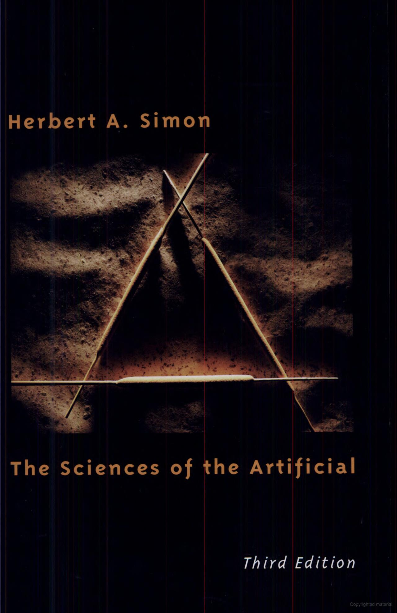

## These people are wrong.

```{=latex}
\begin{center}
```
{height="25%"}
{height="25%"}
{height="25%"}
{height="25%"}
{height="25%"}
```{=latex}
\end{center}
```

To be fair, there are many, many people who are wrong about AI.  But you probably recognize these guys.

- The emergence of "human-level AI" has been "just a few years away" since 1956.  All of these predictions have been wrong.

*Why does it matter that they're wrong?*

## We are decades, perhaps centuries away from "solving" AI.

- AI is immature.
- Currently, unfortunately, overhyped.

```{=latex}
\begin{center}
```
See my advisor's advisor's dated predictions:

{height=30%}

https://rodneybrooks.com/my-dated-predictions/
```{=latex}
\end{center}
```

- Most of the truly groundbreaking discoveries in AI are yet to be made.

```{=latex}
\vspace{.25in}
\begin{center}
\LARGE{This makes AI exciting!}
\end{center}
```

## What does this mean for us?

- If most of the breakthroughs are yet to be made, then

    - *we don't even have the right **paradigm** yet*.

- Many AI courses focus on *the current thing*, focusing on statistical machine learning, and neural networks in particular.

    - This does a disservice to students!

- This course the full spectrum of AI so that you're ready to spot and develop promising new directions.

    - We'll spend little time on machine learning, and barely touch on neural networks.

        - We have entire courses for those subjects!

## What is AI?

:::: {.columns}
::: {.column width="50%"}

```{=latex}
\begin{center}
```
{height="60%"}[^simon1996sciences]
```{=latex}
\end{center}
```

:::
::: {.column width="50%"}


Artificial

- Man-made.  Syntehetic.

Intelligence

- Problem solving, inference, decision making, learning.

Rationality

- Doing the right thing.

:::
::::

[^simon1996sciences]: https://mitpress.mit.edu/9780262691918/the-sciences-of-the-artificial/

## Four Approaches to AI

Decompose AI into thinking and acting, and define standards of performance as fidelity to humans and quanitative rationality.


```{=latex}
\begin{tabular}{lr|cc}\\
     &          & \multicolumn{2}{c}{Standard} \\
     &          & Humanly  & Rationally \\\hline
Mode & Acting   & Acting humanly & Acting rationally \\
     & Thinking & Thinking humanly & Thinking rationally \\
\end{tabular}
```

> Thinking is nothing more than acting in an imagined space.
>
> -- Konrad Lorenz via Bernhard Schölkopf

## Acting humanly

Turing test

- Natural language processing
- Knowledge representation
- Automated reasoning
- Machine learning

Total Turing test

- Computer vision
- Robotics

Nobody cares about Turing tests.

## Thinking humanly

Cognitive modeling

## Acting rationally

Rational agent

## Thinking rationally

"Laws of thought"

## Beneficial machines

Value alignment

## Foundations of AI

- Philosophy
- Mathematics
- Neuroscience
- Psychology
- Computer Engineering
- Control theory and cybernetics
- Linguistics

Such a rich tapestry!

## Philosophy

- Can formal rules be used to draw valid conclusions?
- How does the mind arise from a physical brain?
- Where does knowledge come from?
- How does knowledge lead to action?

## Mathematics

- What are the formal rules to draw valid conclusions?
- What can be computed?
- How do we reason with uncertain information?

- Logic
- Probability and statistics
- Algorithms, computability and complexity
- Optimization


## Economics

Acting rationally

- How should we make decisions in accordance with our preferences?
- How should we do this when others may not go along?
- How should we do this when the payoff may be far in the future?

## Neuroscience

How do brains process information?

{height="50%"}

## Psychology

How do humans and animals think and act?

- Acting humanly

## Computer Engineering

How can we build an efficient computer?

- HPC
- Quantum computing

## Control theory and cybernetics

How can artifacts operate under their own control?

## Linguistics

How does language relate to thought?

## History of AI

Turing award winners:

- Marvin Minsky (1969)
- John McCarthy (1971)
- Allen Newell and Herbert Simon (1975)
- Ed Feigenbaum and Raj Reddy (1994)
- Judea Pearl (1994)
- Yoshua Bengio, Geoffrey Hinton, and Yann LeCun (2019)

## MucCulloch, Pitts, Hebb (1943-1949)

- Perceptrons
- Hebbian learning

## 1956 Dartmouth AI Workshop

Organized by John McCarthy, Marvin Minsky, Claude Shannon, Nathaniel Rochester

Attendees:

Allen Newell and Herbert Simon from Carnegie Tech, Trenchard More from Princeton, Arthur Samuel from IBM, and Ray Solomonoff and Oliver Selfridge from MIT

Logic Theorist

## Symbolic AI (1952-1969)

- Lisp

## First AI Winter (1966-1973)

Lighthill report (Lighthill, 1973) -- British government ended most AI funding

## Expert Systems (1969-1986)

DENDRAL
MYCIN
SHRDLU
Frames

## Second AI Winter (1986)

Experts systems failed to deliver on their inventors' promises.

Knowledge acquisition bottleneck.

Adaptability, brittleness.

## Return of neural networks (1986-present)

Symolism vs Connectionism

Geoff Hinton, et. al.

## Probabilistic reasoning and machine learning (1987-present)

Neats vs scruffies

## Big data (2001-present)

Large data sets -- don't fit on a single machine

## Deep learning (2011-present)

CNN
DRL (AlphaGo)

## The State of the Art

AI Index Highlights from 2019:

- Publications: AI papers increased 20-fold between 2010 and 2019 to about 20,000 a
year. The most popular category was machine learning. (Machine learning papers
in arXiv.org doubled every year from 2009 to 2017.) Computer vision and natural
language processing were the next most popular.
- Sentiment: About 70% of news articles on AI are neutral, but articles with positive tone
increased from 12% in 2016 to 30% in 2018. The most common issues are ethical: data
privacy and algorithm bias.
- Students: Course enrollment increased 5-fold in the U.S. and 16-fold internationally
from a 2010 baseline. AI is the most popular specialization in Computer Science.
- Diversity: AI Professors worldwide are about 80% male, 20% female. Similar numbers
hold for Ph.D. students and industry hires.
- Conferences: Attendance at NeurIPS increased 800% since 2012 to 13,500 attendees.
Other conferences are seeing annual growth of about 30%.
- Industry: AI startups in the U.S. increased 20-fold to over 800.
- Internationalization: China publishes more papers per year than the U.S. and about
as many as all of Europe. However, in citation-weighted impact, U.S. authors are 50%
ahead of Chinese authors. Singapore, Brazil, Australia, Canada, and India are the fastest
growing countries in terms of the number of AI hires.
- Vision: Error rates for object detection (as achieved in LSVRC, the Large-Scale Visual
Recognition Challenge) improved from 28% in 2010 to 2% in 2017, exceeding human
performance. Accuracy on open-ended visual question answering (VQA) improved
from 55% to 68% since 2015, but lags behind human performance at 83%.
- Speed: Training time for the image recognition task dropped by a factor of 100 in just
the past two years. The amount of computing power used in top AI applications is
doubling every 3.4 months.
- Language: Accuracy on question answering, as measured by F1 score on the Stanford
Question Answering Dataset (SQUAD), increased from 60 to 95 from 2015 to 2019; on
the SQUAD 2 variant, progress was faster, going from 62 to 90 in just one year. Both
scores exceed human-level performance.
- Human benchmarks: By 2019, AI systems had reportedly met or exceeded human-
level performance in chess, Go, poker, Pac-Man, Jeopardy!, ImageNet object detection,
speech recognition in a limited domain, Chinese-to-English translation in a restricted
domain, Quake III, Dota 2, StarCraft II, various Atari games, skin cancer detection,
prostate cancer detection, protein folding, and diabetic retinopathy diagnosis.
Unfortunately, the AI Index has been corrupted by LLM hysteria and is mostly slop now.  For example, they use "AI models" to refer to AI systems in general and what they really mean is "LLM."

See https://hai.stanford.edu/ai-index/2025-ai-index-report

## Robotic Vehicles


## Legged Locomotion


## Autonomous planning and scheduling


## Machine Translation

## Speech Recognition

## Recommendations

## Game Playing

## Image Understanding

## Medicine

## Climate Science


## Cambrian Intelligence

Rodney Brooks
https://www.amazon.com/Cambrian-Intelligence-Early-History-New/dp/0262522632/
