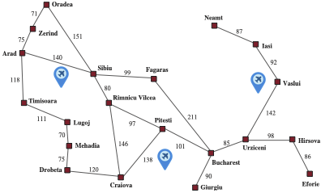

## Local Search

If you don't care about the path to a goal state, you can use **local search**.

- Search neighbors of current state, moving to best neighbor.
- Track only current state.
- Uses very little memory.
- Can find reasonable solutions in large or infinite state spaces.
- Often used for **optmization** problems -- finding states that maximize or minimize an **objective function**.


## State Space Landscape

```{=latex}
\begin{center}
```

```{=latex}
\end{center}
```

## Hill-Climbing Search

```{=latex}
\begin{center}
```

```{=latex}
\end{center}
```

- Also known as **greedy local search**

## The 8 Queens Problem

**Complete-state formulation**: row position for each of 8 columns, e.g., (a) below is `<1, 6, 2, 5, 7, 4, 8, 3>`

```{=latex}
\begin{center}
```
{height="50%"}
```{=latex}
\end{center}
```

- Action: move a single queen to new row within column.  Each state has $8 \cdot 7 = 56$ successor states.
- Possible heuristic: number of pairs of attacking queens (even if blocked).  (b) above has $h = 17$.

    - Useful to remember: $\binom{n}{k} = \frac{n!}{k!(n-k)!}$


## Disadvantages of Hill-Climbing

:::: {.columns}
::: {.column width="60%"}
Susceptible to getting stuck in:

- local maxima
- ridges -- sequences of local maxima
- plateaus, e.g., flat local maxima or shoulders.

{height="30$"}

How to fix:

- Allow "sideways" moves
- Stochastic hill climbing chooses randomly from uphill moves.
- Random restart hill climbing restarts from multiple initial states.

:::
::: {.column width="40%"}

Grid of states superimposed on ridge rising from left to right.

```{=latex}
\begin{center}
```

```{=latex}
\end{center}
```

:::
::::

## Simulated Annealing

```{=latex}
\begin{center}
```
{height="30%"}
```{=latex}
\end{center}
```

- Based on metallurgy -- gradually cool metal to reach low-energy crystalline state.
- Intuition: think of gradient descent instead of gradient ascent -- multiple shallow valleys, one deepest valley.  Shake ball out of shallow valleys into deepest valley.
- Similar to hill climbing, but picks a random move and

    - accepts it if its better,
    - if not better, accept with probability < 1.

- Probability of accepting a worse move depends on:

    - how much worse the move is, $\Delta E$, and
    - the current "temperature," $T$.

If $T$ decreases sufficiently slowly, then the Boltzman distribution, $e^{\frac{\Delta E}{T}}$, ensures that all the probability is concentrated on the global maxima, so the algorithm finds a global maximum with probability approaching 1.

## Evolutionary (Genetic) Algorithms

A kind of **local beam search**: tracking $k$ states instead of just one.

Elements of genetic algorithms:

- Fitness function.
- Population size.
- Candidate representation:

    - Typically a string (vector) over a finite alphabet.
    - **Evolution strategies**: sequence of real numbers.
    - **Genetic programming**: computer programs.

- Mixing number, $\rho$: number of "parents" from which to generate new candidates.  When $\rho = 1$, stochastic beam search.
- Selection process for choosing "parents."
- Recombination procedure.
- Mutation rate.
- Composition of next generation.

    - Elitism: choose top-scoring candidates.
    - Culling: eliminate bottom-scoring candidates.


## A Genetic Algorithm

```{=latex}
\begin{center}
```

```{=latex}
\end{center}
```

## Genetic Algorithm on 8-Queens Problem

```{=latex}
\begin{center}
```

```{=latex}
\end{center}
```

1. Population is generated in (a).
2. Fitness function is applied to population, which is then ranked by fitness score.
3. Highest-scoring candidates are selected for reproduction in (c).
4. Crossover operation is applied to candidates in (c) to produce "children" in (d).
5. In (e) "offspring" are randomly chosen for mutation.  For each chosen candidate, a "gene" is randomly chosen, then that gene is assigned a random "mutated" value.

## Crossover in the 8-queens Problem

Here is a pictorial illustration of the crossover operation in the 8-queens problem:

```{=latex}
\begin{center}
```

```{=latex}
\end{center}
```

Is the random crossover operation depicted here meaningful for the 8-queens problem?

## Genetic Algorithms and Biological Evolution

Genetic algorithms borrow the language of biological evolution for marketing purposes, but are far more simplistic than biological evolution.  My takes:

- Genetic algorithms are just stochastic beam search with "sexual" successor generation and "mutation."
- If there is no meaningful crossover operation, genetic algorithms are just random walks in the state space graph.

There is an interesting connection between biological evolution and AI, in particular learning.

- Learning is adaptation. With experience an agent adapts to a task, getting better at the task.
- Biological evolution can be seen as a learning process whereby specieses "learn" to perform better in their environments.
- The Baldwin effect: immutable traits vs. online learning ability.

    - Plasticity, or the ability to learn, allows a species to adapt to an environment for which it is ill-suited.  E.g., building shelters, fire, etc. in cold regions.
    - Things that are harder, or impossible, to learn online must be encoded in the genome.  E.g., the way our body uses the air it breathes or the sun.

## Continuous State Spaces -- Airports In Romania


:::: {.columns}
::: {.column width="60%"}

```{=latex}
\begin{center}
```
{height="80%"}
```{=latex}
\end{center}
```

:::
::: {.column width="40%"}

If each airport $\bm{x}_i$ is at location $(x_i, y_i)$ and the set of cities closest to airport $\bm{x}_i$ is $C_i$, then

$$
f(\bm{x}) = f(x_1, y_1, x_2, y_2, x_3, y_3)
$$

and we want to minimize

$$
f(\bm{x}) = \sum_{i=1}^3 \sum_{c \in C_i} (x_i - x_c)^2 + (y_i - y_c)^2
$$

For a globally optimal solution, if the airports move "too much," the sets $C_i$ change.  How to deal with that?

:::
::::

## Local Gradient Descent

The gradient of

$$
f(\bm{x}) = \sum_{i=1}^3 \sum_{c \in C_i} (x_i - x_c)^2 + (y_i - y_c)^2
$$

is

$$
\nabla f = \left( \frac{\partial f}{\partial x_1},
                  \frac{\partial f}{\partial y_1},
                  \frac{\partial f}{\partial x_2},
                  \frac{\partial f}{\partial y_2},
                  \frac{\partial f}{\partial x_3},
                  \frac{\partial f}{\partial y_3} \right)
$$

But that would only work for one airport.  We can decompose it into three local problems:

:::: {.columns}
::: {.column width="33%"}

$$
\frac{\partial f}{\partial x_1} = 2 \sum_{c \in C_1} (x_1 - x_c)
$$
$$
\frac{\partial f}{\partial y_1} = 2 \sum_{c \in C_1} (y_1 - y_c)
$$

:::
::: {.column width="33%"}

$$
\frac{\partial f}{\partial x_2} = 2 \sum_{c \in C_2} (x_2 - x_c)
$$
$$
\frac{\partial f}{\partial y_2} = 2 \sum_{c \in C_2} (y_2 - y_c)
$$

:::
::: {.column width="33%"}

$$
\frac{\partial f}{\partial x_3} = 2 \sum_{c \in C_3} (x_3 - x_c)
$$
$$
\frac{\partial f}{\partial y_3} = 2 \sum_{c \in C_3} (y_3 - y_c)
$$

:::
::::

## Gradient Descent in Action

:::: {.columns}
::: {.column width="40%"}

Given our 3 gradient expressions, we can use the update rule:

$$
\bm{x} \leftarrow \bm{x} + \alpha \nabla f(\bm{x})
$$

where $\alpha$ is a **step size**, or learning rate.

- What if $\alpha$ is "too big?"

- What if $\alpha$ is "too small?"

:::
::: {.column width="60%"}

```{=latex}
\begin{center}
```
{height="80%"}[^UDLBook]
```{=latex}
\end{center}
```

:::
::::

[^UDLBook]: https://udlbook.github.io/udlbook/

## Continuous State Spaces and Convexity

A convex set is a set of points in which a line between any two points lies within the set.  A convex function is a function for which the points above the function form a convex set.

```{=latex}
\begin{center}
```
[^UDLBook]
```{=latex}
\end{center}
```

There are mathematical properties of continuous spaces that rule out local minima.  Take my deep learning class to learn about them!

[^UDLBook]: https://udlbook.github.io/udlbook/

## Constrained Optimization via Linear Programming

:::: {.columns}
::: {.column width="30%"}

```{=latex}
\begin{align*}
\text{maximize }    3x_1 + 2x_2  \\
\text{subject to }  -x_1 + 3x_2 &\le  12 \\
                    x_1 + x_2   &\le  8 \\
                    2x_1 - x_2  &\le  10 \\
                    x_1, x_2    &\ge  0
\end{align*}
```

:::
::: {.column width="70%"}

```{=latex}
\begin{center}
```
{height="70%"}[^LPBook]
```{=latex}
\end{center}
```

:::
::::

[^LPBook]: https://vanderbei.princeton.edu/LPbook/

## States in the Vacuum World

Let's return to the vacuum world, whose states are:

```{=latex}
\begin{center}
```

```{=latex}
\end{center}
```

## Nondeterministic Actions: The Erratic Vacuum World

In the erratic vacuum world, the Suck action works as follows:

- When applied to a dirty square the action cleans the square and sometimes cleans up dirt in an adjacent square, too.
- When applied to a clean square the action sometimes deposits dirt on the carpet.

So the result of each action is a set, e.g.:

$$
\text{Results}(1,Suck) = \{5, 7\}
$$

That set of states that the agent believes is possible, {5, 7}, is called a **belief state**.

## A Factored Representation

Let's depart from the book for a few slides and, instead of using an index into a vector of states, create a factored representation for clarity.

- `left-condition` $\in$ {`CLEAN`, `DIRTY`}
- `right-condition` $\in$ {`CLEAN`, `DIRTY`}
- `vacuum-location` $\in$ {`LEFT`, `RIGHT`}
- State representation: `<vacuum-location, left-condition, right-condition>`

So

```{=latex}
\begin{center}
```
`Results(1,Suck) = {5, 7}`
```{=latex}
\end{center}
```
becomes
```{=latex}
\begin{center}
```
`Results(<LEFT, DIRTY, DIRTY>, Suck) = {<LEFT, CLEAN, DIRTY>, <LEFT, CLEAN, CLEAN>}`
```{=latex}
\end{center}
```

Note that the factored representation is easier for us to read (don't have to look up states in a table), but the search algorithms we're considering here treat these states as atomic.

## Conditional Plans

A conditional plan, a.k.a. *contingency plan*, is a plan that specifies action selection based on the observed state while executing the plan.

- In a fully-observable, deterministic world contingencies are not necessary -- a plan is just a sequence of actions.
- We need conditional/contingency plans in environments that are partially observable or nondeterministic.

Consider the start state, `<LEFT, DIRTY, DIRTY>`.  Due to the environment's nondeterminism, not possible to find a sequence of actions guaranteed to solve the problem.  But this simple conditional plan does:

```{=latex}
\begin{center}
```
`[Suck, if State == <LEFT, CLEAN, DIRTY> then [Right, Suck] else []]`
```{=latex}
\end{center}
```


## AND-OR Search Trees

:::: {.columns}
::: {.column width="50%"}

- Branch on agent's action: **OR nodes**, shown as states.
- Branch on environment's outcome: **AND nodes**, shown as circles with arc linking branches to possible outcome states (when > 1).
- A plan includes actions for OR nodes, and conditional actions for AND nodes that contain more than one state.

Trace this conditional plan through the tree on the right.

`[Suck,`
`if State == <LEFT, CLEAN, DIRTY> then [Right, Suck]`
`else []]`

:::
::: {.column width="50%"}

```{=latex}
\begin{center}
```
{height="90%"}
```{=latex}
\end{center}
```

:::
::::

## Slippery Vacuum World

:::: {.columns}
::: {.column width="50%"}

- Like deterministic vacuum world, but a movement action may result in no movement.


`Results(<LEFT, DIRTY, DIRTY>, Right) =`
`    {<LEFT, DIRTY, DIRTY>, <RIGHT, DIRTY, DIRTY>}`


- Do deal with nondetermnistic movements we need cyclic plans.  Use a **while** construct:


`[Suck,`
` while State == <LEFT, CLEAN, DIRTY> do Right,`
` Suck]`


:::
::: {.column width="50%"}

```{=latex}
\begin{center}
```
{height="90%"}
```{=latex}
\end{center}
```

:::
::::

## States in the Vacuum World

Recall the states of the vacuum world:

```{=latex}
\begin{center}
```

```{=latex}
\end{center}
```

## Search in Sensorless Environments

Now let's turn to uncertainty in the state observations, first with a sensorless world.

Sensorless, a.k.a. conformant, problems are surprisingly common.

- Manufacturing: orienting parts regardless of initial position.
- Medicine: applying broadly applicable treatments without running tests.

Consider a sensorless version of the (deterministic) vacuum world. Assume that the agent knows the geography of its world, but not its own location or the distribution of dirt.

Given an initial belief state is {1,2,3,4,5,6,7,8}.

- After [Right], belief state is {2,4,6,8}
- After [Right,Suck] belief state is {4,8}.
- After [Right,Suck,Left,Suck], belief state is {7}.

We say that the agent can **coerce** the world into state 7.

## States in Sensorless Environments

Instead of creating new algorithms, we transform the original problem into a belief state problem.

The original problem, $P$, has components $Actions_P$, $Result_P$ etc., and the belief-state problem has the following components:

- **States**: The belief-state space contains every possible subset of the physical states. If $P$ has $N$ states, then the belief-state problem has $2^N$ belief states, although many of those may be unreachable from the initial state (see next slide).

- **Initial state**: Typically the belief state consisting of all states in P, although in some cases the agent will have more knowledge than this.

## Reachable States in Sensorless Vacuum World

Only 12 reachable belief states out of $2^8 = 256$ possible belief states.

:::: {.columns}
::: {.column width="70%"}

```{=latex}
\begin{center}
```

```{=latex}
\end{center}
```
:::
::: {.column width="30%"}

```{=latex}
\begin{center}
```

```{=latex}
\end{center}
```

:::
::::

## Actions in Sensorless Environments

- **Actions**: If $b = \{s_1,s_2\}$, but $Actions_P(s_1) \ne Actions_P(s_2)$; then agent can't be sure which actions are legal. If illegal actions have no effect, safe to take union of all  actions in the current belief state $b$:

$$
Actions(b) = \bigcup_{s \in b} Actions_P(s)
$$

If an illegal action might lead to catastrophe, safer to allow only the intersection -- set of actions legal in all states. For the vacuum world, every state has the same legal actions, so both methods give the same result.

## Transition Model in Sensorless Environments

- **Transition model**: For deterministic actions, the new belief state has one result state
for each of the current possible states (although some result states may be the same):

$$
b' = Result(b,a) = \{s': s' = Result_P(s,a) \text{ and } s \in b\}
$$

With nondeterminism, the new belief state consists of all the possible results of applying the action to any of the states in the current belief state:

```{=latex}
\begin{align*}
b'= Results(b,a) &= \{s': s' \in Results_P(s,a) and s \in b\}\\
                 &= \bigcup_{s \in b} Results_P(s,a)
\end{align*}
```

The size of $b'$ will be the same or smaller than b for deterministic actions, but may be larger than $b$ with nondeterministic actions.


## Predicting Belief States in Sensorless Vacuum World

```{=latex}
\begin{center}
```

```{=latex}
\end{center}
```

Apply the action to all states in $b$ to get $b'$.

- (a) Predicting the next belief state with the deterministic action, Right.
- (b) Prediction for the same belief state and action in the slippery sensorless vacuum world.

## Goals and Action Costs in Sensorless Environments

- **Goal test**:

    - The agent possibly achieves the goal if $\exists s \in b : IsGoal_P(s)$.
    - The agent necessarily achieves the goal if $\forall s \in b : IsGoal_P(s)$.
    - We aim to necessarily achieve the goal.

- **Action cost**: If the same action can have different costs in different states, then the cost of taking an action in a given belief state could be one of several values. For now we assume that the cost of an action is the same in all states and so can be transferred directly from the underlying physical problem.

## Search in Partially Observable Environments

Many problems cannot be solved without sensing, e.g., sensorless 8-puzzle is impossible.

We can solve 8-puzzles if we can see just the upper-left corner square by moving each tile in turn into the observable square and keeping track of its location from then on.

For a partially observable problem, the problem specification will specify a PERCEPT(s) function that returns the percept received by the agent in a given state.

- If sensing is nondeterministic, then we can use a PERCEPTS function that returns a set of possible percepts.
- For fully observable problems, PERCEPT(s) = s for every state s.
- For sensorless problems PERCEPT(s) = null.

## Local-Sensing Vacuum World

:::: {.columns}
::: {.column width="60%"}

The agent has a position sensor that yields the percept L in the left square, and R in the right square, and a dirt sensor that yields Dirty when the current square is dirty and Clean when it is clean -- but does not sense the other square.

- The PERCEPT in State 1 is [L,Dirty].
- State 3 will also produce [L,Dirty].
- Hence, the initial belief state will be {1,3}.

:::
::: {.column width="40%"}

```{=latex}
\begin{center}
```

```{=latex}
\end{center}
```

:::
::::


## Transition Model in Partially Observable Environments

We can think of the transition model between belief states for partially observable problems as occurring in three stages, as depicted in the next slide:

- The **prediction** stage computes the belief state resulting from the action, Result(b,a), exactly as we did with sensorless problems. To emphasize that this is a prediction, we use the notation $\hat{b} = Result(b,a)$, where the hat over the $b$ means "estimated," and we also use Predict(b,a) as a synonym for Result(b,a).

- The **possible percepts** stage computes the set of percepts that could be observed in the
predicted belief state (using the letter o for observation):

$$
PossiblePercepts(\hat{b}) = \{o : o = Percept(s) \text{ and } s \in \hat{b}\}
$$

- The **update** stage computes, for each possible percept, the belief state that would result from the percept. The updated belief state bo is the set of states in b that could have
produced the percept:

$$
b_o = Update(\hat{b},o) = \{s : o = Percept(s) \text{ and } s \in \hat{b}\}
$$

## Planning Time State Estimation

The agent needs to deal with possible percepts at planning time, because it won’t know the actual percepts until it executes the plan.

- Nondeterminism in the physical environment can enlarge the belief state in the prediction stage, but each updated belief state $b_o$ can be no larger than the predicted belief state $\hat{b}$; observations can only help reduce uncertainty.
- For deterministic sensing, the belief states for the different possible percepts will be disjoint, forming a partition of the original predicted belief state.

Putting these three stages together, we obtain the possible belief states resulting from a given action and the subsequent possible percepts:

$$
Results(b,a) = \{b_o : b_o = Update(Predict(b,a),o) \text{ and }
    o \in PossiblePercepts(Predict(b,a))\}.
$$

## State Transitions with Local Sensing

::: {.columns}
::: {.column width="50%"}
```{=latex}
\begin{center}
```

```{=latex}
\end{center}
```

:::
::: {.column width="50%"}

Predict, possible percepts, update

- (a) Deterministic world.  In final column, update step produces a partition of the belief state in the previous step.
- (b) Slippery world. Update step results in 3 belief states, each of which is no larger than the belief state from which they were produced.

:::
::::

## Local Sensing And-Or Trees

```{=latex}
\begin{center}
```

```{=latex}
\end{center}
```

## Prediction-Update Cycles

Section 4.4.4

$$
b' = UPDATE(PREDICT(b,a),o).
$$

```{=latex}
\begin{center}
```

```{=latex}
\end{center}
```

- Vast majority of real-world environments are partially observable.  Belief state prediction is core task.

- Also known as monitoring, filtering, and state estimation.

Equation above is called a recursive state estimator because it computes the new belief state from the previous one rather than by examining the entire percept sequence. To avoid "fallign behind," the computation has to happen as fast as percepts are coming in.

## Robot Localization

Localization: typical robot state estimation problem in which the robot works out where it is, given a map of the world and a sequence of percepts and actions.

```{=latex}
\begin{center}
```

```{=latex}
\end{center}
```

## Maze Problems

```{=latex}
\begin{center}
```

```{=latex}
\end{center}
```

## Dead Ends in Online Search

```{=latex}
\begin{center}
```

```{=latex}
\end{center}
```

## Online Depth-First Search

```{=latex}
\begin{center}
```

```{=latex}
\end{center}
```

## Random Walks

```{=latex}
\begin{center}
```

```{=latex}
\end{center}
```

## $LRTA^*$ Iterations

```{=latex}
\begin{center}
```

```{=latex}
\end{center}
```

## $LRTA^*$ Algorithm

```{=latex}
\begin{center}
```

```{=latex}
\end{center}
```
