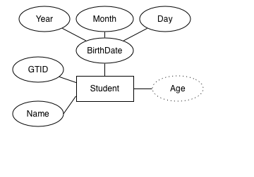
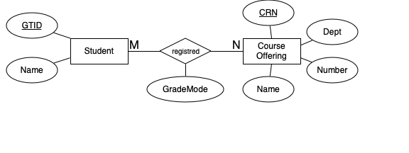
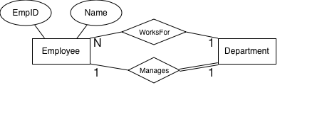

## Entity-Relationship Models

- Entities
- Attributes
- Relationships

## The Role of Conceptual Models

```{=latex}
\begin{center}
```
[^PeopleSkills]
```{=latex}
\end{center}
```

High-level but concrete view of data understandable by end users and database developers

[^PeopleSkills]: https://i.chzbgr.com/maxW500/6474992896/h503A45A5/

## Database Design Process

```{=latex}
\begin{center}
```
{height="60%"}
```{=latex}
\end{center}
```

ER modeling is the box labeled "Conceptual Design."

## Entities and Entity Types

An entity is a real or abstract thing with an independent existence in the world.

- Person (real)
- Building (real)
- Job (abstract)
- Course (abstract)

In ER models we often say "entity" when we mean "entity type."

- An entity type is a set of entities (instances) with the same attributes, i.e., properties of entities.

- An entity set or entity collection is the set of instances of an entity type in a partcular database.

Entity types are depicted with a rectangle.

## Atomic vs. Composite Attributes

- Atomic attributes have a single for an entity instance, e.g., `ID`.
- Composite attributes are composed of one or more compents, e.g., `BirthDate`

```{=latex}
\begin{center}
```
{height="60%"}
```{=latex}
\end{center}
```

An instance of Student might look like:

`("Tom Jones", 902109021, BirthDate(2000, 01, 25))`

## Single-valued vs. Multi-valued Attributes

- Single-valued attributes have one (atomic or composite) value for each instance.
- Multi-valued attributes have a set of (atomic or composite) values for each instance.

```{=latex}
\begin{center}
```
{height="60%"}
```{=latex}
\end{center}
```


## Stored vs. Derived Attributes

- All the attribute types we've seen so far are stored. A derived attribute gets its value from stored attributes and is not stored.
- Age is derived from BirthDate.

```{=latex}
\begin{center}
```
{height="60%"}
```{=latex}
\end{center}
```

## Complex Attributes

- Composite and multi-value attribtes can be arbitrarily nested. Such attributes are called complex attributes.

```{=latex}
\begin{center}`
```
{height="60%"}
```{=latex}
\end{center}
```

NULL values represent the absence of data. Can mean unknown or not applicable.

## Semantic Constraints

What if we wanted to ensure that no degree date were before the student's birthdate?

```{=latex}
\begin{center}
```
{height="40%"}
```{=latex}
\end{center}
```

- In general ER models can't express constraints on the values of particular attributes
  - Can only express contstraints on structure -- attributes of an entity type, sets for multi-valued attributes, components for composite attributes, single values for atomic attributes.
- To express constraints on the values of attributes (often in relation to the values of other attributes) we use a sematic constraint. For example:

> The `Date` for any `Degree` of a `Student` instance cannot be prior to the `BirthDate` of the `Student` instance.

## Keys

A key is a(n) (set of) attribute(s) whose value uniquely identifies an entity instance.

- Key attributes are underlined.
- No two entity instances in a database can have the same values for their key attribues.
- An entity type may have multiple keys.
- Composite keys are modeled with composite attributes.
- Names of key attributes are underlined.
- An entity type must have at least one key, otherwise it is a weak entity type (more later).
- If no attributes are underlined, every attribute forms a composite key.

```{=latex}
\begin{center}
```
{height="50%"}
```{=latex}
\end{center}
```

## Domains/Value Sets

Each attribute has a type.

- A type is a set of values, e.g., the set of integers, the set of months, etc.
- The attribute value for an instance comes from the domain of the attribute.
- Legal attribute values can be further restricted, e.g., `BirthDate` cannot be a future date.

```{=latex}
\begin{center}
```
{height="40%"}
```{=latex}
\end{center}
```

- Attribute types are not modeled in our ER diagram language but can be listed as semantic constraints.

> Example: `Month` $\in$ {`Jan`, `Feb`, `Mar`, ...} or {1, 2, ..., 12}


## Relationship Types

Relationships between entity types are explicitly modeled. Relationships have

- Names
- Degree -- the number of participating entity types (we'll only consider binary relationships)
- Attributes (optional)
- Constraints

  - Cardinality
  - Participation

## Relationships as Attributes

In this ER model a Student can have an Advisor.

```{=latex}
\begin{center}
```
{height="60%"}
```{=latex}
\end{center}
```

- But an advisor is a professor, which is an entity that is related to many other entities.
- And if a professor advises many students, the professor's information will be repeated in the database.

## Elevating Attributes to Relationships

The `advises` relationship type represents a relationship between Professor and Student.

```{=latex}
\begin{center}
```
{height="60%"}
```{=latex}
\end{center}
```

Relationship instances are represented as tuples of the key values of the related entity instances.

- `(123456789, 987654321)` means the professor with ID 123456789 is the advisor of the student with ID 987654321.

## Recursive Relationships

An entity type can be related to itself. Here every employee has one supervisor. A supervisor may have many supervisees.

```{=latex}
\begin{center}
```
{height="60%"}
```{=latex}
\end{center}`
```

## Cardinality Ratios

Two kinds of binary relationship constraints:

- Cardinality ratios
- Participation constraints

We've already seen 1-to-many cardinality ratios. Here's a many-to-many cardinality ratio:

```{=latex}
\begin{center}
```
{height="95%"}
```{=latex}
\end{center}
```

## Attributes of Relationship Types

Notice that the `registered` relationship has attributes.

```{=latex}
\begin{center}
```
{height="60%"}
```{=latex}
\end{center}
```

A tuple for an instance of the registered attribute would have a Student key value, a Course key value, and the values for the attributes of the relationship. For example:

- `(123456789, 8675309, "P/F")` means the Student with ID 123456789 is registered for the course with CRN 8675309 in Pass/Fail mode.

## Participation Constraints

Two kinds of participatoin constraints.

- Total (existence): every entity in an entity set participates in a relationship
- Partial: some of the entities in an entity set participate in a relationship

Here a department must have a manager, but not every employee is required to be a manager.

```{=latex}
\begin{center}
```
{height="60%"}
```{=latex}
\end{center}
```

## Weak Entity Types

```{=latex}
\begin{center}
```
{height="60%"}
```{=latex}
\end{center}
```

## Weak Entity Types

- Don't have keys
- May have partial keys
- Must have total participation with identifying entity type
- Identifiable by a composite key: identifying entity's key + weak entity's partial key

Identifying relationship is represented with double-lined diamond.

## Courses and Department

Here, a course is offered by a department.

- Courses in different departments can have the same number.
- The department key and the course number are sufficient to uniquely identify a course.
- A department will only have one course with a given number, so the number is a partial key.

```{=latex}
\begin{center}
```
{height="60%"}
```{=latex}
\end{center}
```

## Multiple Identifying Relationships

A weak entity type can be identified in relation to multiple entity types.

```{=latex}
\begin{center}
```
{height="60%"}
```{=latex}
\end{center}
```

The key for an INVENTORY instance is

> (StoreId, ProductId(MfrDate, SerialNo), InventoryId)

## Fin

- Entity-relationship models express contents and constraints on data using

  - entities,
  - attributes, and
  - relationships.

- ER modeling is a part of conceptual design.
- ER models are understood by both technical and non-technical stakeholders (e.g., customers).
- Constraints that can't be modeled using in the ER modeling scheme can be expressed as semantic constraints.
