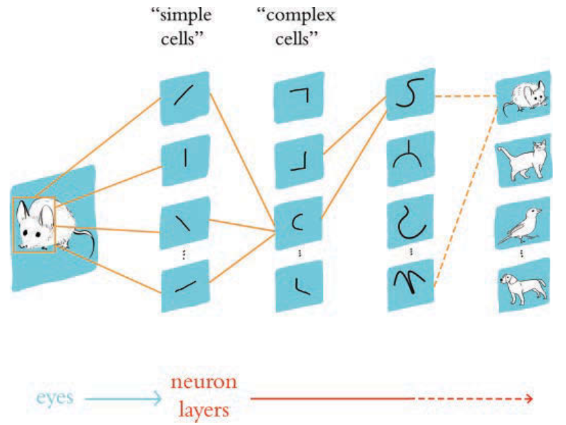

## Biological Vision

In the 1950s, Hubel and Wiesel at Johns Hopkins, experimenting on cats, discovered the hierarchical nature of neurons in the visual cortex.

```{=latex}
\begin{center}
```
{height="70%"}[^DLI]
```{=latex}
\end{center}
```

[^DLI]: [https://www.deeplearningillustrated.com](https://www.deeplearningillustrated.com)

## Machine Vision

In 1980 Kunihiko Fukushima proposed the *Neocognitron* architecture explicitly based on neuron layers in biological vision.

```{=latex}
\begin{center}
```
{height="60%"}[^DLI]
```{=latex}
\end{center}
```

It took the success of LeCun and Bengio's *LeNet-5*, and later Krizhevsky and Stuskever's *AlexNet* to realize the full potential of a deeply layered machine vision model and firmly establish the supremacy of Deep Learning for machine vision.

## Shallow Networks

Recall the grapphical depiction of a single input/output network:

```{=latex}
\begin{center}
```
{height="70%"}
```{=latex}
\end{center}
```

Note the

- $\theta$s for weights on preactivations,
- $\phi$s for weights on activations, and
- bias terms indicated with a "from" index of 0.

## Composing Shallow Networks

:::: {.columns}
::: {.column width="50%"}

Now recall the general formulation of a single input/output shallow network (left half of figure on right):

$$
h_d = a(\theta_{d0} + \theta_{d1}x)
$$

$$
y = \phi_0 + \sum_{d=1}^{D}\phi_d h_d
$$

You could concatenate this with another shallow network with the same architecture (right half of figure on right) that takes the first network's output as its input:

$$
h'_d = a(\theta'_{d0} + \theta'_{d1}y)
$$

$$
y' = \phi'_0 + \sum_{d=1}^{D}\phi'_d h'_d
$$

:::
::: {.column width="50%"}

```{=latex}
\begin{center}
```
{height="70%"}
```{=latex}
\end{center}
```

:::
::::

## Composed 1D Shallow Networks

If we substitute the expression for $y$ (notice I'm using $i$ to index over units in the first hidden layer, and $d$ for the second, where there is the same number $D$ of hidden units in each layer):

$$
y = \phi_0 + \sum_{i=1}^{D}\phi_i h_i
$$

into the formulas for the hidden units in the second shallow network we get:

$$
h'_d = a(\theta'_{d0} + \theta'_{d1} y) = a(\theta'_{d0} + \theta'_{d1} \phi_{0} + \sum_{i=1}^{D} \theta'_{d1} \phi_{i}h_{i})
$$

```{=latex}
\begin{center}
```
{height="30%"}
```{=latex}
\end{center}
```

## From Composed 1D Shallow Nets to 1D Deep Net

If we then let $\psi_{d0} = \theta'_{d0} + \theta'_{d1} \phi_0$  and $\psi_{di} = \theta'_{d1} \phi_i$ we get:

$$
h'_d = a(\psi_{d0} + \sum_{i=1}^{D} \psi_{di} h_i )
$$

```{=latex}
\begin{center}
```
{height="50%"}
```{=latex}
\end{center}
```


## Deep Neural Network Signal Flow

4.3 (Fig 4.5)
```{=latex}
\begin{center}
```
{height="70%"}
```{=latex}
\end{center}
```

## Hyperparameters

The hyperparameters of a network are fixed quantities describing the architecure of the network.  They include:

- *Width*, $D$: number of hidden units in each layer
- *Depth*, $K$: number of hidden layers

The dimensionality of the input and output are also fixed.

```{=latex}
\begin{center}
```
{height="50%"}
```{=latex}
\end{center}
```

The parameters, biases and weights, are adjusted during training and denoted with greek letters.

## Linear Algebra Interlude

- Vector Addition
- Scalar Multiplication
- $\boldsymbol{A}\vec{x}$

## Matrix Network Notation

We can take the previous 1D deep net formulated with sums and formulate it with matrices:

$$
\left[
\begin{array}{c}
h_1\\
h_2\\
h_3
\end{array}
\right]
=
a \left[
\left[
\begin{array}{c}
\theta_{10}\\
\theta_{20}\\
\theta_{30}
\end{array}
\right]
+
\left[
\begin{array}{c}
\theta_{11}\\
\theta_{21}\\
\theta_{31}
\end{array}
\right]
x
\right]
$$

$$
\left[
\begin{array}{c}
h'_1\\
h'_2\\
h'_3
\end{array}
\right]
=
a \left[
\left[
\begin{array}{c}
\psi_{10}\\
\psi_{20}\\
\psi_{30}
\end{array}
\right]
+
\left[
\begin{array}{ccc}
\psi_{11} & \psi_{12} & \psi_{13} \\
\psi_{21} & \psi_{22} & \psi_{23} \\
\psi_{31} & \psi_{23} & \psi_{33}
\end{array}
\right]
\left[
\begin{array}{c}
h_1\\
h_2\\
h_3
\end{array}
\right]
\right]
$$

$$
y' = \phi'_{0} +
\left[
\begin{array}{ccc}
\phi'_1 & \phi'_2 & \phi'_3
\end{array}
\right]
\left[
\begin{array}{c}
h'_1\\
h'_2\\
h'_3
\end{array}
\right]
$$

Or, collapsing the vectors and matrices:

$$
\boldsymbol{h} = a(\boldsymbol{\theta}_0 + \boldsymbol{\theta} x)
$$
$$
\boldsymbol{h}' = a(\boldsymbol{\psi}_0 + \boldsymbol{\Psi}\boldsymbol{h})
$$
$$
y' = \phi'_0 + \boldsymbol{\phi}'^T \boldsymbol{h'}
$$


## General Matrix Formulation

A general formulation of a network $\boldsymbol{y} = f(\vec{x}, \vec{\phi})$ where

- $K$ is the number of layers,
- $\vec{\phi}$ refers to all the learned parameters $\{ \boldsymbol{\beta}_k, \boldsymbol{\Omega}_k \}_{k=0}^K$,
- $\boldsymbol{\beta}_{k}$ are the biases in layer $k$ and $\boldsymbol{\Omega}_{k}$ are the weights in layer $k$ (replacing the $\theta$s and $\phi$s from before).

$$
\boldsymbol{h}_K = a \left( \boldsymbol{\beta}_{K-1} + \boldsymbol{\Omega}_{K-1} \boldsymbol{h})_{K-1} \right)
$$
$$
\boldsymbol{y} = \boldsymbol{\beta}_{K} + \boldsymbol{\Omega}_{K} \boldsymbol{h}_{K} \tag{4.15}
$$

We can write the whole network as:

$$
\bm{y} = \bm{\beta}_K + \bm{\Omega}_K a \left( \bm{\beta}_{K-1} + \bm{\Omega}_{K-1} a (... \bm{\beta}_1 + \bm{\Omega}_1 a (\bm{\beta}_0 + \bm{\Omega}_0 a )  )   \right) \tag{4.16}
$$

```{=latex}
\begin{center}
```
{height="30%"}
```{=latex}
\end{center}
```

## Capacity of Shallow vs. Deep Neural Networks

Considering 1D networks:

- A shallow network with $D > 2$ hidden units can create up to $D+1$ linear regions.
- A deep network with $K$ layers of $D > 2$ hidden units can create up to $(D+1)^K$ linear regions.

Some functions require exponentially more hidden units than an equivalent deep network, a phenomenon known as *depth efficiency*

Deep nets seem to generalize better than shallow nets but require more training.

## Closing Thoughts

We now have the terminology and knowledge of the feed-forward operation of deep neural networks.  FOr the rest of the course we will

- learn how deep networks are trained, and
- survey the major deep network architectures for a range of applications.
