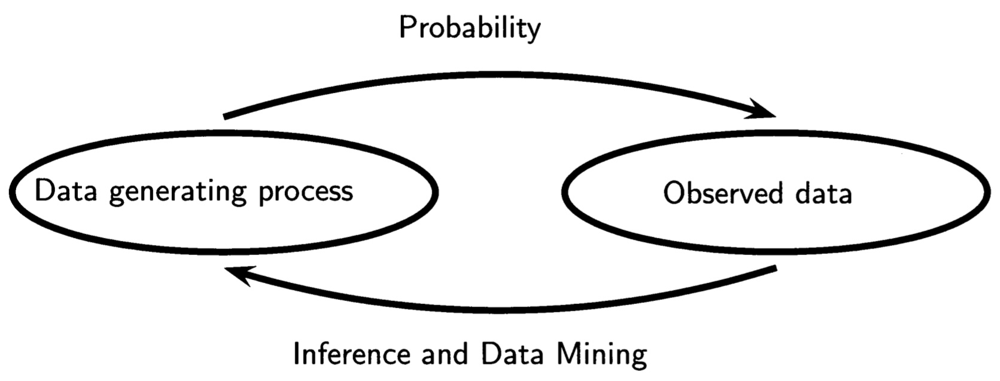

## Probability[^DLFC2]

Probability theory: quantification and manipulation of uncertainty.

- Epistemic, a.k.a. systematic uncertainty: we only see data sets of finite size
- Aleatoric, a.k.a. intrinsic, stochastic uncertainty: noise -- we only observe partial information

```{=latex}
\begin{center}
```
{height="40%"}
```{=latex}
\end{center}
```

[^DLFC2]: Follows Chapter 2 of [Deep Learning Foundations and Concepts](https://www.bishopbook.com)

## Probability in Machine Learning

We observe data generated by a random process.

```{=latex}
\begin{center}
```
{height="50%"}[^AOS]
```{=latex}
\end{center}
```

We make some assumptions about the data generating function and infer its parameters using samples from the process (training data).

[^AOS]: [All of Statistics](https://www.stat.cmu.edu/~larry/all-of-statistics/)

## A Medical Screening Example

A cancer with occurence rate of 1% (.01) has a "90% accurate" test, and:

```{=latex}
\begin{center}
```
{height="45%"}
```{=latex}
\end{center}
```
```{=latex}
\begin{center}
```
False positive rate: .03, False negative rate: 0.10
```{=latex}
\end{center}
```

Questions:

- If we screen someone, what is the probability that they test positive?
- If someone tests positive, what is the probability that they have cancer?

We'll return to these questions after we develop some analysis tools.

## Joint Probability

:::: {.columns}
::: {.column width="60%"}

Let $X$ and $Y$ be *random* (a.k.a. *stochastic*) variables and

- $\{x_i\}_{i=1}^L$
- $\{y_j\}_{j=1}^M$
- $N$ trials in which we sample $X$ and $Y$
- $n_{ij}$ is number of trials in which $X=x_i$ and $Y=y_j$
- $c_i$ is the number of trials in which $X=x_i$, for all $y$s
- $r_j$ is the number of trials in which $Y=y_j$, for all $x$s

Then the joint probability of observing $x_i$ and $y_j$ is

$$
p(X=x_i, Y=y_j)=\frac{n_{ij}}{N}
$$

We can visualize this event with the grid diagram on the right.  Note that we're always observing events where both random variables have values, e.g., when we screen a person for cancer we're observing a joint event of two random variables: the test result and the actual existence of cancer.

:::
::: {.column width="45%"}

```{=latex}
\begin{center}
```
{width="100%"}
```{=latex}
\end{center}
```

:::
::::

## The Sum Rule

:::: {.columns}
::: {.column width="60%"}

$$
p(X=x_i) = \frac{c_i}{N}
$$

Notice that the number of instances in column $i$, $c_i$, is the sum of instances in each cell having $n_{ij}$ instances, so $c_i = \sum_j n_{ij}$.  Recalling that

$$
p(X=x_i, Y=y_j)=\frac{n_{ij}}{N}
$$

we have

$$
p(X=x_i)=\sum_{j=1}^M p(X=x_i, Y=y_j)
$$

This is the *sum rule*, which is also called the marginal probability becuase we sum over the other variable and write the sum in the margin of the table.

:::
::: {.column width="45%"}

```{=latex}
\begin{center}
```
{width="100%"}
```{=latex}
\end{center}
```

:::
::::

## Conditional Probability

:::: {.columns}
::: {.column width="60%"}

If we consider trials in which $X = x_i$, the fraction of those trials in which $Y = y_j$ is written

$$
p(Y = y_j|X = x_i)
$$

We call this the *conditional probability* of $Y = y_j$ given $X = x_i$, which is the fraction of points in column $i$ that fall in cell $i,j$ so:

$$
p(Y=y_j|X=x_i) = \frac{n_{ij}}{c_i}
$$

:::
::: {.column width="45%"}

```{=latex}
\begin{center}
```
{width="100%"}
```{=latex}
\end{center}
```

:::
::::

## The Product Rule

Given the previous definitions for conditional probabilities and marginal probabilities, we can derive a formula for joint probabilities:

```{=latex}
\begin{align*}
p(X=x_i, Y=y_j) &= \frac{n_{ij}}{N} = \frac{n_{ij}}{c_i} \frac{c_i}{N}\\
p(X=x_i, Y=y_j) &= p(Y=y_j|X=x_i) p(X=x_i)
\end{align*}
```

This is the *product rule*.

We can summarize the sum and product rules with a more compact notation:

$$
\text{Sum rule:  } p(X) = \sum_Y p(X, Y)
$$

$$
\text{Product rule:  } p(X, Y) = p(Y|X)p(X)
$$

These two rules underlie all the probabilistic machinery we'll use in this course.

## Visualizing Joint Distributions

:::: {.columns}
::: {.column width="50%" halign="right"}

{height="40%"}

```{=latex}
\begin{center}
```
{height="40%"}
```{=latex}
\end{center}
```

:::
::: {.column width="50%"}

```{=latex}
\begin{center}
```
{height="40%"}
```{=latex}
\end{center}
```
```{=latex}
\begin{center}
```
{height="40%"}
```{=latex}
\end{center}
```

:::
::::

## Bayes' Theorem

Using the symmetry $p(x, y) = p(Y, X)$ and the product rule:

```{=latex}
\begin{align*}
p(X, Y)    &= p(Y, X)\\
p(Y|X)p(X) &= p(X|Y)p(Y)\\
p(Y|X)     &= \frac{p(X|Y)p(Y)}{p(X)}
\end{align*}
```

This is called *Bayes' Theorem* or *Bayes' Rule.*

## Analysis of Medical Screening Example

:::: {.columns}
::: {.column width="30%"}

With our probabilistic machinery we can now analyze our cancer screening example.

```{=latex}
\begin{align*}
p(C=1)     &= \frac{1}{100} \\
p(C=0)     &= \frac{99}{100}\\
p(T=1|C=1) &= \frac{90}{100}\\
p(T=0|C=1) &= \frac{10}{100}\\
p(T=1|C=0) &= \frac{3}{100} \\
p(T=0|C=0) &= \frac{97}{100}
\end{align*}
```

:::
::: {.column width="70%"}

If we screen someone, probability that they test positive:

```{=latex}
\begin{align*}
p(T=1) &= p(T=1|C=0)p(C=0) + p(T=1|C=1)p(C=1)\\
       &= \frac{3}{100} \times \frac{99}{100} + \frac{90}{100} \times \frac{1}{100}\\
       &= \frac{387}{10,000}\\
       &= .0387
\end{align*}
```

If someone tests positive, probability they have cancer:

```{=latex}
\begin{align*}
p(C=1|T=1) &= \frac{p(T=1|C=1)p(C=1)p(C=1)}{p(T=1)}\\
           &= \frac{90}{100} \times \frac{1}{100} \times \frac{10,000}{387} \\
           &= \frac{90}{387}\\
           &\approx 0.23
\end{align*}
```


:::
::::


## Prior and Posterior Probabilities

Bayes' Theorem updates our belief about someone's cancer.

- Before we run the test, the *prior probability* that someone has cancer is $p(C)$
- After we run the test, we use Bayes' Theorem to calculate the *posterior probability* $p(C|T)$


## Independent Variables

If the joint distribution factorizes into the product of the marginals:

$$
p(X, Y) = p(X)p(Y)
$$

Then we say that $X$ and $Y$ are *independent*.  So

$$
P(Y|X) = p(Y)
$$
and
$$
P(X|Y) = p(X)
$$

Question: in our cancer screening example, is the probability of a positive test independent of whether a person has cancer?

