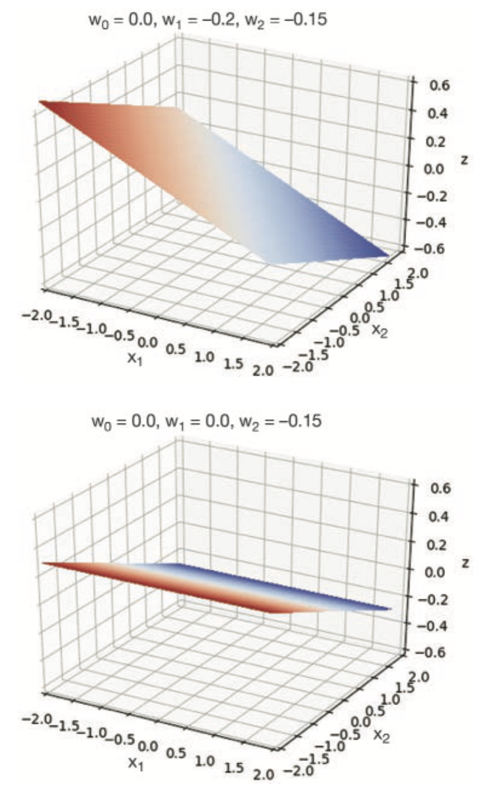

## Biological Neurons and Brains

{height="50%"}[^BioNeuron]

- *Dendrites* receive input signals
- *Cell body* "sums" the input signals, applies some function (e.g. threshold) to sum, and places output signal on *axon*
- Axons connect to dendrites of other neurons via *synapses*
- Brain has $~10^{11}$ neurons, each connected to $~10^{4}$ other neurons
- Much more complex than ANNs -- excitatory and inhibitory signals, "backward" connections, neurotransmitters, etc.

[^BioNeuron]: [https://github.com/blueberrymusic/Deep-Learning-A-Visual-Approach](https://github.com/blueberrymusic/Deep-Learning-A-Visual-Approach)

## Linear Algebra Interlude

Vector: list/array of numbers.

$\mathbb{R}^{D}$ means an $D$-dimensional vectors of real numbers.

Column vector in $\mathbb{R}^{3}$:

$$
\vec{x} = \left[\begin{array}{c}
1 \\ 2 \\ 3
\end{array}\right]
\vec{w} = \left[\begin{array}{c}
4 \\ 5 \\ 6
\end{array}\right]
$$

Transpose of a column vector is a row vector:

$$
\vec{x}^T = \left[\begin{array}{ccc}
1 & 2 & 3
\end{array}\right]
$$

Inner product, a.k.a. "dot" product of two vectors:

$$
\vec{x}^T\vec{w} =
\left[\begin{array}{ccc}
1 & 2 & 3
\end{array}\right]
\left[\begin{array}{c}
4 \\ 5 \\ 6
\end{array}\right]
=\sum_{i=1}^{D}x_i w_i
= (1)(4)+(2)(5)+(3)(6) = 32
$$

## Artificial Neurons

General model of an artificial neuron:

```{=latex}
\centering
\begin{tikzpicture}[shorten >=1pt,->]
\tikzstyle{unit}=[draw,shape=circle,minimum size=1cm]
\tikzstyle{compute}=[draw,shape=rectangle,minimum size=1cm]


% Input layer
\node[unit](one) at (0,4){$1$};
\node[unit](x1) at (0,2){$x_1$};
\node[unit](x2) at (0,0){$x_2$};

% Perceptron
\draw (3.86,2) circle [radius=1.74cm];
\node[compute](z) at (3,2){$z = \vec{x}^T \vec{w}$};
\node[compute](a) at (5,2){$a(z)$};

% Output
\node[unit](y) at (7,2){$y$};

% Connections
\draw (one) -- (z) node[xshift=-50, yshift=40]{$w_0$};
\draw (x1) -- (z) node[xshift=-50, yshift=8]{$w_1$};
\draw (x2) -- (z) node[xshift=-50, yshift=-28]{$w_2$};
\draw (z) -- (a);
\draw (a) -- (y);
\end{tikzpicture}
```

- The summation and ReLU activation functions are implicit in the book's depictions of units (represented by the big outer circle here).
- The book uses $\theta$ instead of $w$ for input weights and adds $\phi$ for output weights.  We'll adopt the same naming conventions when we depict neural networks going forward.

## Early History

- McCulloch and Pitts (1943): first mathematical model of a biological neuron.  Threshold activation function to simulate synaptic firing.
- Rosenblatt (1958, 1962) coined the term *perceptron* and came up with a perceptron learning algorithm.
- Minsky and Papert (*Perceptrons*, 1969) analyzed perceptrons in detail, focusing on their limitations and killing neural network research in CS departments until the 1990s.
- Rummelhart, Hinton and Williams (1986) published the backpropagation algorithm, the key ingredient needed to make MLPs practical.

## Simple Shallow Network

A *shallow network* has an input layer, a single hidden layer, and an output layer.
A neural network with one input, $x$, one output, $y$, and 10 paramters, $\vec{\phi}$ can be written mathematically as

$$
y = f(x, \vec{\phi}) = \phi_0 + \phi_1 a(\theta_{10} + \theta_{11}x) + \phi_2 a(\theta_{20} + \theta_{21}x) + \phi_3 a(\theta_{30} + \theta_{31}x)
$$

and depicted diagrammatically as

```{=latex}
\begin{center}
\begin{tikzpicture}[auto,shorten >=1pt,->]
\tikzstyle{unit}=[draw,shape=circle,minimum size=.75cm]


% Input layer
\node[unit,style=red](inone) at (0,2){$1$};
\node[unit](x) at (0,1){$x_1$};

% Hidden layer
\node[unit,style=red](hone) at (3,3){$1$};
\node[unit](h1) at (3,2){$h_1$};
\node[unit](h2) at (3,1){$h_2$};
\node[unit](h3) at (3,0){$h_3$};

% Output
\node[unit](y) at (6,1){$y$};

% Connections
\draw (inone) to node [style=red]{$\theta_{10}$} (h1);
\draw (inone) to node [style=red]{$\theta_{20}$} (h2);
\draw (inone) to node [style=red]{$\theta_{30}$} (h3);
\draw (x) to node {$\theta_{11}$} (h1);
\draw (x) to node {$\theta_{21}$} (h2);
\draw (x) to node {$\theta_{31}$} (h3);

\draw (hone) to node [style=red]{$\phi_0$} (y);
\draw (h1) to node {$\phi_1$} (y);
\draw (h2) to node {$\phi_2$} (y);
\draw (h3) to node {$\phi_3$} (y);

\end{tikzpicture}
\end{center}
```

Here we show the bias inputs (in red) and all the weights.  In future diagrams, those will be left off.

## Rectified Linear Units

The activation function in the previous neural networkj (and in future ones) is the *rectified linear unit*, or ReLU:

$$
a(z) = RelU(z) =
\begin{cases}
0, & z < 0\\
z, & z \ge 0
\end{cases}
$$

The plot of $ReLU(z)$ is:

```{=latex}
\begin{center}
\includegraphics{ShallowReLU.pdf}
\end{center}
```

## Signal Flow in Shallow Networks

:::: {.columns valign="top"}
::: {.column width="50%"}

{height="90%"}

:::
::: {.column width="55%"}

The flow of signals through network with input $x = 1$.

- Top row: inputs multiplied by weights $\theta_{h_i 1}$ and added to biases $\theta_{h_i 0}$
- Middle row: summed inputs passed through ReLU
- Third row: ReLU outputs scaled by weights $\vec{\phi}$
- Final row: outputs of hidden units summed and added to biases $\vec{\phi}$

Look at the plots and guess the parameters.  Then go to [https://udlbook.github.io/udlfigures/](https://udlbook.github.io/udlfigures/), select "3.3a - 1D shallow network (ReLU)", check your guess and play around with the parameter values.
:::
::::

## General Single Input/Single Output Shallow Network Definition

Given a shallow network with one input, $D$ hidden units, and one output, each hidden unit $h_d$ computes:

$$
h_d = a(\theta_{d0} + \theta_{d1}x)
$$

- What assumption does the equation above make about the activation function(s)?

and output $y$ is computed by:

$$
y = \phi_0 + \sum_{d=1}^{D}\phi_d h_d
$$

- Number of hidden units determines the network's *capacity*
- With ReLU units, a network with $D$ hidden units has $D$ joints and thus $D+1$ linear regions

## Universal Approximation Theorem

For any function, there exits a shallow network with enough hidden units to approximate the function to any precision.

```{=latex}
\begin{center}
```

```{=latex}
\end{center}
```

For each of the function plots above, how many hidden units are in the network that produced the function?

## Multivariate Outputs

Most practical neural networks have multivariate inputs and outputs.  With multiple outputs:

```{=latex}
\begin{center}
```
{height="30%"}
```{=latex}
\end{center}
```

First two layers are same as in single input/output network, but output layer computed by:

```{=latex}
\begin{align*}
y_1 & = \phi_{10} + \phi_{11}h_1 + \phi_{12}h_2 + \phi_{13}h_3 + \phi_{14}h_4\\
y_2 & = \phi_{20} + \phi_{21}h_1 + \phi_{22}h_2 + \phi_{23}h_3 + \phi_{24}h_4
\end{align*}
```


Each output unit has distinct weights on inputs from hidden units, so each can produce a different function, as shown in the plot above.

## Multivariate Inputs

With two inputs and one output, we have:

```{=latex}
\begin{center}
```

```{=latex}
\end{center}
```

Output layer same as in single input/output network.  Hidden unit outputs now computed by:

```{=latex}
\begin{align*}
h_1 & = a(\theta_{10} + \theta_{11}x_1 + \theta_{12}x_2)\\
h_2 & = a(\theta_{20} + \theta_{21}x_1 + \theta_{22}x_2)\\
h_3 & = a(\theta_{30} + \theta_{31}x_1 + \theta_{32}x_2)
\end{align*}
```

## Signal Flow in Multi-Input Network


:::: {.columns}
::: {.column width="40%"}

With two inputs to hidden layers we have two slopes and thus the inputs to the activation function are planes.

```{=latex}
\begin{center}
```
{height="80%"}
```{=latex}
\end{center}
```

:::
::: {.column width="65%"}

In 2nd row, the ReLUs clip planes where $z < 0$:

```{=latex}
\begin{center}
```
{height="70%"}
```{=latex}
\end{center}
```

Output layer combines clipped planes into polygonal surface.

See [https://udlbook.github.io/udlfigures/](https://udlbook.github.io/udlfigures/): 3.8b - 2D shallow network (ReLU)

:::
::::

## General Shallow Networks

```{=latex}
\begin{center}
```
{height="30%"}
```{=latex}
\end{center}
```


A shallow neural network is a function $\vec{y} = f(\vec{x}, \vec{\phi})$ with $\vec{x} \in \mathbb{R}^{D_i}$, $\vec{y} \in \mathbb{R}^{D_o}$ and $\vec{h} \in \mathbb{R}^D$ from $D$ hidden units.  Each $\{h_d\}_{d=1}^D$ computes

$$
h_d = a(\theta_{d0} + \sum_{i=1}^{D_i} \theta_{di} x_i)
$$

and the output is computed by

$$
y_j = \phi_{j0} + \sum_{d=1}^D \phi_{jd} h_{d}
$$

## Capacity of Shallow Networks

For $i$-dimentional input, $D$ hidden units can divide input with $D_i$ hyperplanes into $2^{D_i}$ linear regions.

```{=latex}
\begin{center}
```
{height="30%"}
```{=latex}
\end{center}
```

More generally:

```{=latex}
\begin{center}
```
{height="30%"}
```{=latex}
\end{center}
```


## Other Kinds of Activation Functions


```{=latex}
\begin{center}
```
{height="60%"}
```{=latex}
\end{center}
```

Play around with the interactive figures on [https://udlbook.github.io/udlfigures/](https://udlbook.github.io/udlfigures/) to get a feel for the different funciton surfaces produced by different activation functions.


## Closing Thoughts

- Shallow networks are an important technical and conceptual building block to deep networks
- So far we've only talked about *inference* -- producing an output from an input
- Next we'll learn about the structure and inference in deep networks
- Then we'll spend a lot of time learning how to *train* these networks -- the thing that makes them useful!
