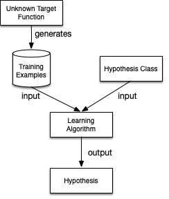
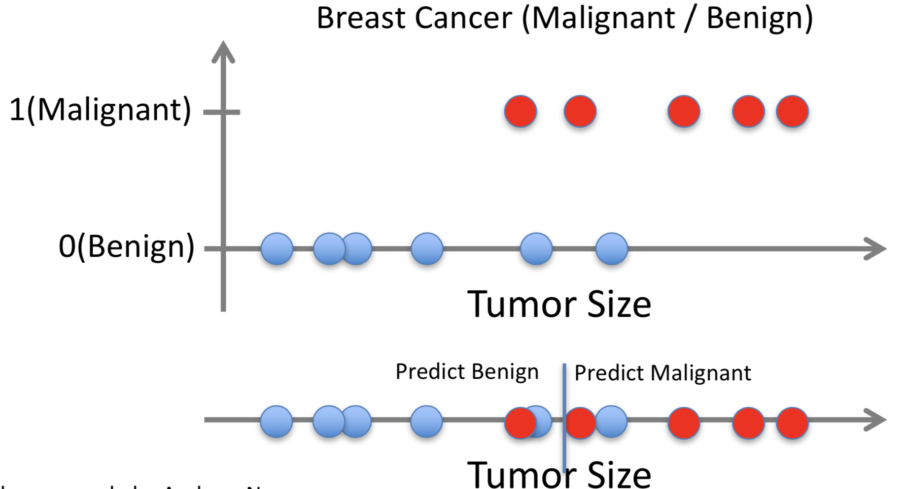
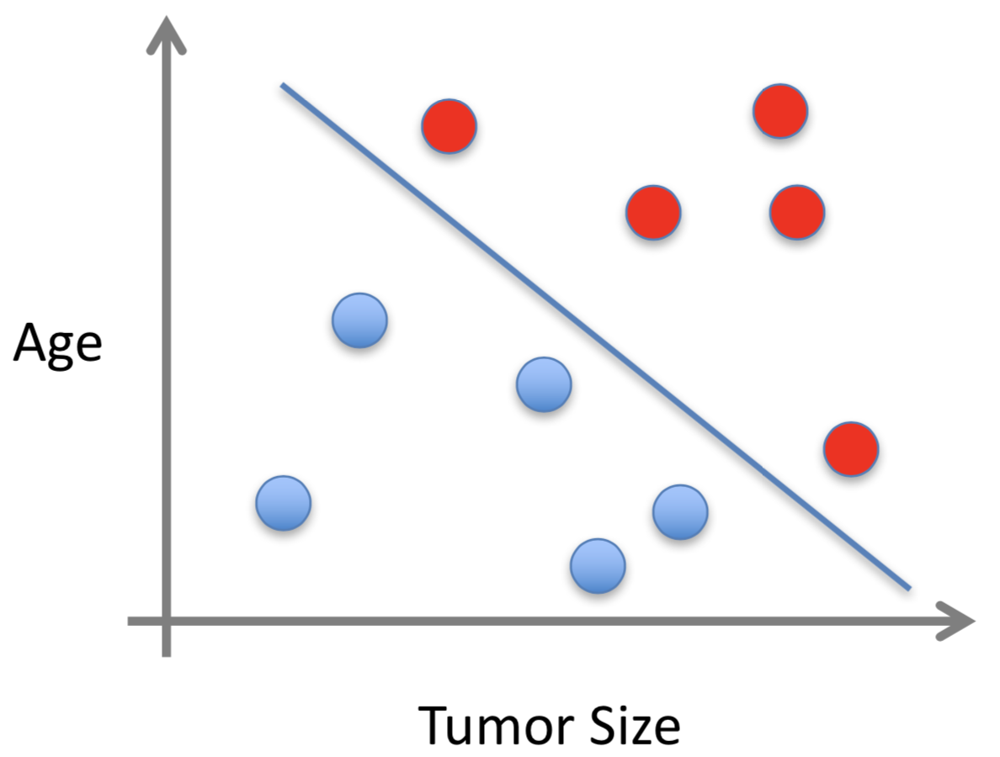
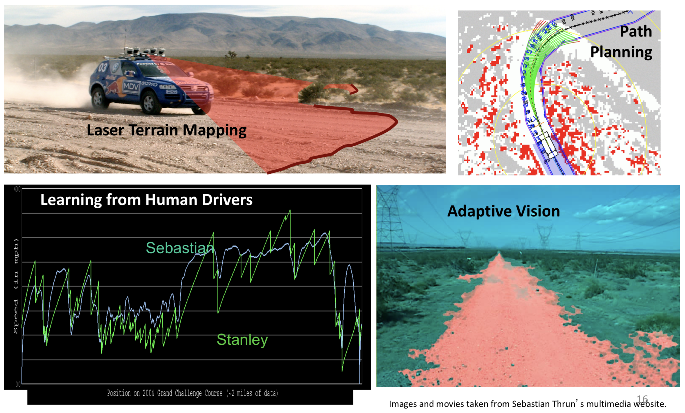
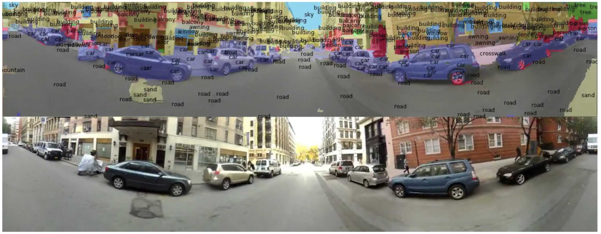
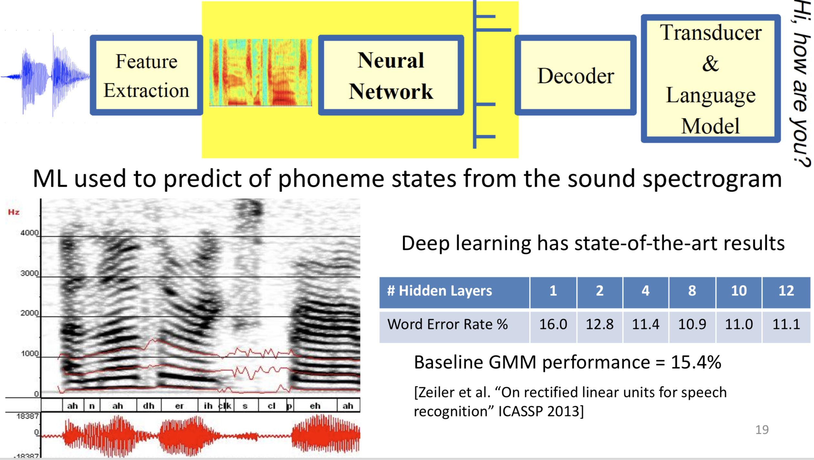
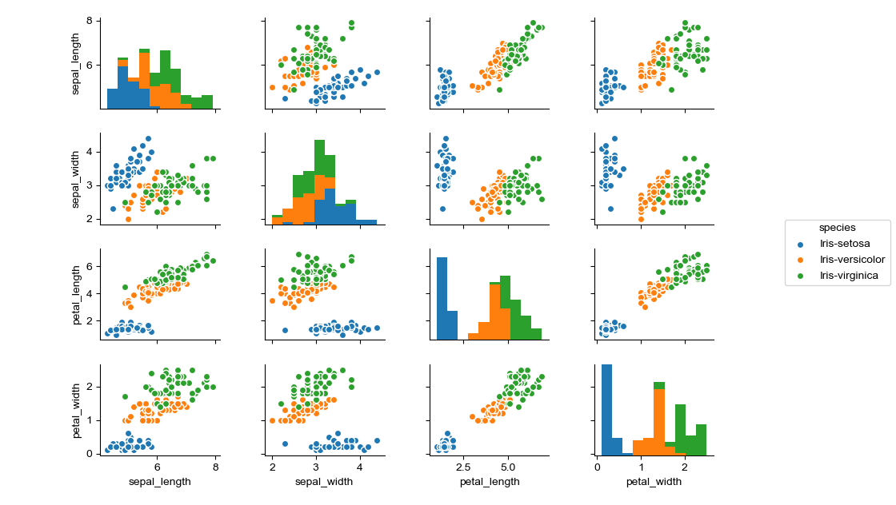

% Introduction to Machine Learning

## What is learning?

> "Learning is any process by which a system improves performance from experience."
> - Herbert Simon

## What is machine learning?

The hype answer:

> "Machine learning is the next Internet"
> - Tony Tether, Director, DARPA


> "Machine learning is the hot new thing"
> - John Hennessy, President, Stanford


> "Machine learning is today’s discontinuity"
> - Jerry Yang, CEO, Yahoo


> "Machine learning is the new electricity"
> -Andrew Ng, Chief Scientist Baidu


> "Software is eating the world."
> - Marc Andreessen, co-Author of Mosaic, founder of Andreessen Horowitz (VC firm).


> "AI is eating software."
> - Jensen Huang, CEO Nvidia

[^byron]

[^byron]: Slide credit: [Byron Boots](https://www.cc.gatech.edu/~bboots3/)

## What is machine learning?

The hype is real.

{height=70%}

[From slate.com](https://slate.com/human-interest/2014/06/big-data-whats-even-creepier-than-target-guessing-that-youre-pregnant.html)

## What is machine learning?

Definition by Tom Mitchell (1998):

Machine Learning is the study of algorithms that

- improve their performance `P`
- at some task `T`
- with experience `E`.

A well-defined learning task is given by `<P, T, E>`.

## Examples of Machine Learning Tasks [^mooney]

Improve on task `T`, with performance `P`, given experience `E`

`T`: Playing checkers

- `P`: Percentage of games won against an arbitrary opponent
- `E`: Playing practice games against itself

`T`: Recognizing hand-written words

- `P`: Percentage of words correctly classified
- `E`: Database of human-labeled images of handwritten words

`T`: Driving on four-lane highways using vision sensors

- `P`: Average distance traveled before a human-judged error
- `E`: A sequence of images and steering commands recorded while observing a human driver.

`T`: Categorize email messages as spam or legitimate.

- `P`: Percentage of email messages correctly classified.
- `E`: Database of emails, some with human-given labels

[^mooney]: Slide credit: Ray Mooney

## Elements of Machine Learning Tasks

Every machine learning task includes

- data from which to learn,
- a model that takes input data and produces an "answer",
- a loss function that quantifies the badness of our model, and
- an algorithm that adjiusts the model’s parameters to minimize the loss

Our model, or hypothesis, comes from a model/hypothesis class.  Once the parameters are learned, we have an instance of the hypothesis class tuned to our particular machine learning problem.

## Machine Learning Archtecture

{height=80%}

## Traditional Programming vs Machine Learning

{height=80%}

## When to use Machine Learning

ML is used when [^alpaydin]:

- Human expertise does not exist (navigating on Mars)
- Humans can’t explain their expertise (speech recognition, vision)
- Models must be customized (personalized medicine)
- Models are based on huge amounts of data (genomics)

[^alpaydin]: Ethem Alpaydin, Introduction to Machine Learning

## Kinds of Machine Learning Tasks

- Classification: identify the correct label for an instance
  - Is this a picture of a dog?
  - Which radio emitted the signal we received?
  - Will this customer respond to this advertisement?

- Clustering: identify the groups into which instances fall
  - What are the discernible groups of ... customers, cars, colors in an images

- Agent behavior
  - Given the state, which action should the agent take to maximize its goal attainment?

## Categories of Machine Learning Algorithms

- Supervised
  - Learn from a training set of labeled data -- the supervisor
  - Generalize to unseen instances

- Unsupervised
  - Learn from a set of unlabeled data
  - Place an unseen instance into appropriate group
  - Infer rules describing the groups

- Reinforcement learning
  - Learn from a history of trial-and-error exploration
  - Output is a /policy/ -- a mapping from states to actions (or probabolity distributions over actions)

Classification using supervised learning methods makes up the lion's share of machine learning.

## Supervised Learning Example: Breast Cancer Identification

- Given $(\vec{x_1}, y_1), (\vec{x_2}, y_2), ..., (\vec{x_n}, y_n)$
- Learn a function $h(\vec{x})$ to approximate $f(\vec{x})$ -- the *target* function -- to predict $y$ given $\vec{x}$
  – if $y$ is categorical == classification
  – if $y$ is real-valued == regression

{height=40%}[^ng]

[^ng]: From Andrew Ng

## Supervised Learning Example: Breast Cancer Identification

We can often obtain a better model with more features.

{height=60%}

But as we'll learn, we don't get this extra power for free.


## State of the Art in Machine Learning -- Autonomous Cars

{height=80%}

## State of the Art in Machine Learning -- Scene Labeling

{width=95%}[^farabet]

[^farabet]: Farabet et al. ICML 2012, PAMI 2013

## State of the Art in Machine Learning -- Speech Recognition

{height=80%}


## A Practical Example: Iris Classification

It's a rite of passage to apply supervised learning to the Iris data set. The canonical source for the Iris data set is the [UCI Machine Learning Repository](https://archive.ics.uci.edu/ml/). Download  [iris.data](https://archive.ics.uci.edu/ml/machine-learning-databases/iris/iris.data).

{height=6-%}

## Iris Data

The data set contains 150 instance of Iris flowers with

- 4 features:
  - sepal_length
  - sepal_width
  - petal_length
  - petal_width

and

- 3 classes:
  - Iris-setosa
  - Iris-versicolour
  - Iris-virginica

## Scikit-learn Recipe

1. Set up feature matrix and target array
2. Choose (import) model class
3. Set model parameters via arguments to model constructor
4. Fit model to data
5. Apply model to new data

Let's apply this recipe to a data set.


## Scikit-learn Data Representation

The basic supervised learning setup in Scikit-learn is:

- Feature Matrix

  - Rows are instances
  - Columns are features

- Target array

  - An array of len(rows) containing the training labels for each instance

We can easily obtain these with a Pandas DataFrame.

## Step 1: Iris feature matix and target array

From the description on the [Iris Data Set page](https://archive.ics.uci.edu/ml/datasets/Iris) we know that the Iris instances have four features -- (sepal_length, sepal_width, petal_length, petal_width) -- and three classes -- (Iris-setosa, Iris-versicolour, Iris-virginica). We can read these into a DataFrame with


```Python
import pandas as pd
import sklearn
iris = pd.read_csv("iris.data", names=["sepal_length",
                                       "sepal_width",
                                       "petal_length",
                                       "petal_width",
                                       "species"])
```

Note: this DataFrame is in [tidy format](http://vita.had.co.nz/papers/tidy-data.pdf).

## Step 1.1: Scikit-learn Input Data

For Scikit-learn we need a feature matrix `X` and target array `y`:

```Python
X_iris = iris.drop("species", axis=1)
y_iris = iris["species"]
```

We can check that the number of samples in the feature matrix equals the number of labels in the target array with

```Python
X_iris.shape[0] == y_iris.shape[0] # True
```

There are 150 samples and 150 target labels.

## Step 2: Choose a model

No hypothesis class (aka model class, aka algorithm, aka estimator) is best for all data [^fn2]. You must choose your model class based on the data. Things to consider:

- What's the dimensionality of your data?
- Are your features linearly separable?
- Are your features numeric or categorical?

Scikit-learn calls models *estimators*.

A good first choice is a linear model class, so we'll use a support vector machine (SVM).

[^fn2]: [Wolpert and Macready, *No Free Lunch Theorems for Optimization*](https://www.cc.gatech.edu/~isbell/reading/papers/nfl-optimization.pdf)

<!-- ## Step 2: Visualizing the Iris data

You can begin to explore your data with a pairplot:

```Python
import seaborn as sns
sns.pairplot(iris, hue="species", size=1.5)
```

{height=60%}

These look linearly separable, so we'll use a linear discriminant classifier, SVM. -->

## Step 3: Set model parameters

```Python
from sklearn import svm
model = svm.SVC(kernel="linear")
```

Most parameters are optional, with reasonable default values. Beacuse we know the Iris data set is so well-suited to liner classifiers we choose a `linear` kernel (deafult is `rbf` -- radial basis function)


## Step 4: Fit model to data

We want to separate our data into non-overlapping training and test subsets. Since the data in our data set are arranged in a neat order, we should randomize the samples and split in a way that represents each class equally in the training and test sets. Scikit-learn provides a library functoin to do this:

```Python
from sklearn.model_selection import train_test_split
X_iris_train, X_iris_test, y_iris_train, y_iris_test = \
    train_test_split(X_iris,
                     y_iris,
                     random_state=1)
```

Now we can train our classifier on the training data (fit the model to the training data).

```Python
model.fit(X_iris_train, y_iris_train)
```

## Step 5: Apply model to new data

To apply the trained model to new (unseen) data, pass an array of instances to ~predict~:

```Python
y_iris_model = model.predict(X_iris_test)
```

We can test the generalization error (how well the classifier performs on unseen data) using the built-in accuracy score:

```Python
from sklearn.metrics import accuracy_score
accuracy_score(y_iris_test, y_iris_model)
1.0
```

As you can see, a linear SVM classifier works perfectly on the Iris data. Try out different classifiers to see how well they perform.

A Scikit-learn estimator (model/hypothesis) is an object that has `fit` (train) and `predict` (test) methods.

## Closing Words

> "A breakthrough in machine learning is worth 10 Microsofts." -- Bill Gates
