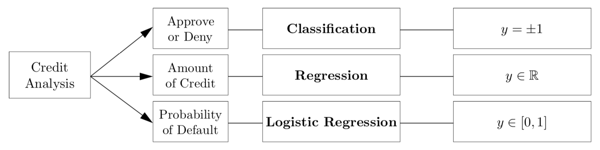
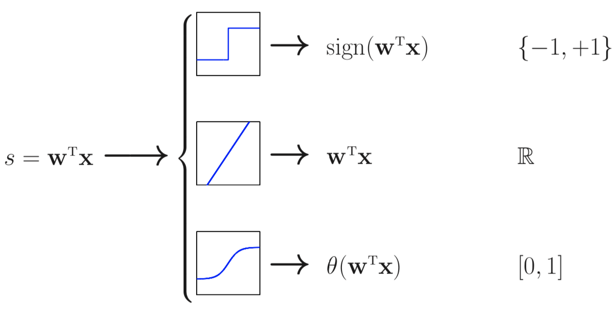
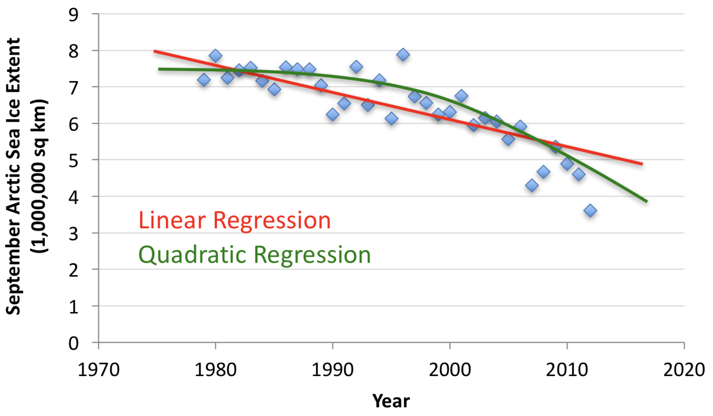
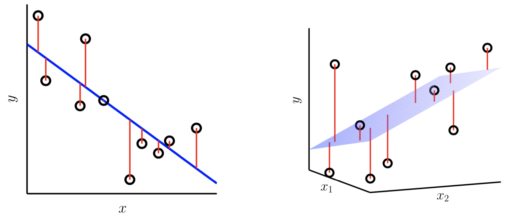
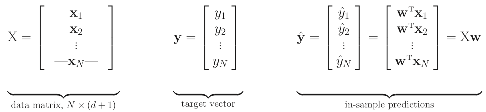
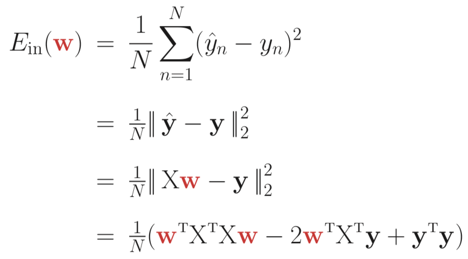
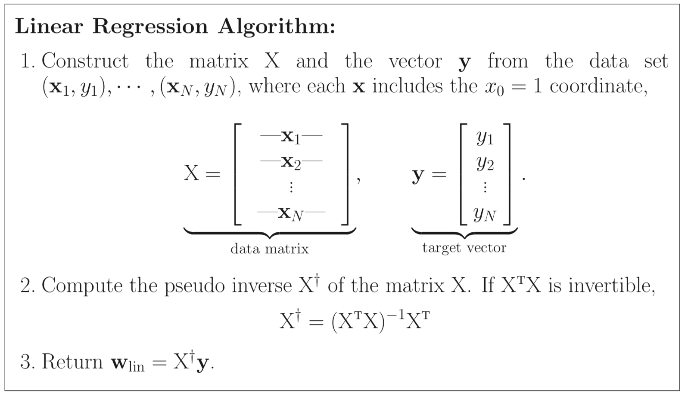

% Linear Regression

## The Linear Model

So far we've dealt with classification, where the target function maps feature vectors to discrete classes, but the linear model is more versatile.  Consider the credit analysis problem:

{height=30%}

We can use the linear model to learn

- a yes/no (perceptron)
- an arbitrary real number (linear regression)
- a probability (logistic regression)

As we'll see later, we can even learn to separate classes that are not linearly separable due to their nature, not noise in the data set.

## The Linear Signal

{height=40%}[^magdon-ismail]

$$
y = \theta(s)
$$

Three different error measures/loss functions:

- Perceptron: Classification error (0-1 loss)
- Linear Regression: Mean square error
- Logistic Regression: Cross-entropy error

The different error measures lead to different algorithms for minimizing the error.

[^magdon-ismail]: http://www.cs.rpi.edu/~magdon/courses/learn/slides.html

## Linear Regression

In linear regression the target function maps feature vectors in $\mathbb{R}^{d+1}$ to arbitrary real values.

{height=40%}[^byron-boots]

- In linear binary classification we assume that there is a line that separates classes acceptably well.
- In linear regression we assume that there is a line that fits the data acceptably well.

[^byron-boots]: https://www.cc.gatech.edu/~bboots3/CS4641-Fall2018/Lecture3/03_LinearRegression.pdf

## Error for Linear Regression

In linear regression we minimize the mean square error (MSE) between $h(\vec{x})$ and $y$.

$$
E_{in} = \frac{1}{N} \sum_{n=1}^{N} ( h(\vec{x_n} - y_n )^2
$$

{height=50%}

## Matrix Representation of $E_{in}(\vec{w})$

We can represent the problem in matrix form:

{height=40%}

Then:

{height=40%}

## Minimizing $E_{in}(\vec{w})$

For linear regression, $h$ is a linear combination of the components of $\vec{x}$:

$$
h(x) = \vec{w}^T \vec{x}
$$

And minimizing the error is expressed as the optimization problem:

$$
w_{lin} = \argmin_{\vec{w} \in \mathbb{R}^{d+1}} E_{in}(\vec{w})
$$

## Minimizing Matrix Represeantation of $E_{in}(\vec{w})$

Since $E_{in}(\vec{w})$ is differentiable we can set the gradient to 0:

$$
\nabla E_{in}(\vec{w}) = \vec{0}
$$

The gradient of our matrix representation of $E_{in}(\vec{w})$ is

$$
\nabla E_{in}(\vec{w}) = \frac{2}{N} ( X^T X \vec{w} - X^T \vec{y})
$$

which is $\vec{0}$ when

$$
X^T X \vec{w} = X^T \vec{y}
$$

If we assume $X^T X$ is invertible, then $\vec{w} = X^{\dagger} \vec{y}$, leading to the one-step algorithm for linear regression ...

## Linear Regression Algorithm

{height=80%}

## Closing Thoughts

- The linear regression algorithm demonstrates some common themes in machine learning: 

    - manipulate the error function into a form that allows us to use to mathematical tricks to simplify the problem 
    - make simplifying assumptions that make the theory clean but typically work well in practice
    
- Linear regression is well-studied in statistics

- Some wouldn't consider linear regression to be machine learning becuase it has an analytic rather than algorithmic solution

    - important ideas in linear regression appear in other algorithms (e.g., minimizing gradient)
    - linear regression is an important tool in a data scientist's tool box
