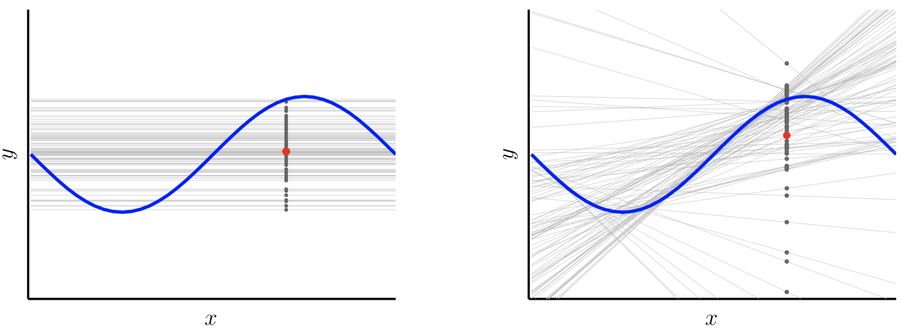

% Computational Learning Theory

## Decidability

- Computation

    - Decidability -- which problems have algorithmic solutions

- Machine Learning

    - Feasibility -- what assumptions must we make to trust that we can learn an unknown target function from a sample data set

## Complexity

Complexity is a measure of efficiency.  More efficient solutions use fewer resources.

- Computation -- resources are time and space

    - Time complexity -- as a function of problem size, $n$, how many steps must an algorithm take to solve a problem
    - Space complexity -- how much memory does an algorithm need

- Machine learning -- resource is data

    - Sample complexity -- how many training examples, $m$, are needed so that with probability $\ge \delta$ we can learn a classifier with error rate lower than $\epsilon$

Practically speaking, computational learning theory is about how much data we need to

## Feasibility of Machine Learning

Machine learning is feasible if we adopt a probabilistic view of the problem and make two assumptions:

- Our training samples are drawn from the same (unknown) probability distribution as our test data, and

- Our training samples are drawn independently (with replacement)

These assumptions are known as the *i.i.d assumption* -- data samples are independent and identically distributed (to the test data).

So in machine learning we use a data set of samples to make a statement about a population.

## The Hoeffding Inequality

If we are trying to estimate some random variable $\mu$ by measuring $\nu$ in a sample set, the Hoeffding inequality bounds the difference between in-sample and out-of-sample error by

$$
\mathbb{P}[|\nu - \mu| > \epsilon] \ge 2e^{-2e^2 N}
$$ 

So as the number of our training samples increases, the probability decreases that our in-sample measure $\nu$ will differ from the population parameter $\mu$ it is estimating by some error tolerance $\epsilon$.

The Hoeffding inequality depends only on $N$, but this holds only for some parameter.  In machine learning we are trying to estimate an entire function.

## The Hoeffding Inequality in Machine Learning

In machine learning we're trying to learn an $h(\vec{x}) \in \mathcal{H}$ that approximates $f: \mathcal{X} \rightarrow \mathcal{Y}$.  

- In the learning setting the measure we're trying to make a statement about is *error* and 
- we want a bound on the difference between in-sample error [^count]:

$$
E_{in}(h) = \frac{1}{N} \sum_{n=1}^{N}  \llbracket h(\vec{x}) \ne f(\vec{x}) \rrbracket
$$

and out-of-sample error:

$$
E_{out}(h) = \mathbb{P} [ h(\vec{x}) \ne f(\vec{x}) ]
$$

So the Hoeffding inequality becomes

$$
\mathbb{P} [|E_{in}(h) - E_{out}(h)| > \epsilon ] \le 2e^{-2e^2N}
$$

But this is the error for one hypothesis.

[^count]: $\llbracket statement \rrbracket = 1$ when statement is true, 0 otherwise.

## Error of a Hypothesis Class

 We need a bound for a hypothesis class.  The union bound states that if $\mathcal{B}_1, ..., \mathcal{B}_M$ are any events,

$$
\mathbb{P} [ \mathcal{B}_1, or \mathcal{B}_2, or, ..., or \mathcal{B}_M ] \le \sum_{m=1}^{M} \mathbb{P} [ \mathcal{B}_m ]
$$

For $\mathcal{H}$ with $M$ hypotheses ${h_1, ..., h_M}$ the union bound is:

$$
\mathbb{P} [|E_{in}(g) - E_{out}(g)| > \epsilon ] \le \sum_{m=1}^{M} \mathbb{P} [|E_{in}(h(m)) - E_{out}(h(m))| > \epsilon ]
$$

If we apply the Hoeffding inequality to each of the $M$ hypotheses we get:

$$
\mathbb{P} [|E_{in}(g) - E_{out}(g)| > \epsilon ] \le 2Me^{-2 \epsilon^2 N}
$$

We'll return to the result later when we consider infinite hypothesis classes.

## $\epsilon$-Exhausted Version Spaces

We could use the previous result to derive a formula for $N$, but there is a more convenient framework based on version spaces.

Recall that a version space is the set of all hypotheses consistent with the data.

- A version space is said to be $\epsilon$-exhausted with respect to the target function $f$ and the data set $\mathcal{D}$ if every hypothesis in the version space has error less than $\epsilon$ on $\mathcal{D}$.  
- Let $|H|$ be the size of the hypothesis space.  
- The probability that for a randomly chosen $\mathcal{D}$ of size $N$ the version space is not $\epsilon$-exhausted is less than

$$
|H|^{-\epsilon N}
$$

## Bounding the Error for Finite $\mathcal{H}$

$|H|^{-\epsilon N}$ is an upper bound on the failure rate of our hypothesis class, that is, the probablility that we won't find hypothesis that has error less than $\epsilon$ on $\mathcal{D}$.  If we want this failure rate to be no greater than some $\delta$, then

$$
|H|^{-\epsilon N} \le \delta
$$

And solving for $N$ we get

$$
N \ge \frac{1}{\epsilon} ( \ln |H| + \ln \frac{1}{\delta} )
$$

## PAC Learning for Finite $\mathcal{H}$

The PAC learning formula

$$
N \ge \frac{1}{\epsilon} ( \ln |H| + \ln \frac{1}{\delta} )
$$

means that we need at least $N$ training samples to guarantee that we will learn a hypothesis that will

- *probably*, with probability $1 - \delta$ be
- *approximately*, within error $\epsilon$
- *correct*.

Notice that $N$ grows

- linearly in $\frac{1}{\epsilon}$,
- logarithmically in $\frac{1}{\delta}$, and
- logarithmically in $|H|$.

## PAC Learning Example

Consider a hypothesis class of boolean literals.  You have variables like *tall*, *glasses*, etc., and the hypothesis class represents whether a person will get a date.  How many examples of people who did and did not get dates do you need to learn with 95% probability a hypothesis that has error no greater than .1

First, what's the size of the hypothesis class?  For each of the variables there are three possibilities: true, false, and don't care.  For example, one hypothesis for variables $tall, glasses, longHair$ might be:

$$
tall \land \lnot glasses \land true
$$

Meaning that you must be tall and not wear glasses to get a date but it doesn't matter if your hair is long.  

## PAC Learning Example

Since there are three values for each variable the size of the hypothesis class is 

$$
3^d
$$

If we have 10 variables then

$$
N \ge \frac{1}{\epsilon} ( \ln |H| + \ln \frac{1}{\delta} ) = \frac{1}{.1}(\ln 3^{10} + \ln \frac{1}{.05} ) = 140
$$

## Dichotomies

Returning to 

$$
\mathbb{P} [|E_{in}(g) - E_{out}(g)| > \epsilon ] \le 2Me^{-2 \epsilon^2 N}
$$

Where $M$ is the size of the hypothesis class (also sometimes written $|H|$).  For infinite hypothesis classes, this won't work.  What we need is an *effective* number of hypotheses.

Diversity of $H$ is captured by idea of dichotomies.  For a binary target function, there are many $h \in H$ that produce the same assignments of labels.  We groupo these into *dichotomies*.

## Effective Number of Hypotheses

## Growth Function

## Shattering

## VC Dimension

The VC-dimendion $d_{VC}$ of a hypothesis set $\mathcal{H}$ is the largest $N$ for which $m_{\mathcal{H}}(N) = 2^N$.

Another way to put it: VC-dimension is the maximum number of points in a data set for which you can arrange the points in such a way that $\mathcal{H}$ shatters those points for any labellings of the points.

## VC Bound

For a confidence $\delta > 0$, the VC generalization bound is:

$$
E_{out}(g) \le E_{in}(g) + \sqrt{ \frac{8}{N} \ln \frac{4m_\mathcal{H}(2N)}{\delta} }
$$

If we use a polynomial bound on $d_{VC}$:

$$
E_{out}(g) \le E_{in}(g) + \sqrt{ \frac{8}{N} \ln \left( \frac{4 ((2 N)^{d_{VC}} - 1}{\delta} \right) }
$$

## VC Bound and Sample Complexity

For an error tolerance $\epsilon > 0$ (our max acceptable difference between $E_{in}$ and $E_{out}$) and a confidence $\delta > 0$, we can compute the sample complexity of an infinite hypothesis class by:

$$
N \ge \frac{8}{\epsilon_2} \ln \left( \frac{4 ((2N)^{d_{VC}} + 1}{\delta} \right)
$$

Note that $N$ appears on both sides, so we need to solve for $N$ iteratively.  See [colt.sc](../code/colt.sc) for an example.

If we have a learning model with $d_{VC} = 3$ and want a generalization error at most $\epsilon = 0.1$ and a confidence of 90% ($\delta = 0.05$), we get $N = 29299$

- If we try higher values for $d_{VC}$, $N \approx 10000 d_{VC}$, which is a gross overestimate.
- Rule of thumb: you need $10 d_{VC}$ training examples to get decent generalization.

## VC Bound as a Penalty for Model Complexity

You can use the VC bound to estimate the number of training samples you need, but you typically just get a data set -- you're given an $N$.

- Question becomes: how well can we learn from the data given this data set?

If we plug values into:

$$
E_{out}(g) \le E_{in}(g) + \sqrt{ \frac{8}{N} \ln \left( \frac{4 ((2 N)^{d_{VC}} - 1}{\delta} \right) }
$$

For $N = 1000$ and $\delta = 0.1$ we get

- If dvc = 1, error bound = 0.09
- If dvc = 2, error bound = 0.15
- If dvc = 3, error bound = 0.21
- If dvc = 4, error bound = 0.27
 
## Appoximation-Generalization Tradeoff

The VC bound can be seen as a penalty for model complexity.  For a more complex $\mathcal{H}$ (larger $d_{VC}$), we get a larger generalization error.

- If $\mathcal{H}$ is too simple, it may not be able to approximate $f$.
- If $\mathcal{H}$ is too complex, it may not generalize well.

This tradeoff is captured in a conceptual framework called the *bias-variance* decomposition which uses squared-error to decompose the error into two terms:

$$
\mathbb{E}_{\mathcal{D}} = bias + var
$$

Which is a statement about a particular hypothesis class over all data sets, not just a particular data set.

## Bias-Variance Tradeoff

{height=40%}

- $\mathcal{H}_1$ (on the left) are lines of the form $h(x) = b$ -- high bias, low variance
- $\mathcal{H}_2$ (on the right) are lines of the form $h(x) = ax + b$ -- low bias, high variance

Total error is a sum of errors from bias and variance, and as one goes up the other goes down.  Try to find the right balance.  We'll learn techniques for finding this balance. 
