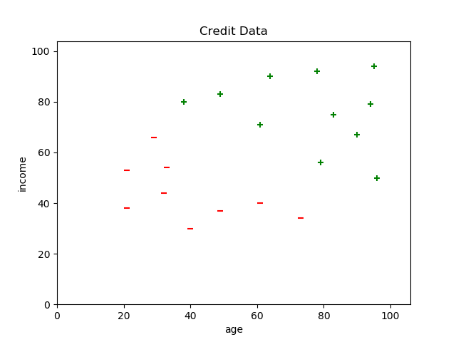
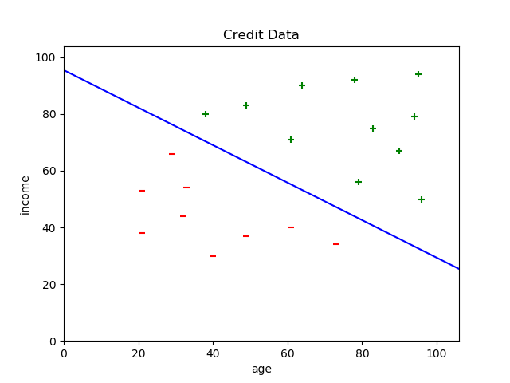

% Linear Separators
% The Perceptron Learning Algorithm

## Learning Problem Setup

Every machine learning problem contains the following elements:

- An input $\vec{x}$ 
  - (though, as we'll see later, $\vec{x}$ can be a list aof arbitrary feature values, not necessarily a vector)
- An unkown target function $f: \mathcal{X} \rightarrow \mathcal{Y}$
- A data set $\mathcal{D}$
- A learning model, which consists of
    - a hypothesis class $\mathcal{H}$, and
    - a learning algorithm.

A learning algorithm uses elements of $\mathcal{D}$ to estimate parameters of of a particular $h(\vec{x})$ from $\mathcal{H}$ which maps every $\vec{x}$ to an element of $\mathcal{Y}$.
    
## Example: Credit Scoring

Let's create a credit score based on two variables: age and income (in thousands), which are real numbers.

- An input $\vec{x}$ is a vector in $\mathbb{R}^2$.  For example, a 25 year-old person making $60,000 would be represented by the vector $(24, 60)$.

- "Credit score" = $\sum_{i=1}^{d} w_i x_i$

In other words:

- Approve credit if $\sum_{i=1}^{d} w_i x_i$ > threshold
- Deny credit if $\sum_{i=1}^{d} w_i x_i$ < threshold

The weights $w_i$ represent the importance of corresponding features of input instances.

## Learning Model

Our credit score:

- Approve credit if $\sum_{i=1}^{d} w_i x_i$ > threshold
- Deny credit if $\sum_{i=1}^{d} w_i x_i$ < threshold

Can be turned into a learning model as 

$$
h(x) = sign((\sum_{i=1}^{d} w_i x_i) + w_0)
$$

The "bias weight" $w_0$ corresponds to the threshold.

Our learning model is a discriminant -- for an instance $\vec{x}$ it returns $+1$ or $-1$.

## The Credit Data Set

Let's look at a particular data set, $\mathcal{D}$, stored in [credit.csv](../code/credit.csv)

- Each data point represents a previous customer
- Since this is is supervised learning, every data point has an associated label: $+1$ for a customer off whom the bank made money, $-1$ for a customer off whom the bank lost money 

We can load the data set directly into a DataFrame:

```Python
In [34]: credit = pd.read_csv(credit.csv)                                                    

In [35]: credit                                                                                   
Out[35]: 
    age  income  approve
0    64      90        1
1    78      92        1
2    38      80        1
3    29      66       -1
4    94      79        1
... additional rows elided
```

## Credit Data Plot

A scatter plot gives us intuition about the structure of the data.

{height=70%}

Is there a line that separates the +s from the -s?

## A Linear Separator

Here's a line that separates the data into classes.

{height=70%}

Are there other lines? How many of these lines are there? 

## Version Spaces

A *version space* is the set of all $h$ in $\mathcal{H}$ consistent with our training data.  For our credit data, it's the set of all lines that separate the classes.

{height=70%}

Now the question is, how can we find one of these lines mechanically?

## The Perceptron Hypothesis Class

The set of lines (more generally, hyperplanes) is a hypothesis class known as the *perceptron*. 

$$
\mathcal{H} = \{h(\vec{x}) = sign(\vec{w}^T \cdot \vec{x})\}
$$

where

::::{.columns valign="center"}
::: {.column width="40%"}

$$
\vec{w} =
\begin{bmatrix}
w_{0} \\
w_{1} \\
\vdots \\
w_{d}
\end{bmatrix}
\in \mathbb{R}^d
$$

:::
::: {.column width="40%"}

$$
\vec{x} =
\begin{bmatrix}
1 \\
x_{1} \\
\vdots \\
x_{d}
\end{bmatrix}
\in \{1\} \times \mathbb{R}^d
$$

:::
::::

Notice that we enode the bias term as $w_0$ and we prepend all data points with $1$ so that a simple dot product of the weight vector with a data point gives us the weighted sum we formalized earlier.


## The Perceptron Learning Algorithm

A simple algorithm to find a linear separator is the perceptron learning algorithm:

Given a data set $\mathcal{D}$ with each $\vec{x_i}$ in $\mathcal{D}$ prepended with a $1$, and labels $\vec{y}$

1. Initialize $\vec{w} = (w_0, w_1, ..., w_d)$ with zeros or random values.
    
2. As long as there is a $\vec{x_i}$ in $\mathcal{D}$ for which $sign(\vec{w}^T \cdot \vec{x}) \ne y_i$
    - Update $\vec{w}$ using the update rule:
        - $\vec{w}(t + 1) = \vec{w}(t) + y_i \vec{x_i}$ ($t$ is "time", or iteration number)

When the algorithm finishes, $\vec{w}$ is a line separating the two classes (assuming $\mathcal{D}$ is linearly separable).

Let's see this algorithm in action...

## The General Form of Learning Algorithms

The Perceptron Learning Algorithm exemplifies the general form of learning algorithms 

1. Initialize a model's parameters to some initial values.
2. Until some stopping criterion is reached (e.g., error within bounds)

    -  Evaluate the model on some subset of the data $\mathcal{D}$
    -  If error is present, update the model's parameters to reduce the error
        - The magnitude of the correction is often captured in a "learning rate" hyperparameter, often represented by $\eta$ or $\alpha$

When the algorithm is finished, you have a model, a particular $h \in \mathcal{H}$, that "fits" the training data.

## Closing Thoughts

The perceptron model and the perceptron learning algorithm give us a simple, easy to grasp introduction to general issues in machine learning.

In the coming weeks we will develop a more sophisticated conceptual and algorithmic toolkit.

- For our PLA we chose a data set with a strong (and rare) property: perfect linear separability.  What if we have data that are not linearly separable?

- How do we model error?

- How do we deal with noise?

- What if our data can't be represented as vectors?
